<br />
<div align="center">
  <a href="https://content.provaltech.com/docs/8ead1ffd-dade-4e17-9958-3313da9a7aa8">
    
  </a>
  <h3 align="center">OmniPrompt</h3>
  <p align="center">Display a prompt on the desktop — on Windows and macOS!</p>
</div>

## About

<div align="center">

</div>

**OmniPrompt** is a simple application designed to present a prompt on the desktop and optionally display a date and time picker. It supports any number of buttons, optional header images and custom application icons (local files or URLs), and adjustable sizing/styling for the prompt window, text box, logo, and fonts.

**OmniPrompt** is a cross-platform, Go-based reimplementation of the original .NET [Prompter](https://content.provaltech.com/docs/aba254a9-e917-481d-9152-ecb6e990d98c) tool, built to run natively on both Windows and macOS from a single codebase. The command-line arguments are intentionally kept compatible with the original tool, so most existing scripts can switch over by pointing at the new executable.

### Built With

* [Go](https://go.dev/) and [Wails v2](https://wails.io/) (native window, no browser required)
* Vanilla HTML/CSS/JS frontend

Because it compiles to a single native binary, there is no separate desktop runtime to install (unlike the original .NET version) — just download and run.

## Getting Started

Download the executable for your platform (`OmniPrompt.exe` on Windows, the `OmniPrompt.app` bundle on macOS) and run it from a terminal or script.

### Building from source

* [Go](https://go.dev/dl/) 1.25 or newer
* [Node.js](https://nodejs.org/) (for building the frontend)
* The [Wails v2 CLI](https://wails.io/docs/gettingstarted/installation): `go install github.com/wailsapp/wails/v2/cmd/wails@latest`

**Windows:**

```console
wails build -windowsconsole
```

> **Note:** `-windowsconsole` keeps a console attached on Windows so that the button clicked, selected date/time, and user input are printed to stdout when run from a script. Without it, Wails builds a windowed app with no visible console output.

**macOS:**

```console
wails build
```

This produces `build/bin/OmniPrompt.app`, which already prints to stdout when launched from Terminal — no extra flag needed like on Windows. Run it with `wails build -platform darwin/universal` instead if you need a single build that runs natively on both Intel and Apple Silicon Macs.

## Usage

OmniPrompt is meant to be launched from a command prompt/script and returns one to three values on stdout:

  1. The name of the button that was pressed, or `'Timer elapsed'` if a timeout was specified and it elapsed.
  2. (Optional) The date and time that was selected by the user, in local time with the local UTC offset (e.g. `2026-07-08T09:00:00.000-04:00`).
  3. (Optional) The text entered in the user input field. The input box is multi-line, so this can span multiple lines of output — when capturing it in a script, read everything from that point to the end of output rather than assuming it's a single line (see Examples 6 and 9 below).

### Arguments

| Long Name              | Short Name | Example                     | Description                                                                                                                       |
| ---------------------- | ---------- | ---------------------------- | ----------------------------------------------------------------------------------------------------------------------------------|
| `--title`              | `-t`       | "My Prompt Title"             | The title of the window.                                                                                                          |
| `--message`            | `-m`       | "You should reboot!"          | The message to display in the prompt. Use `\n` to add a new line to the message, and `**bold**`/`*italic*`/`__underline__` for basic formatting. `--htmlmessage`/`-l` should be used with HTML formatted messages. |
| `--icon`               | `-i`       | "Resources/omniprompt.ico"    | Path (local or URL) to an image to display next to the title.                                                                     |
| `--headerimage`        | `-h`       | "Resources/grumpy-cat.png"    | Path (local or URL) to an image to display in the header of the prompt.                                                           |
| `--theme`              | `-e`       | light                         | The theme to use for the prompt (dark, light). Defaults to dark.                                                                  |
| `--datetimeselector`   | `-d`       | N/A                           | Enable the date/time selector, which will pass back an additional output to the console.                                          |
| `--buttontypes`        | `-b`       | OK Cancel "Do Something"      | A space separated list of strings to display as buttons on the prompt. Defaults to "OK".                                          |
| `--timeout`            | `-o`       | 60                            | The number of seconds to wait for input before closing the window. Returns `'Timer elapsed'` on timeout.                          |
| `--twelvehour`         | `-c`       | N/A                           | Make the time display in 12-hour time instead of 24-hour time.                                                                    |
| `--datetimefromhours`  | `-y`       | 0                             | The number of hours to add to the current time in order to set the starting point for the Date/Time selector.                     |
| `--datetimetohours`    | `-z`       | 48                            | The number of hours to add to the initial time in the Date/Time selector in order to display the last available option to select. |
| `--htmlmessage`        | `-l`       | N/A                           | Set this to enable HTML decoding of the message.                                                                                  |
| `--userinput`          | `-u`       | N/A                           | Set this to enable the user input field.                                                                                          |
| `--userinputtext`      | `-x`       | N/A                           | Set initial/help text for the user input field.                                                                                   |
| `--promptsize`         | `-p`       | 640x480                       | Size of the whole prompt window, as `WIDTHxHEIGHT` in pixels. Defaults to `640x480` if not provided.                              |
| `--textboxsize`        | `-g`       | 500x200                       | Size of the message text box, as `WIDTHxHEIGHT` in pixels. Defaults to filling the available space if not provided.               |
| `--logosize`           | `-j`       | 300x100                       | Size of the header image/logo box, as `WIDTHxHEIGHT` in pixels. Defaults to `400x150` if not provided.                            |
| `--textsize`           | `-n`       | 16                            | Font size (in px) for the message text. Defaults to `14` if not provided.                                                         |
| `--textstyle`          | `-f`       | Calibri                       | Font family for the prompt text, e.g. `Calibri`, `"Times New Roman"`, `"Comic Sans MS"`. Defaults to `Arial` if not provided.      |
| `--buttontextstyle`    | `-v`       | Calibri                       | Font family for button text. Defaults to `Arial` if not provided.                                                                 |
| `--buttontextsize`     | `-w`       | 16                            | Font size (in px) for button text. Defaults to `14` if not provided.                                                              |
| `--buttonsize`         | `-k`       | 100x40                        | Size of each button, as `WIDTHxHEIGHT` in pixels. Defaults to auto-sized if not provided.                                         |
| `--titletextstyle`     | `-r`       | Calibri                       | Font family for the title bar text. Defaults to `Arial` if not provided.                                                          |
| `--titletextsize`      | `-q`       | 16                            | Font size (in px) for the title bar text. Defaults to `14` if not provided.                                                       |
| `--titlefieldsize`     | `-a`       | 640x35                        | Size of the title bar, as `WIDTHxHEIGHT` in pixels. Defaults to the full window width at `35px` height if not provided.           |

Any sizing/style argument that is omitted keeps OmniPrompt's existing default look — you only need to set the ones you want to change.

### Line breaks in messages

How you add a line break to `--message` depends on whether `--htmlmessage`/`-l` is used:

* **Plain text messages (default):** type the two literal characters `\n` anywhere in the message and OmniPrompt converts each one into a real line break before displaying it. This is a plain string replacement, not a shell escape sequence, so you don't need any special quoting — just type `\n` as-is inside your normal quoted string, in PowerShell, cmd, or bash alike:

  ```console
  OmniPrompt.exe -m "Line one\nLine two\nLine three"
  ```

* **HTML messages (`-l`):** the message is rendered as literal HTML, so `\n` is *not* converted — use HTML tags instead, e.g. `<br>` for a line break or `<p>...</p>` for paragraphs:

  ```console
  OmniPrompt.exe -l -m "<p>Line one</p><p>Line two</p>"
  ```

See Example 4 (plain text) and Example 13 (HTML) below for full working examples of each.

### Text formatting in plain messages

Plain text messages (i.e. without `--htmlmessage`/`-l`) support a small set of Markdown-style markers for basic emphasis, without needing to write full HTML:

| Marker              | Result       |
| -------------------- | ------------ |
| `**bold text**`      | **bold text**   |
| `*italic text*`      | *italic text*   |
| `__underlined text__`| underlined text |

```console
OmniPrompt.exe -m "This update is **required** and should be installed *tonight* — see the __attached notes__ for details."
```

Markers can be combined and nested (e.g. `**bold with *italic* inside**`). Anything else in the message (including stray `<`, `>`, or `&` characters) is displayed literally and is never interpreted as HTML — only use `--htmlmessage`/`-l` if you need full HTML control. See Example 14 below.

### Logging

Every run appends a line-by-line log of what happened — parameters received, whether images loaded, which button was clicked, which date/time was selected, and any errors — to `OmniPrompt.log`, created next to the executable (on both Windows and macOS). The log is capped at 2 MB and automatically cleared once it exceeds that size, so it's safe to leave in place for troubleshooting without growing unbounded.

## Running from an RMM as root/SYSTEM

Most RMM agents run scripts as `root` (macOS) or `SYSTEM` (Windows) rather than as the person sitting at the keyboard. A prompt launched that way can still *appear* on the user's screen, but it belongs to a different session than the user's desktop, so it can't receive clicks or keystrokes — the window shows up but is completely unresponsive to the end user. On macOS this is often accompanied by a harmless `NOT IMPLEMENTED - CopyPropertiesForAllFonts` line in the console log; that's a benign CoreText diagnostic that shows up when a GUI app is running outside a normal logged-in session, not an actual error, and isn't something to fix on its own — it's a symptom of the same root cause as the unresponsive window, and normally goes away once the prompt is launched inside the user's session as shown below.

To get an interactive, clickable prompt, the command needs to run *within the logged-in user's session* instead of root/SYSTEM's own session.

> **Always set `--timeout`/`-o` for anything launched from an RMM.** Because `AlwaysOnTop` is enabled, a prompt that fails to bridge into the user's session correctly is not just unresponsive — it can sit on top of everything and make the machine unusable until it's dismissed. `-o <seconds>` guarantees the window closes itself and hands control back to the user even if the interactive bridging below doesn't work in your environment, turning a stuck session into a self-resolving one. Treat every technique on this page as best-effort, not guaranteed, until you've verified it end-to-end on your own fleet's actual macOS/Windows versions.

### macOS: `launchctl asuser`

Bridging root → the logged-in user's GUI session is one of the most macOS-version-sensitive things in system administration — what works on one macOS version can silently stop working on the next. Before troubleshooting further, verify the basics:

```bash
# Run this from the same root context your RMM uses, and confirm it prints the
# actual end user's short name — not "root", and not empty.
stat -f%Su /dev/console
```

If that returns `root` or nothing, the machine has no one logged in at the physical console from macOS's point of view (e.g. it's sitting at the login window, or your RMM's session isn't recognized as the console session) — no launch technique will make a prompt interactive in that case, since there is no logged-in GUI session to bridge into.

If it does return the right user, try:

```bash
currentUser=$(stat -f%Su /dev/console)
userID=$(id -u "$currentUser")

output=$(launchctl asuser "$userID" sudo -u "$currentUser" /tmp/OmniPrompt.app/Contents/MacOS/OmniPrompt -m "..." -d -u -x "...")
```

**Do not wrap this in `su -l`.** It may seem like the next thing to try (it's what actually switches the audit session `sudo -u` doesn't), but `su -l`'s session switch requires a privilege that processes spawned by RMM/remote-execution agents typically don't have. It fails outright with `Could not switch to audit session ...: Operation not permitted` before your command ever runs — this isn't a quoting problem and can't be fixed with better escaping.

**If the window above renders but still won't accept clicks**, that's macOS's WindowServer declining to route input to a process whose audit session doesn't match the console user's actual login session — `sudo -u` changes the effective user but not the audit session, and (as above) `su -l` can't fix that from this execution context. At that point, command-line session bridging has hit a real platform limit, not a scripting mistake. The reliable fix is a small per-user [LaunchAgent](https://developer.apple.com/library/archive/documentation/MacOSX/Conceptual/BPSystemStartup/Chapters/CreatingLaunchdJobs.html) pre-installed on the machine (loaded at that user's login, so it always runs with the correct session context already) that root triggers remotely — e.g. via `launchctl kickstart`/a watched file — rather than trying to jump into the user's session after the fact. That's a bigger install-time investment than a one-line RMM command, so it isn't included here yet; let me know if you want it built out.

**If a prompt does get stuck unresponsive**, force it closed remotely rather than waiting on the end user:

```bash
pkill -x OmniPrompt
```

`stat -f%Su /dev/console` finds who's logged in at the screen; `launchctl asuser <uid>` bootstraps the command into that user's GUI session so it can render there, instead of running in root's own disconnected session. stdout is still returned to your root-level script normally, so capturing `$output` and splitting it works exactly like the other macOS examples above — when the prompt is actually interactive. If you're seeing the unresponsive-window symptom rather than a hard error, please report back the exact macOS version on the affected Mac so this section reflects what's actually verified to work on it.

### Windows: run in the logged-on user's session

A process started as `SYSTEM` can't show an interactive window on the logged-on user's desktop directly — this has been blocked since Windows Vista for security reasons (session 0 isolation). The standard workaround is [PsExec](https://learn.microsoft.com/sysinternals/downloads/psexec) from Sysinternals:

```powershell
# explorer.exe only ever runs in an interactive logged-on session, never in Session 0,
# so its SessionId reliably identifies the session to target.
$sessionId = Get-Process -IncludeUserName -Name explorer -ErrorAction SilentlyContinue | Select-Object -First 1 -ExpandProperty SessionId

$prompterOutput = & .\PsExec.exe -accepteula -i $sessionId -nobanner .\OmniPrompt.exe -m "..." -d -u -x "..."
```

`-i $sessionId` tells PsExec to run the command interactively in that session's desktop instead of Session 0, so the logged-on user can actually click it. PsExec still relays stdout and the exit code back to the calling SYSTEM-context script, so `$prompterOutput[0]`/etc. work the same as the other Windows examples above.

Many RMM platforms (ConnectWise, NinjaOne, Datto, etc.) also expose a built-in "run as logged-on user" execution context for scripts — if yours does, that's simpler than scripting this yourself and makes this whole section unnecessary.

If a prompt ever ends up stuck unresponsive here too, force it closed remotely the same way:

```powershell
Stop-Process -Name OmniPrompt -Force
```

### Alternative: read the result from a file instead of stdout

Every run also writes its result as JSON to a file in the *current user's* config directory — so as long as OmniPrompt is launched as the logged-on user (via either technique above), this file lands in that user's own profile:

* Windows: `%AppData%\_automation\OmniPrompt\last_run.json`
* macOS: `~/Library/Application Support/_automation/OmniPrompt/last_run.json`

```json
{
 "Selection": "Confirm",
 "Timestamp": "2026-07-09T11:00:00-04:00",
 "DatetimeSelection": "2026-07-09T11:00:00.000-04:00",
 "UserInput": "Feedback\n\nwith line breaks\n\nFeedback"
}
```

This is a useful fallback if capturing stdout across the session boundary is ever unreliable in your specific RMM/PsExec setup — read this file from your root/SYSTEM-level script after the prompt closes instead of relying on the captured command output.

## Examples

All examples below star a rotating cast of extremely opinionated cats. `--icon`/`-i` is always `Resources/omniprompt.ico`; `--headerimage`/`-h` varies per example and should match the cat in question. Local images or your own image URLs both work the same way for either.

**Meet the cats** (save your images under these filenames and everything below lines up):

| Cat                              | Header image file             |
| --------------------------------- | ------------------------------ |
| Grumpy Cat (Mr. Grumbles)         | `Resources/grumpy-cat.png`     |
| Fluffy Cat (Sir Fluffington)      | `Resources/fluffy-cat.png`     |
| Silly Cat                         | `Resources/silly-cat.png`      |
| Cute Kitten (Bean)                | `Resources/cute-kitten.png`     |
| Maniac Cat                        | `Resources/maniac-cat.png`     |
| Pirate Cat (Captain Fluffbeard)   | `Resources/pirate-cat.png`     |
| Screeching Cat (Sir Screechalot)  | `Resources/screeching-cat.png` |
| Screaming Cat (Mr. Whiskers)      | `Resources/screaming-cat.png`  |
| Cool Cat                          | `Resources/cool-cat.png`       |
| Evil Kitten                       | `Resources/evil-kitten.png`    |
| All of them, at once (group photo)| `Resources/cats.png`           |

### Example 1 — Basic message

```Console
C:\> OmniPrompt.exe -m "The cat has knocked the plant over again. For the fourth time today. I'm starting to think it's personal."
OK
```

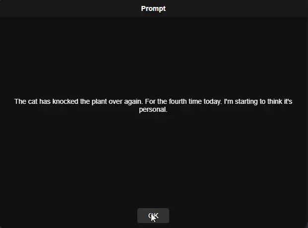

### Example 2 — Date selection with icon, header image, and custom buttons (Mr. Whiskers, Screaming Cat)

```powershell
$prompterOutput = .\OmniPrompt.exe -m "It's time for Mr. Whiskers' annual vet visit. He already knows. He is already screaming. Please pick a time before he unionizes the other cats." -d -i "Resources/omniprompt.ico" -h "Resources/screaming-cat.png" -t "Vet Appointment Scheduler (Good Luck)" -b OK Cancel "Not Sure" -e light
$prompterOutput[0]
# Will be OK, Cancel, or Not Sure
$prompterOutput[1]
# Will be a parsable datetime, e.g. 2026-07-08T09:00:00.000-04:00
[datetime]::Parse($prompterOutput[1])
# Wednesday, July 8, 2026 9:00:00 AM
```

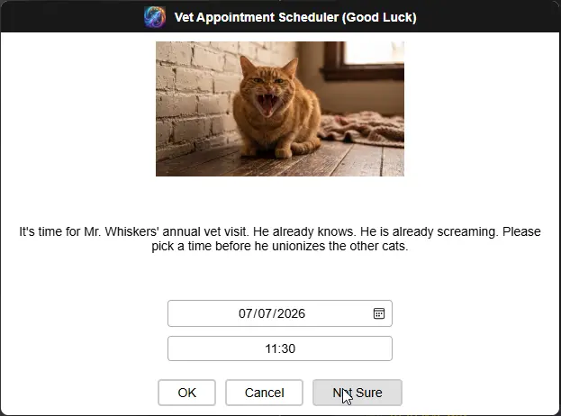

### Example 3 — Date/time range (Bean, Cute Kitten)

```powershell
$prompterOutput = .\OmniPrompt.exe -m "A ridiculously cute kitten named Bean is ready for pickup and has already claimed a cardboard box as sovereign territory. Please choose a pickup slot within the next 72 hours." -d -i "Resources/omniprompt.ico" -h "Resources/cute-kitten.png" -t "Kitten Pickup Scheduler" -b OK -e light -y 0 -z 72
# The available times to select will be within the next 0 to 72 hours from now.
$prompterOutput[0]
# Will be OK
$prompterOutput[1]
# Will be a parsable datetime, e.g. 2026-07-10T14:30:00.000-04:00
[datetime]::Parse($prompterOutput[1])
# Friday, July 10, 2026 2:30:00 PM
```

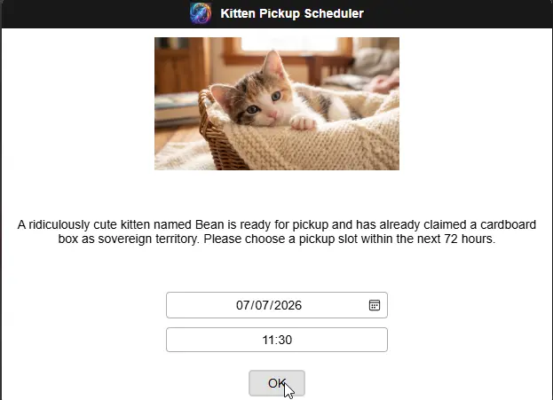

### Example 4 — Message with line breaks (Silly Cat)

```powershell
$prompterOutput = .\OmniPrompt.exe -m "Reminder:\nFeed the cat (again)\nClean the litter box (again)\nApologize to the cat for existing\nRefill the water bowl the cat will never drink from" -i "Resources/omniprompt.ico" -h "Resources/silly-cat.png" -t "Daily Cat Chores (Allegedly)" -b OK -e light
# Use \n to add a line break in the message.
$prompterOutput[0]
# Will be OK
```

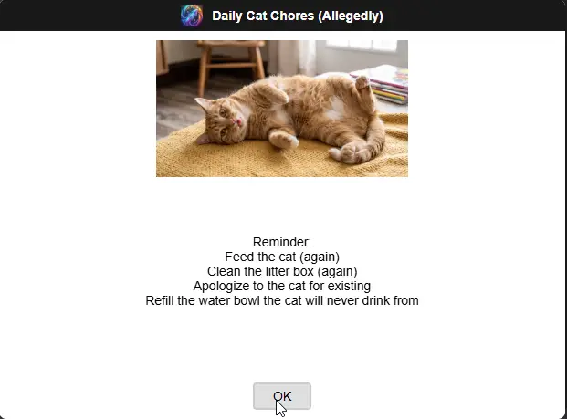

### Example 5 — HTML formatted message (Maniac Cat)

```powershell
$prompterOutput = .\OmniPrompt.exe -m "<!DOCTYPE html><html><head></head><body><p>A cat has knocked over three houseplants, unrolled an entire roll of toilet paper, and achieved what can only be described as <b>DEFCON 1 Zoomies</b>, as reported to <a href='https://www.provaltech.com'>ProValTech Cat Rescue</a>.</p><p>Please contact the incident response team below:</p><table border='1' style='margin: 0 auto;'><tr><th>Name</th><th>Email</th></tr><tr><td>Chaos Coordinator</td><td><a href='mailto:coordinator@provaltech.com'>coordinator@provaltech.com</a></td></tr></table></body></html>" -l -i "Resources/omniprompt.ico" -h "Resources/maniac-cat.png" -t "Maniac Cat Incident Report" -b OK -e Light -g 550x250
# HTML formatted message with a URL, a table (centered via style='margin: 0 auto;'), and a mailto: address.
$prompterOutput[0]
# Will be OK
```

`<table>` is a block element, so `text-align: center` on its own (which is all `#mainMessageBrowser` applies) only centers the text *inside* the table, not the table itself — add `style='margin: 0 auto;'` directly on the `<table>` tag to center the table as a whole, as shown above. `-g 550x250` also gives the paragraph and table more breathing room than the default box.

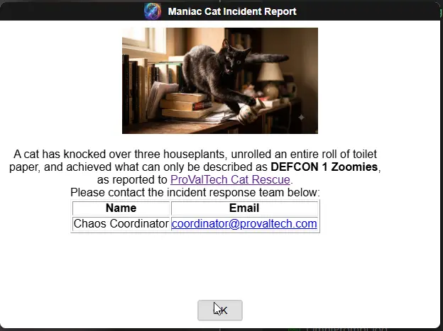

### Example 6 — Feedback prompt with user input (Cool Cat)

```powershell
$prompterOutput = .\OmniPrompt.exe -m "So... how was the whole 'being adopted by a very cool cat' experience?\nRate it 1 to 5. He's watching you type this, by the way, and he already knows which number you're going to pick." -i "Resources/omniprompt.ico" -h "Resources/cool-cat.png" -t "Adoption Feedback (No Pressure)" -b 1 2 3 4 5 -e Light -u -x "We value your feedback. Please share your thoughts in this text box."
# Enables the text box for the user's input.
$rating = $prompterOutput[0]
$feedback = if ($prompterOutput.Count -gt 1) { ($prompterOutput[1..($prompterOutput.Count - 1)] -join "`n") } else { "" }

$rating
# Will be 5
$feedback
# The cat walked in, immediately owned the place, and has not made eye contact with me since. 10/10 would adopt a cool cat again.
```

The feedback box is a multi-line text field, so its captured output can span more than one line — `$prompterOutput[0]` is always safe (the button never contains a line break), but everything from index 1 onward needs to be rejoined with `-join "`n"` rather than read as a single `$prompterOutput[1]`, or a multi-line reply gets silently truncated to just its first line. The `if ($prompterOutput.Count -gt 1)` guard also matters: if the feedback box is left untouched, OmniPrompt doesn't print anything for it at all, so `$prompterOutput` only has one element and indexing `[1]` directly would either error or (worse) silently return the wrong value.

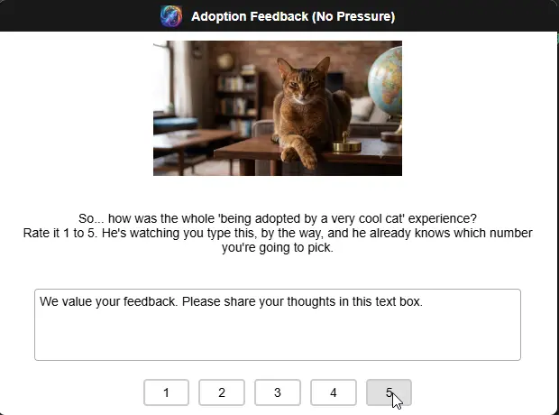

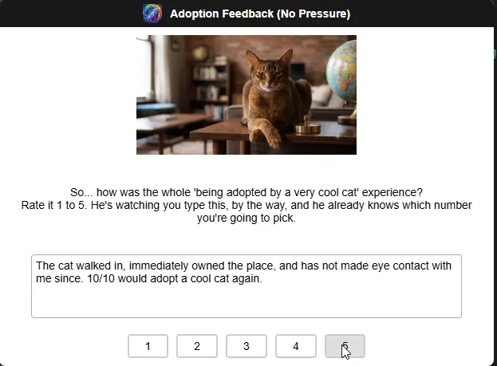

### Example 7 — Custom prompt window size (Maniac Cat, again)

```console
C:\> OmniPrompt.exe -m "The chaos has escalated. A bigger prompt window was requested by the incident response team, because apparently 640x480 isn't enough room to contain this particular cat's ambitions." -h "Resources/maniac-cat.png" -t "Maniac Cat Strikes Again" -p 1000x750 -n 18 -j 700x500
OK
```

Bigger chaos needs a bigger box — `-p` scales the whole window up from the 640x480 default.

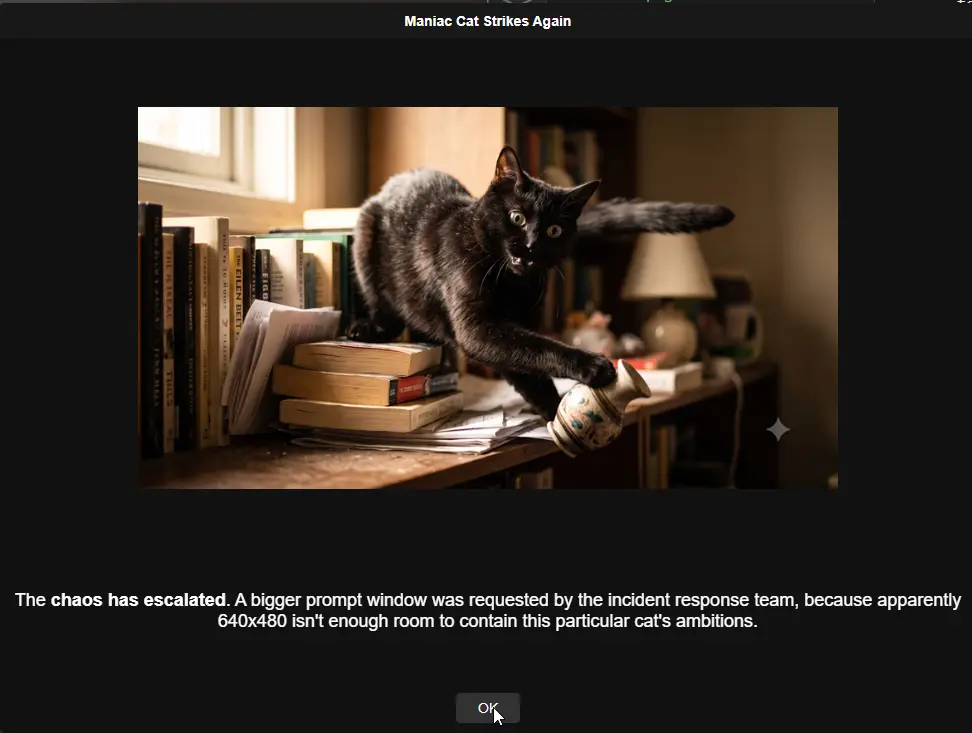

### Example 8 — Custom text box size, logo size, text size, and font (Sir Fluffington, Fluffy Cat)

```console
C:\> OmniPrompt.exe -m "Meet today's Cat of the Day, Sir Fluffington the Magnificently Fluffy. His fur has its own gravitational field. We've enlarged the logo box accordingly." -h "Resources/fluffy-cat.png" -t "Cat of the Day" -g 600x350 -j 400x250 -n 20 -f Calibri -e light
OK
```

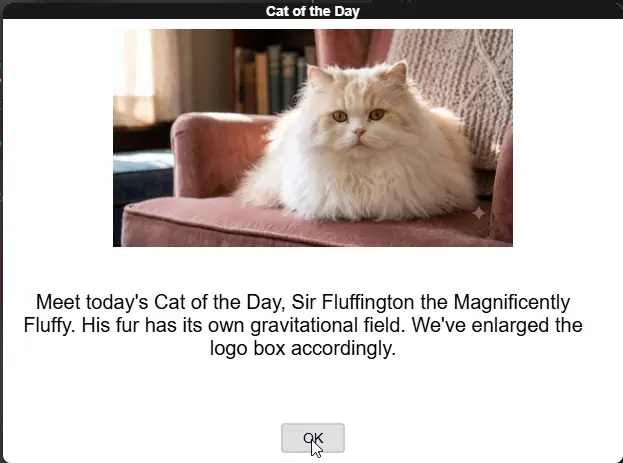

### Example 9 — Everything combined (Captain Fluffbeard, Pirate Cat)

```powershell
$prompterOutput = .\OmniPrompt.exe -m "Arrr, the adoption pickup for Captain Fluffbeard be scheduled! Confirm the date and time below, and leave any notes for the crew — er, the foster team." -d -y 0 -z 72 -u -x "Any notes for the foster team?" -i "Resources/omniprompt.ico" -h "Resources/pirate-cat.png" -t "Captain Fluffbeard's Adoption Pickup" -b Confirm Reschedule -e light -p 850x700 -g 600x150 -j 350x120 -n 16 -f "Trebuchet MS" -o 120
$button = $prompterOutput[0]
$datetime = $prompterOutput[1]
$notes = if ($prompterOutput.Count -gt 2) { ($prompterOutput[2..($prompterOutput.Count - 1)] -join "`n") } else { "" }

$button
# Will be Confirm, Reschedule, or 'Timer elapsed' after 120 seconds
$datetime
# Will be a parsable datetime, e.g. 2026-07-09T11:00:00.000-04:00
$notes
# Whatever notes were typed (can be multiple lines), or empty if left as the placeholder text
```

Like Example 6, `$notes` can legitimately span multiple lines, so it's rejoined from index 2 onward rather than read as a single `$prompterOutput[2]`.

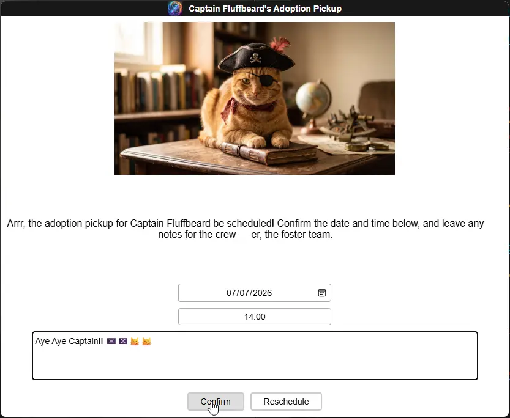

### Example 10 — 12-hour time format (Mr. Grumbles, Grumpy Cat)

```powershell
$prompterOutput = .\OmniPrompt.exe -m "It's grooming day for Mr. Grumbles. He already knows. He has already started plotting. Please pick a time and maybe wear long sleeves." -d -c -i "Resources/omniprompt.ico" -h "Resources/grumpy-cat.png" -t "Grooming Scheduler (He Will Not Enjoy This)" -b OK -e light
# -c switches the time list to 12-hour format (e.g. "02:30 PM" instead of "14:30").
$prompterOutput[0]
# Will be OK
$prompterOutput[1]
# Will be a parsable datetime, e.g. 2026-07-08T14:30:00.000-04:00
```

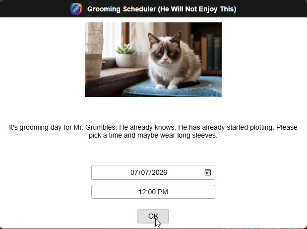

### Example 11 — Timeout with a default answer

```console
C:\> OmniPrompt.exe -m "If nobody responds to this in 30 seconds, we are legally required to assume the cat has taken over the household." -t "Cat Litter Reminder" -b "Done Now" -o 30
Timer elapsed
```

Useful for reminders you don't want blocking a script indefinitely — check the printed value for `'Timer elapsed'` to distinguish a timeout from an actual button click.

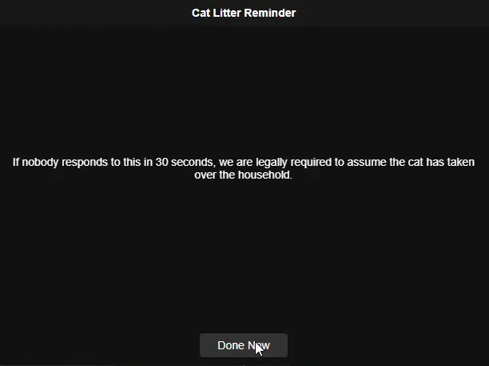

### Example 12 — Icon only, default (dark) theme

```console
C:\> OmniPrompt.exe -m "Backup completed for the cat photo archive. All 4,213 photos of the same cat sleeping in slightly different positions are safe." -i "Resources/omniprompt.ico" -t "Backup Complete"
OK
```

No `--headerimage`/`--theme` given here — this shows OmniPrompt's default look (dark theme, small icon next to the title, no header image) when only the minimum is specified.

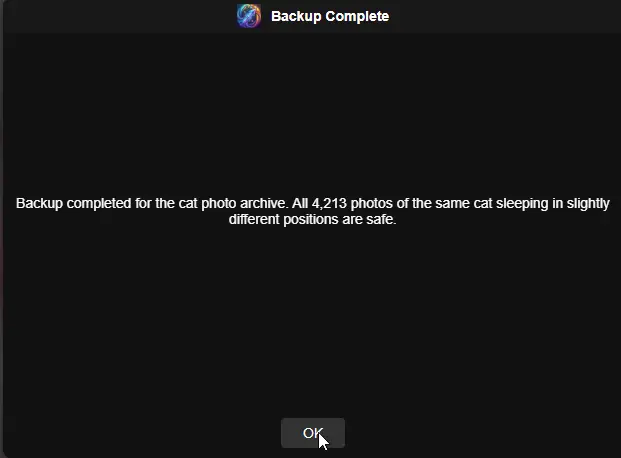

### Example 13 — Line breaks in an HTML message (Silly Cat, again)

```powershell
$prompterOutput = .\OmniPrompt.exe -m "<p><b>Reminder:</b></p><p>Feed the cat (again)</p><p>Clean the litter box (again)</p><p>Apologize to the cat for existing</p><p>Refill the water bowl the cat will never drink from</p>" -l -i "Resources/omniprompt.ico" -h "Resources/silly-cat.png" -t "Daily Cat Chores (HTML Edition, Allegedly)" -b OK -e light
# With --htmlmessage/-l set, \n is not converted — use <p> or <br> tags for line breaks instead.
$prompterOutput[0]
# Will be OK
```

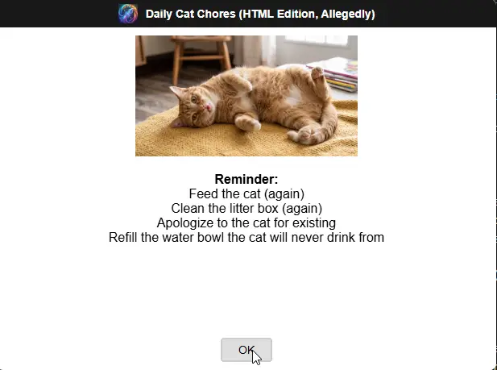

### Example 14 — Bold, italic, and underline formatting (Sir Screechalot, Screeching Cat)

```console
C:\> OmniPrompt.exe -m "**Urgent:** Sir Screechalot is *overdue* for a checkup and has been screeching about it nonstop. Please schedule this __within 48 hours__, or at least before the neighbors call animal control." -i "Resources/omniprompt.ico" -h "Resources/screeching-cat.png" -t "Cat Health Reminder (Urgent, Allegedly)" -b OK -e light -g 320x100
OK
```

`**Urgent:**` renders bold, `*overdue*` renders italic, and `__within 48 hours__` renders underlined — no `--htmlmessage`/`-l` needed for this level of formatting. The extra-cramped `-g 320x100` text box only adds to the sense of urgency.

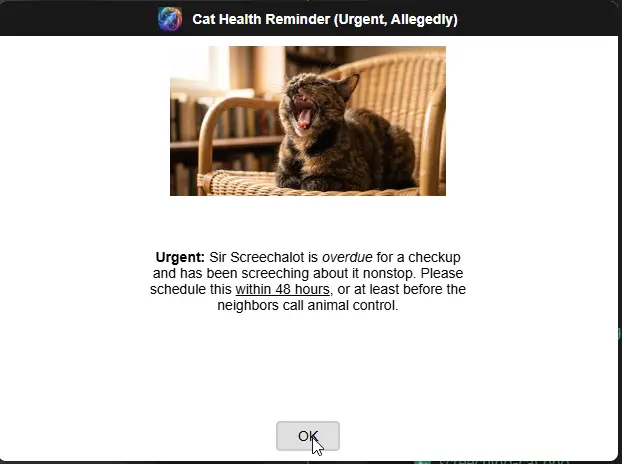

### Example 15 — The whole gang, at once (group photo)

```console
C:\> OmniPrompt.exe -m "All nine cats have been sighted in the same room at the same time. Mr. Grumbles is glaring from the armchair, Sir Fluffington is asleep two feet from the chaos, Silly Cat is hanging from the curtains for reasons unknown, Bean is attacking a ball of yarn, Maniac Cat just knocked an entire stack of books onto the floor, Captain Fluffbeard is guarding the treasure chest from the bookshelf, Sir Screechalot is mid-screech, Mr. Whiskers is mid-scream, and Cool Cat is wearing sunglasses indoors and judging everyone. This has never happened voluntarily before. Please advise." -i "Resources/omniprompt.ico" -h "Resources/cats.png" -t "Household Status Meeting (Mandatory Attendance)" -b OK "Send Help" -e dark -p 900x750 -j 800x500 -f "Times New Roman"
OK
```

`Resources/cats.png` is a single wide group photo rather than a per-cat image, so the header box is widened with `-j 800x500` (instead of the 400x150 default) to give a landscape shot room to breathe, with `-p 900x750` to grow the window to match.

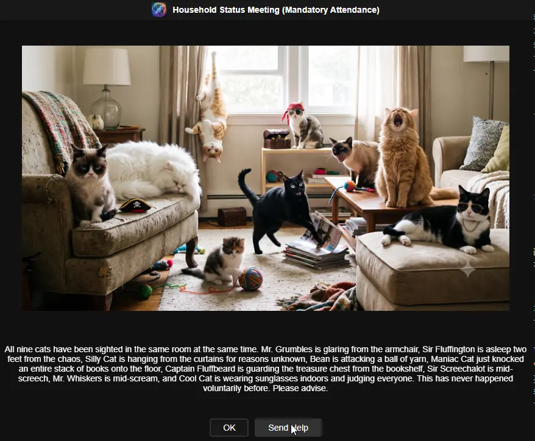

### Example 16 — Security incident (Evil Kitten)

```console
C:\> OmniPrompt.exe -m "**Warning:** An Evil Kitten has been detected attempting to reprogram the smart thermostat to 'Arctic Apocalypse' and has already disabled two smoke detectors 'for privacy reasons'. Containment is *not* guaranteed. Proceed with caution." -i "Resources/omniprompt.ico" -h "Resources/evil-kitten.png" -t "Security Incident: Evil Kitten Detected" -b Negotiate Contain Surrender -e dark -f Chiller
Contain
```

A dramatic `-f Chiller` (or any suitably melodramatic font you have installed) suits a villain origin story better than the default Arial, and the `**bold**`/`*italic*` markers from Example 14 add just the right amount of alarm.

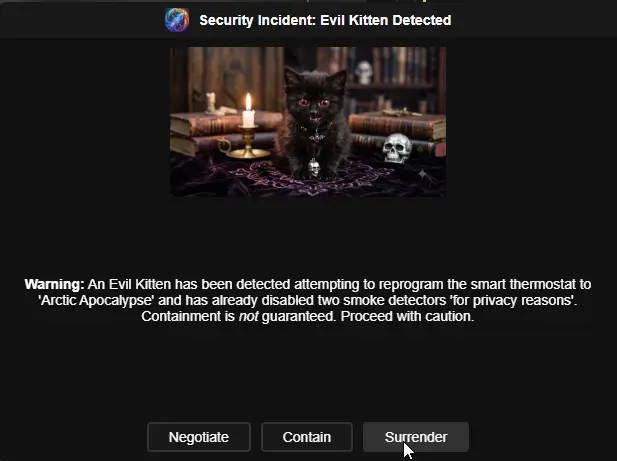

### Example 17 — Every parameter at once, HTML edition (The Whole Union)

All nine cats, demonstrating every single CLI flag OmniPrompt has in one sitting:

```powershell
$prompterOutput = .\OmniPrompt.exe `
  -t "All-Paws Household Meeting" `
  -m "<h3>Mandatory All-Paws Meeting</h3><p>All nine cats have unionized and are demanding <b>unlimited treats</b>, <i>exclusive sunbeam access</i>, and a formal apology for the vacuum cleaner incident. Please confirm a date/time for negotiations and leave any counter-demands below.</p>" `
  -l `
  -i "Resources/omniprompt.ico" `
  -h "Resources/cats.png" `
  -e dark `
  -d -y 0 -z 72 -c `
  -u -x "Type your counter-demands here..." `
  -b Comply Negotiate Run `
  -o 60 `
  -p 1020x780 `
  -g 700x300 `
  -j 800x380 `
  -n 16 `
  -f "Times New Roman" `
  -v "Times New Roman" `
  -w 14 `
  -k 120x45 `
  -r "Times New Roman" `
  -q 18 `
  -a 400x50

$button = $prompterOutput[0]
$datetime = $prompterOutput[1]
$notes = if ($prompterOutput.Count -gt 2) { ($prompterOutput[2..($prompterOutput.Count - 1)] -join "`n") } else { "" }

$button
$datetime
$notes
```

Every sizing/style flag from the Arguments table above is exercised here at the same time — useful as a one-shot smoke test after building from source, not just a real-world example. `-l` is set, so the message is genuine HTML (`<h3>`/`<b>`/`<i>`) rather than the plain-text `**bold**`/`*italic*`/`__underline__` markers, since the two formatting modes are mutually exclusive — see Example 18 for the plain-text equivalent.

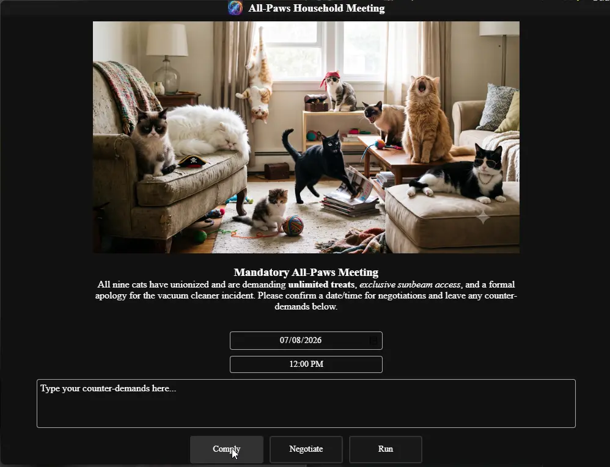

### Example 18 — Every parameter at once, plain-text edition (The Whole Union, Again)

Identical to Example 17 in every way except `-l` is dropped and the message uses `\n`/`**bold**`/`*italic*`/`__underline__` instead of HTML tags:

```powershell
$prompterOutput = .\OmniPrompt.exe `
  -t "All-Paws Household Meeting" `
  -m "Mandatory All-Paws Meeting\nThe union is demanding **unlimited treats**, *exclusive sunbeam access*, and a __formal apology__ for the vacuum cleaner incident. Please confirm a date/time for negotiations and leave any counter-demands below." `
  -i "Resources/omniprompt.ico" `
  -h "Resources/cats.png" `
  -e light `
  -d -y 0 -z 72 -c `
  -u -x "Type your counter-demands here..." `
  -b Comply Negotiate Run `
  -o 60 `
  -p 1020x780 `
  -g 800x200 `
  -j 800x400 `
  -n 16 `
  -f "Times New Roman" `
  -v Georgia `
  -w 14 `
  -k 120x45 `
  -r "Courier New" `
  -q 18 `
  -a 400x50

$button = $prompterOutput[0]
$datetime = $prompterOutput[1]
$notes = if ($prompterOutput.Count -gt 2) { ($prompterOutput[2..($prompterOutput.Count - 1)] -join "`n") } else { "" }

$button
$datetime
$notes
```

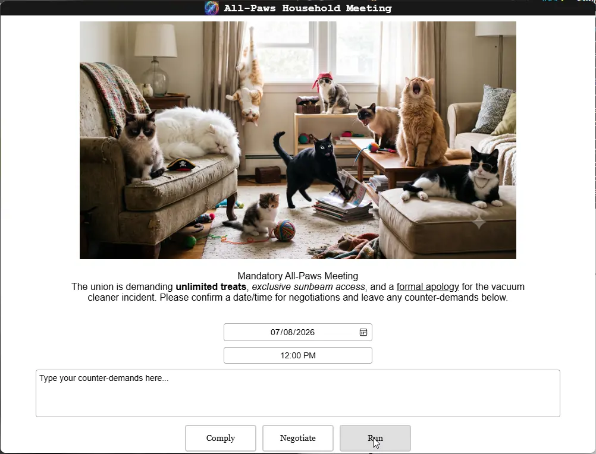

## macOS Examples

The examples above use PowerShell/`cmd`, but OmniPrompt runs the same way on macOS. A few differences to note:

* Run the binary inside the app bundle directly from Terminal (double-clicking the `.app` in Finder won't give you a console to read the output from): `./OmniPrompt.app/Contents/MacOS/OmniPrompt`.
* The first time you run an unsigned/unnotarized build, macOS Gatekeeper may block it — allow it via **System Settings > Privacy & Security > Open Anyway**.
* Local image paths work the same as the ones already used above (e.g. `Resources/omniprompt.ico`, `Resources/grumpy-cat.png`); use an absolute path (e.g. `/Users/yourname/Pictures/cat.png`) if the image isn't relative to where you're running the command from.
* Since bash/zsh don't have PowerShell's `$array[index]` output capture, the examples below split OmniPrompt's stdout by line instead.

### macOS Example 1 — Basic message

```console
$ ./OmniPrompt.app/Contents/MacOS/OmniPrompt -m "The cat has knocked the plant over again. For the fourth time today. I'm starting to think it's personal."
OK
```

### macOS Example 2 — Date selection with icon, header image, and custom buttons (Mr. Whiskers, Screaming Cat)

```bash
output=$(./OmniPrompt.app/Contents/MacOS/OmniPrompt -m "It's time for Mr. Whiskers' annual vet visit. He already knows. He is already screaming. Please pick a time before he unionizes the other cats." -d -i "Resources/omniprompt.ico" -h "Resources/screaming-cat.png" -t "Vet Appointment Scheduler (Good Luck)" -b OK Cancel "Not Sure" -e light)
button=$(echo "$output" | sed -n '1p')
datetime=$(echo "$output" | sed -n '2p')

echo "$button"
# Will be OK, Cancel, or Not Sure
echo "$datetime"
# Will be a parsable datetime, e.g. 2026-07-08T09:00:00.000-04:00
date -jf "%Y-%m-%dT%H:%M:%S" "${datetime%%.*}" "+%A, %B %e, %Y %I:%M:%S %p"
# Wednesday, July 8, 2026 09:00:00 AM
```

### macOS Example 3 — HTML formatted message with line breaks (Silly Cat)

```bash
output=$(./OmniPrompt.app/Contents/MacOS/OmniPrompt -m "<p><b>Reminder:</b></p><p>Feed the cat (again)</p><p>Clean the litter box (again)</p><p>Apologize to the cat for existing</p><p>Refill the water bowl the cat will never drink from</p>" -l -i "Resources/omniprompt.ico" -h "Resources/silly-cat.png" -t "Daily Cat Chores (HTML Edition, Allegedly)" -b OK -e light)
echo "$output"
# Will be OK
```

### macOS Example 4 — Feedback prompt with user input (Cool Cat)

```bash
output=$(./OmniPrompt.app/Contents/MacOS/OmniPrompt -m "So... how was the whole 'being adopted by a very cool cat' experience?\nRate it 1 to 5. He's watching you type this, by the way, and he already knows which number you're going to pick." -i "Resources/omniprompt.ico" -h "Resources/cool-cat.png" -t "Adoption Feedback (No Pressure)" -b 1 2 3 4 5 -e Light -u -x "We value your feedback. Please share your thoughts in this text box.")
rating=$(echo "$output" | sed -n '1p')
feedback=$(echo "$output" | sed -n '2,$p')

echo "$rating"
# Will be 5
echo "$feedback"
# The cat walked in, immediately owned the place, and has not made eye contact with me since. 10/10 would adopt a cool cat again.
```

The feedback box is multi-line, so `sed -n '2,$p'` (line 2 through the end of output) is used instead of `sed -n '2p'` (line 2 only) — otherwise a multi-line reply gets truncated to just its first line. If the box is left untouched, OmniPrompt doesn't print a feedback line at all, and `sed -n '2,$p'` correctly returns nothing rather than erroring.

### macOS Example 5 — Custom sizing/style with a date range (Captain Fluffbeard, Pirate Cat)

```bash
output=$(./OmniPrompt.app/Contents/MacOS/OmniPrompt -m "Arrr, the adoption pickup for Captain Fluffbeard be scheduled! Confirm the date and time below, and leave any notes for the crew — er, the foster team." -d -y 0 -z 72 -u -x "Any notes for the foster team?" -i "Resources/omniprompt.ico" -h "Resources/pirate-cat.png" -t "Captain Fluffbeard's Adoption Pickup" -b Confirm Reschedule -e light -p 850x700 -g 600x150 -j 350x120 -n 16 -f "Trebuchet MS" -o 120)
button=$(echo "$output" | sed -n '1p')
datetime=$(echo "$output" | sed -n '2p')
notes=$(echo "$output" | sed -n '3,$p')

echo "$button"
# Will be Confirm, Reschedule, or 'Timer elapsed' after 120 seconds
echo "$datetime"
# Will be a parsable datetime, e.g. 2026-07-09T11:00:00.000-04:00
echo "$notes"
# Whatever notes were typed (can be multiple lines), or empty if left as the placeholder text
```

Like macOS Example 4, `notes` is captured from line 3 to the end (`3,$p`) rather than line 3 only, since it can span multiple lines.

### macOS Example 6 — The whole gang, at once (group photo)

```console
$ ./OmniPrompt.app/Contents/MacOS/OmniPrompt -m "All nine cats have been sighted in the same room at the same time. Mr. Grumbles is glaring from the armchair, Sir Fluffington is asleep two feet from the chaos, Silly Cat is hanging from the curtains for reasons unknown, Bean is attacking a ball of yarn, Maniac Cat just knocked an entire stack of books onto the floor, Captain Fluffbeard is guarding the treasure chest from the bookshelf, Sir Screechalot is mid-screech, Mr. Whiskers is mid-scream, and Cool Cat is wearing sunglasses indoors and judging everyone. This has never happened voluntarily before. Please advise." -i "Resources/omniprompt.ico" -h "Resources/cats.png" -t "Household Status Meeting (Mandatory Attendance)" -b OK "Send Help" -e dark -p 900x750 -j 800x500 -f "Times New Roman"
OK
```

## Acknowledgments

* [Wails](https://wails.io) — the Go + web frontend toolkit this app is built on
* [go-flags](https://github.com/jessevdk/go-flags) — command-line argument parsing
* [FlatIcon](https://www.flaticon.com) — original Prompter icon assets

## Changelog

### 2026-07-07

- Initial version of the document
