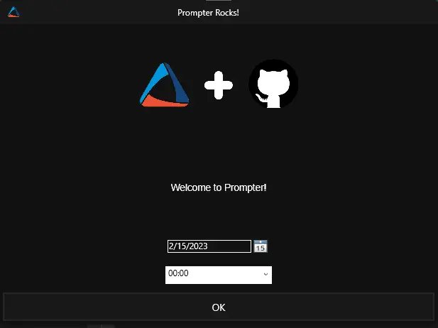
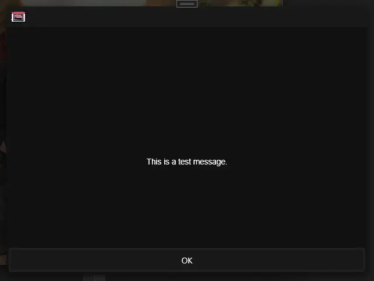
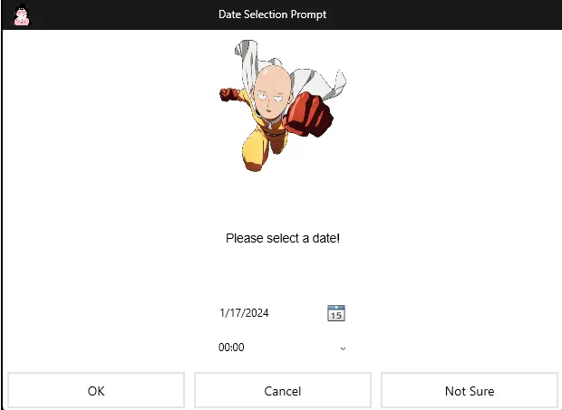
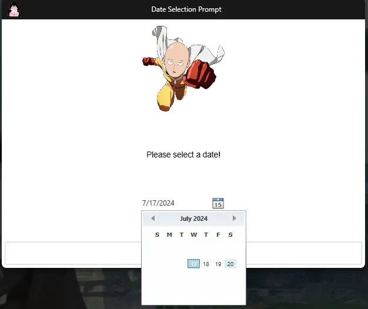
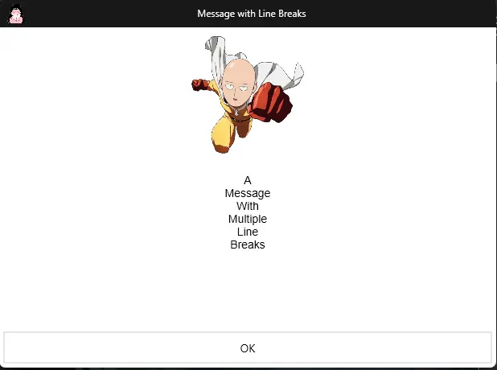
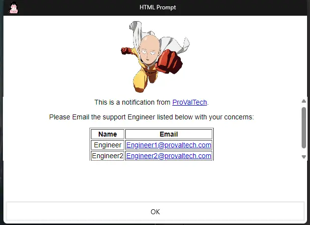
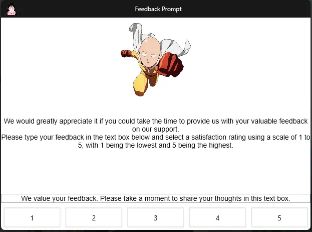
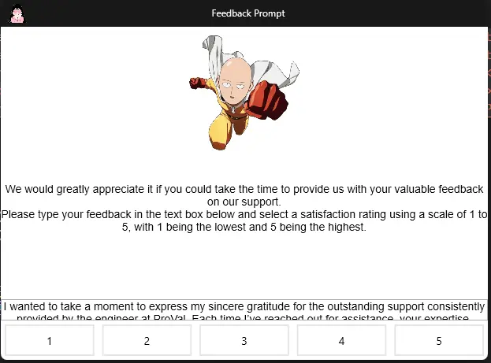

<br />
<div align="center">
  <a href="https://content.provaltech.com/docs/aba254a9-e917-481d-9152-ecb6e990d98c">
    
  </a>

<h3 align="center">Prompter</h3>

  <p align="center">
    Display a prompt on the desktop!
  </p>
</div>

## About

<div align="center">

</div>

Prompter is a simple application designed to present a prompt on the desktop and optionally display a date and time picker. It supports any number of buttons, as well as optional header images and custom application icons.

### Built With

* [.NET 8.0](https://dotnet.microsoft.com/en-us/download/dotnet/8.0)

## Getting Started

Install the .NET Desktop Runtime 8.0 and then simply download and run Prompter.exe to get started.

### Prerequisites

* .NET 8.0 Desktop Runtime

  ```shell
  winget install Microsoft.DotNet.DesktopRuntime.8
  ```

  or

  ```powershell
  Set-ExecutionPolicy Bypass -Scope Process -Force
  [System.Net.ServicePointManager]::SecurityProtocol = [System.Net.ServicePointManager]::SecurityProtocol -bor 3072
  iex ((New-Object System.Net.WebClient).DownloadString('https://community.chocolatey.org/install.ps1'))
  & "$env:ALLUSERSPROFILE\chocolatey\bin\choco.exe" "install" "dotnet-8.0-desktopruntime"
  ```

## Usage

Prompter is meant to be launched from a command prompt and returns one to two values:

  1. The name of the button that was pressed, or 'Timer elapsed' if a timeout was specified and it elapsed.
  2. (Optional) The date and time that was selected by the user.

### Arguments

| Long Name            | Short Name | Example                       | Description                                                                                                                      |
| -------------------- | ---------- | ----------------------------- | ---------------------------------------------------------------------------------------------------------------------------------|
| `--title`            | `-t`       | "My Prompt Title"             | The title of the window.                                                                                                         |
| `--message`          | `-m`       | "You should reboot!"          | The message to display in the prompt. Use `\n` to add a new line to the message. `--htmlmessage` or `-l` parameter should be used with the HTML formatted messages.|
| `--icon`             | `-i`       | "https://site.com/icon.png"   | Path (Local or URL) to an image to display in the taskbar.                                                                       |
| `--headerimage`      | `-h`       | "https://site.com/header.png" | Path (Local or URL) to an image to display in the header of the prompt.                                                          |
| `--theme`            | `-e`       | light                         | The theme to use for the prompt (dark, light). Will use the Windows default theme if not specified.                              |
| `--datetimeselector` | `-d`       | N/A                           | Enable the date/time selector which will pass back an additional output to the console.                                          |
| `--buttontypes`      | `-b`       | OK Cancel "Do Something"      | A space separated list of strings to display as buttons on the prompt. Defaults to "OK".                                         |
| `--timeout`          | `-o`       | 60                            | The number of seconds to wait for input before closing the window. Will return 'Timer elapsed' on timeout.                       |
| `--twelvehour`       | `-c`       | N/A                           | Make the time display in 12-hour time instead of 24-hour time.                                                                   |
| `--datetimefromhours`| `-y`       | 0                             | The number of hours to add to the current time in order to set the starting point for the Date/Time selector.                    |
| `--datetimetohours`  | `-z`       | 48                            | The number of hours to add to the initial time in the Date/Time selector in order to display the last available option to select.|
| `--htmlmessage`      | `-l`       | N/A                           | Set this to true to enable to enable the HTML Decoding of the Message.                                                           |
| `--userinput`        | `-u`       | N/A                           | Set this to true to enable the user input field.                                                                                 |
| `--userinputtext`    | `-x`       | N/A                           | Set initial/help text for the user input field.                                                                                  |

### Examples

#### Example 1

```console
C:\> Prompter.exe -m "This is a test message"
OK
```



#### Example 2

```powershell
$prompterOutput = .\Prompter.exe -m "Please select a date!" -d -i "https://clipartcraft.com/images/anime-transparent-aesthetic-2.png" -h "https://www.pngmart.com/files/13/One-Punch-Man-Saitama-PNG-Picture.png" -t "Date Selection Prompt" -b OK Cancel "Not Sure" -e light
$prompterOutput[0]
# Will be OK, Cancel, or Not Sure
$prompterOutput[1]
# Will be a parsable datetime i.e. 2022-06-27T00:00:00.0000000-04:00
[datetime]::Parse($prompterOutput[1])
# Monday, June 27, 2022 12:00:00 AM
```



#### Example 3

```powershell
$prompterOutput = .\Prompter.exe -m "Please select a date!" -d -i "https://clipartcraft.com/images/anime-transparent-aesthetic-2.png" -h "https://www.pngmart.com/files/13/One-Punch-Man-Saitama-PNG-Picture.png" -t "Date Selection Prompt" -b OK -e light -y 0 -z 72
#The available dates to select will be within the next 0 to 72 hours, with the default date being the current date and time.
$prompterOutput[0]
# Will be OK
$prompterOutput[1]
# Will be a parsable datetime i.e. 2024-07-19T00:00:00.0000000-04:00
[datetime]::Parse($prompterOutput[1])
# Friday, July 19, 2024 12:00:00 AM
```



#### Example 4

```powershell
$prompterOutput = .\Prompter.exe -m "A\nMessage\nWith\nMultiple\nLine\nBreaks" -i "https://clipartcraft.com/images/anime-transparent-aesthetic-2.png" -h "https://www.pngmart.com/files/13/One-Punch-Man-Saitama-PNG-Picture.png" -t "Message with Line Breaks" -b OK -e light
#Use \n to add a line break in the message.
$prompterOutput[0]
# Will be OK

```



#### Example 5

```powershell
$prompterOutput = .\Prompter.exe -m "<!DOCTYPE html><html><head></head><body><p>This is a notification from <a href='https://www.provaltech.com'>ProValTech</a>.</p><p>Please Email the support Engineer listed below with your concerns:</p><table border='1'><tr><th>Name</th><th>Email</th></tr><tr><td>Engineer</td><td><a href='mailto:Engineer1@provaltech.com'>Engineer1@provaltech.com</a></td></tr><tr><td>Engineer2</td><td><a href='mailto:Engineer2@provaltech.com'>Engineer2@provaltech.com</a></td></tr></table></body></html>" -l -i "https://clipartcraft.com/images/anime-transparent-aesthetic-2.png" -h "https://www.pngmart.com/files/13/One-Punch-Man-Saitama-PNG-Picture.png" -t "HTML Prompt" -b OK -e Light
#HTML Formatted message with an URL, a Table, and mailto: addresses.
$prompterOutput[0]
# Will be OK

```



#### Example 6

```powershell
$prompterOutput = .\Prompter.exe -m "We would greatly appreciate it if you could take the time to provide us with your valuable feedback on our support.\nPlease type your feedback in the text box below and select a satisfaction rating using a scale of 1 to 5, with 1 being the lowest and 5 being the highest." -i "https://clipartcraft.com/images/anime-transparent-aesthetic-2.png" -h "https://www.pngmart.com/files/13/One-Punch-Man-Saitama-PNG-Picture.png" -t "Feedback Prompt" -b 1 2 3 4 5 -e Light -u -x "We value your feedback. Please take a moment to share your thoughts in this text box."
#Enables the Text Box for the user's input.
$prompterOutput[0]
# Will be 5
$PrompterOutput[1]
#I wanted to take a moment to express my sincere gratitude for the outstanding support consistently provided by the engineer at ProVal. Each time I've reached out for assistance, your expertise, professionalism, and dedication have been remarkable. Your swift responses and thorough solutions have not only resolved my issues efficiently but have also greatly enhanced my understanding of the systems. Your unwavering commitment to delivering top-notch service is truly commendable and makes a significant difference in our operations. Thank you for always going above and beyond to ensure our success.
```





## Acknowledgments

* [FlatIcon](https://www.flaticon.com)
* [CommandlineParser](https://github.com/commandlineparser/commandline)