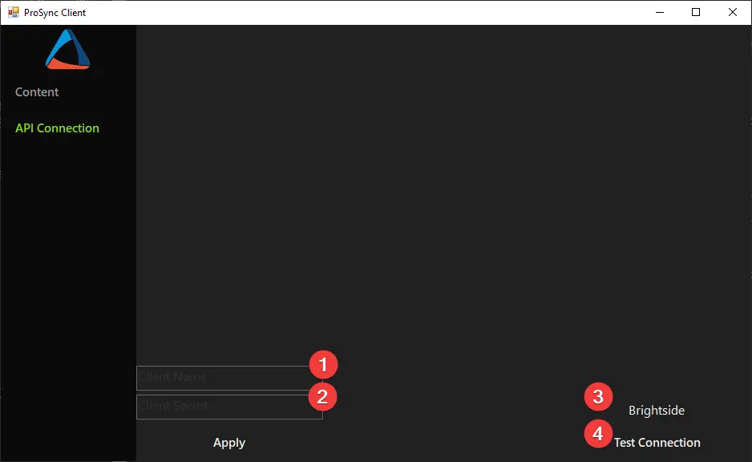
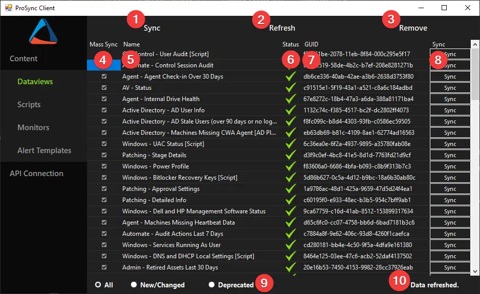

## Overview

The **ProSync Client** is a ConnectWise Automate plugin designed to connect to a centrally managed Automate instance via REST API calls. The plugin will download and synchronize content from the central instance to the installed instance. Developed by [ProVal Tech](https://www.provaltech.com/), the plugin is written in [C#](https://docs.microsoft.com/en-us/dotnet/csharp/) and is a piece of the ProSync solution, along with the [ProSync Server](/docs/0fb32d9c-c3a1-4c97-a93d-1e167f46b0fb) and the `ProSync API`.

## Installation

To install the **ProSync Client** plugin, first download the latest DLL binary from this [Link](https://file.provaltech.com/repo/app/ProSyncClient.dll). Once you have the `ProSyncClient.dll` downloaded, use the following steps to perform the initial setup of the plugin:

1. Open the **ConnectWise Automate Control Center** and navigate to **System > Solutions > Plugin Manager**.
2. In the top left corner, click **Advanced > Manage Plugins > Add Plugin**.
3. In the File Dialog, select the downloaded `ProSyncClient.dll` and click **OK**.
4. When prompted to restart the **DB Agent**, click **Yes**.
5. After the DB Agent completes the restart, close and reopen the **Automate Control Center**.
6. Open the **ProSync Client** menu by navigating to **Tools > ProSync Client**.

## Usage

The **ProSync Client** is *currently* separated into two sections, **Content** and **API Connection**. If you have just installed the plugin, then you will want to start by entering the **API Connection** information.

### API Connection

The **API Connection** section is where you will enter the **Client Name** and **Secret** for the **ProSync Client** to connect to the `ProSync API`. Refer to the documentation for the [ProSync Server](/docs/0fb32d9c-c3a1-4c97-a93d-1e167f46b0fb) on creating API Clients. No other functions will be available in the **ProSync Client** without valid API connection information.

1. **Client Name** - Enter the API client name here.
2. **Client Secret** - Enter the API client secret here.
    - Once the Name and Secret are filled in, click **Apply** to save the credentials into the ProSync Client API table for future authentication.
3. **Client Name Label** - Shows the currently configured client name in the API table.
4. **Test Connection Button** - Uses the currently configured API credentials to test the connection to the `ProSync API`. Presents a pop-up window with the results.

### Content

The **Content** section of the **ProSync Client** is where content can be synced into or removed from the client Automate instance.

1. **Mass Sync Button** - Syncs all content of the selected type. Items with the **Mass Sync** checkbox unchecked are excluded. Items with **Global** or **Ticket** tags are excluded.
2. **Refresh Button** - Refreshes the data in the content table.
3. **Remove Button** - Removes ***ALL*** content of the selected type from the Automate instance.
4. **Mass Sync Checkbox** - If checked, the item will be included in the synchronization process when clicking the **Mass Sync Button**.
5. **Name** - The name of the content piece.
6. **Status Icon** - The current synchronization status of the content piece.
    -  **Up To Date** - The content is the latest version available from the API.
    -  **Update Available** - The content has an updated version from the API.
    -  **Deprecated** - The content has been removed from the API.
    -  **Not Installed** - The content has not been synchronized from the API. All content will show as Not Installed upon first installation of the plugin, regardless of previous manual imports. Running a Mass Sync will update the icons after completing.
7. **GUID** - The GUID of the content piece. This will be a consistent GUID between the client and the server.
8. **Sync Button** - Used to sync a single piece of content. <u>***This ignores the Mass Sync status***</u> and will remove content from the client Automate server if it is deprecated.
9. **Filter Radio Buttons** - Filters the list based on status of the content. Note that this does not filter the targets for the **Mass Sync Button** or the **Remove Button**. These buttons will still target all available content of the selected type.
10. **Status Label** - Will show the last action taken and a loading spinner while an action is in progress.