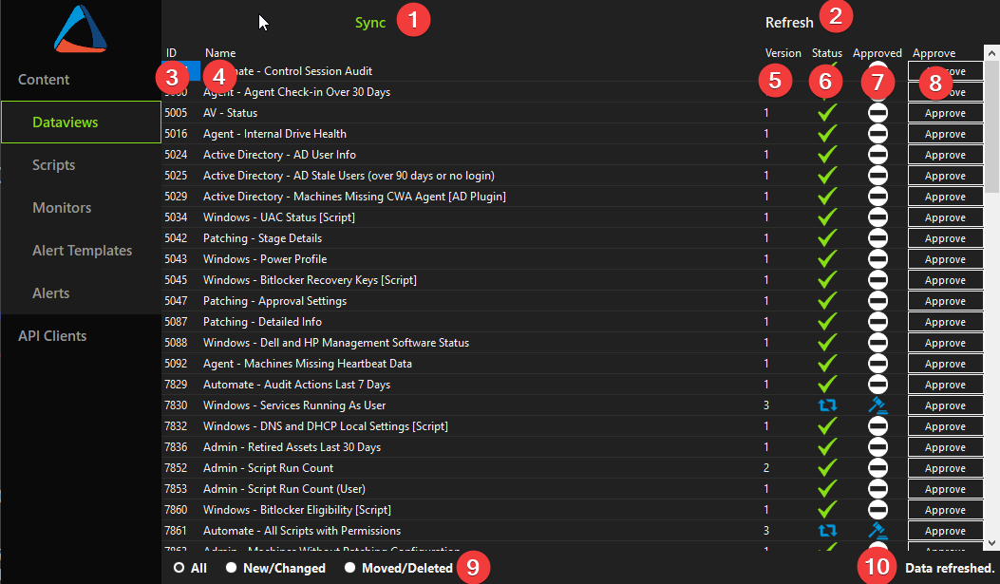

## Overview

The **ProSync Server** application (named "ProSync" in the ConnectWise Automate Plugin Manager) is a plugin designed to manage and distribute content across multiple instances of ConnectWise Automate from a central location. Developed by [ProVal Tech](https://www.provaltech.com/), the plugin is written in [C#](https://docs.microsoft.com/en-us/dotnet/csharp/) and is a piece of the ProSync solution, along with the [ProSync Client](/docs/611894b8-9984-4e1e-a061-2753bcf65b28) and the `ProSync API`.

## Usage

The ProSync Server is *currently* separated into two sections, **Content** and **API Clients**.

### Content

The **Content** section of the **ProSync Server** plugin is where you will be reviewing changes, approving new and changed content, and syncing that approved content to the tables which will be read by the `ProSync API`. Clicking the **Content** button on the sidebar will give you a dropdown of the different types of content to review. Clicking on a particular type of content will populate the display panel on the right with a table of all applicable content of that type.

*Figure 1 - ProSync Server Content View*

1. **Sync Button** - Synchronizes all approved changes and removals for the selected content type to the production tables for the `ProSync API` to read. Note that this also occurs on a 7-minute interval via the `ISync2` interface in the plugin.
2. **Refresh Button** - Refreshes the current view with the latest content changes for the selected content type.
3. **ID** - The unique ID of the content.
4. **Name** - The name of the content.
5. **Version** - The latest **approved** version of the content.
6. **Status** - The current change status of the content. The possible statuses of the content are:

    -  **Unchanged** - The content has not been changed or removed from the Automate instance.
    -  **Changed** - The content is new or has been changed.
    -  **Moved or Deleted** - The content was moved or deleted.

7. **Approved** - Denotes the current approval status of the content. The possible statuses of the content are:

    -  **No Action Needed** - The content is unchanged and does not need approval.
    -  **Needs Approval** - The content has been added, changed, or deleted and requires review and approval.
    -  **Change Approved** - The new or changed content has been approved for synchronization.
    -  **Move/Delete Approved** - The content has been moved or deleted and approved to be removed from the synchronization list.

8. **Approve Button** - Approves the add, change, or delete of the current content. Has no effect if the content is currently unchanged.
9. **Filter** - Changes the view of the content to show **All**, only **New or Changed**, or only **Moved or Deleted** content.
10. **Status** - Shows information about the most recent command executed.

### API Clients

The **API Clients** section of the plugin is where you can add and remove API access for specific members.

*Figure 2 - ProSync Server API Clients View*

1. **Client Addition Section** - Enter a **Client Name**, **Client Secret**, and **confirm the secret**. Then, click the **Add** button to create an API member for the [ProSync Client](/docs/611894b8-9984-4e1e-a061-2753bcf65b28) to use as authentication with the `ProSync API`.
2. **Client List** - Shows the current list of clients available to authenticate with the API.
3. **Delete Button** - Select a client in the **Client List** and click the **Delete** button to remove that member's access to the API, preventing further synchronization of content.
