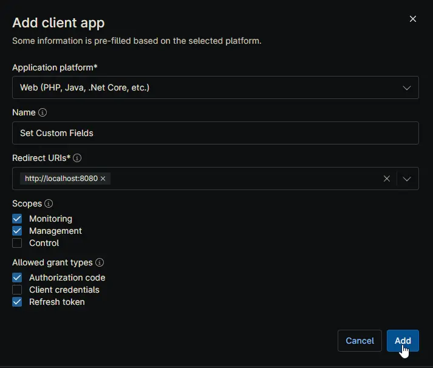
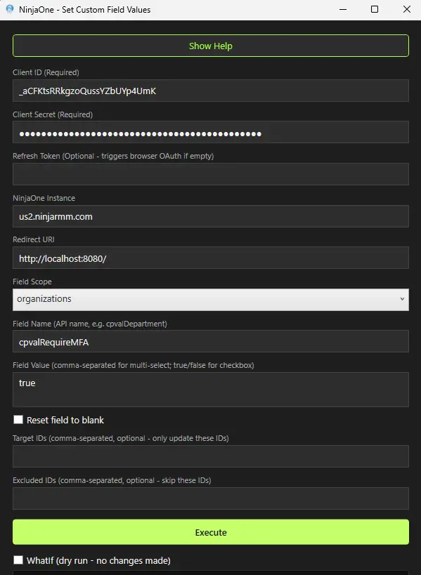
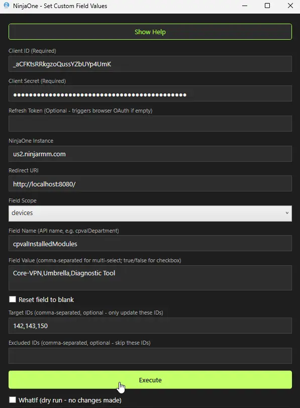
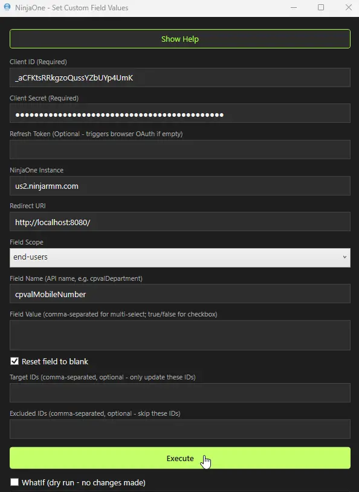
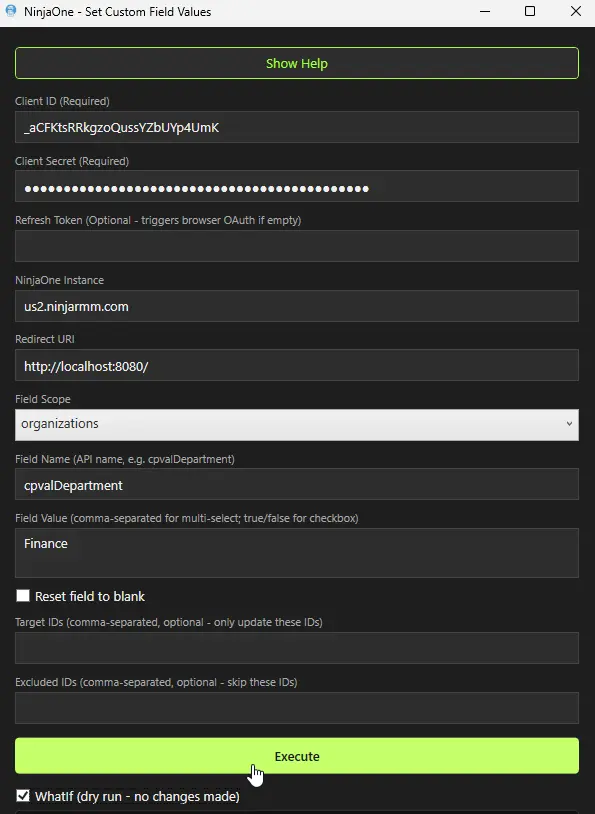

 

  
    <h3 align="center">NinjaOne - Set Custom Field Values</h3>
    

        Bulk-update NinjaOne custom fields with a simple Windows GUI.
    

## About

    

NinjaOne - Set Custom Field Values is an end-user friendly Windows tool that helps you update custom fields in bulk through the NinjaOne Public API.

It is designed to reduce manual effort and avoid data formatting mistakes. You choose a scope (Organizations, Devices, Locations, or End-Users), provide a field name/value, and the tool handles the API workflow.

The app includes smart value conversion so you can enter readable values while the tool sends the correct API format:

- Dropdown values are resolved from display names to option GUIDs.
- Multi-select values are resolved from comma-separated display names to GUID arrays.
- Checkbox values are converted from `true`/`false` text to boolean values.
- Numeric/decimal values are converted to number types.
- Reset mode can clear fields to blank.

### Built With

- PowerShell 5.1+
- Windows Presentation Foundation (WPF)
- [PS2EXE](https://github.com/MScholtes/PS2EXE) for executable packaging

## Getting Started

Download the pre-compiled [SetNinjaOneCustomField.exe](https://contentrepo.net/repo/app/SetNinjaOneCustomField.exe) and run it. No installation is required.

### Prerequisites

- Windows device with PowerShell 5.1 or later
- NinjaOne API application with:
  - Client ID
  - Client Secret
  - Redirect URI matching this tool

### NinjaOne API App Configuration

Before using the tool, create an API application in NinjaOne:

1. Sign in to NinjaOne as an administrator.
2. Go to **Administration** > **Apps** > **API**.
3. Select **Add Client App**.
4. Configure the app:
     - **Application Platform:** `Web (PHP, Java, .NetCore, etc.)`
     - **Name:** `Set Custom Fields` (or any preferred name)
     - **Redirect URI:** `http://localhost:8080/`
     - **Scopes:** `Monitoring`, `Management`
     - **Grant Type:** `Authorization Code`, `Refresh Token`
5. Save the app and copy the **Client ID** and **Client Secret**.

> Important: The Redirect URI in NinjaOne must exactly match the Redirect URI entered in this tool.

### Sample API Config

## Usage

1. Open the application.
2. If you need instructions, click **Show Help** to view the built-in help guide.
3. Enter your API and field details.
4. Click **Execute**.
5. Review progress and results in the built-in console.

If **Refresh Token** is blank, the tool starts an interactive browser sign-in flow and automatically captures the callback.

### Application Fields and Options

| Field Name | Required | Description |
| --- | --- | --- |
| **Client ID** | Yes | OAuth Client ID from your NinjaOne API app. |
| **Client Secret** | Yes | OAuth Client Secret from your NinjaOne API app. |
| **Refresh Token** | No | Existing refresh token. If omitted, the tool starts browser-based OAuth and retrieves one interactively. |
| **NinjaOne Instance** | Yes | NinjaOne host name, for example `us2.ninjarmm.com`, `eu.ninjarmm.com`, `app.ninjarmm.com`, or your branded tenant URL. |
| **Redirect URI** | Yes | Local callback URL for OAuth, default is `http://localhost:8080/`. Must match your NinjaOne app setting. |
| **Field Scope** | Yes | Where the field exists: `organizations`, `devices`, `locations`, or `end-users`. |
| **Field Name** | Yes | API field name, for example `cpvalDepartment`. |
| **Field Value** | Conditional | <ul><li>Required unless <strong>Reset field to blank</strong> is checked.</li><li>For dropdown fields, enter the option display name.</li><li>For multi-select fields, enter comma-separated display names.</li><li>For checkbox fields, enter <code>true</code> or <code>false</code>.</li><li>For text fields, enter plain text.</li></ul> |
| **Reset field to blank** | No | Clears the field value instead of setting a new value. |
| **Target IDs** | No | Comma-separated object IDs to update only specific items. |
| **Excluded IDs** | No | Comma-separated object IDs to skip. Ignored when Target IDs are provided. |
| **WhatIf (dry run)** | No | Simulates updates and reports what would change, without writing data. |

## Field Type Behavior

The tool automatically checks the custom field definition and handles values correctly:

- `DROPDOWN`: display name -> option GUID
- `MULTI_SELECT`: comma-separated display names -> GUID array
- `CHECKBOX`: `true`/`false` text -> boolean
- `TEXT_MULTILINE`: kept as-is
- `NUMERIC`/`DECIMAL`: converted to numeric values
- Other field types: sent as string values

## Examples

### Example 1: Set a checkbox for all organizations

- **Field Scope:** `organizations`
- **Field Name:** `cpvalRequireMFA`
- **Field Value:** `true`
- **Result:** Updates the checkbox to true across all organizations.

### Example 2: Update a multi-select field on specific devices

- **Field Scope:** `devices`
- **Field Name:** `cpvalInstalledModules`
- **Field Value:** `Core-VPN,Umbrella,Diagnostic Tool`
- **Target IDs:** `142,143,150`
- **Result:** Resolves display names to GUIDs and updates only those device IDs.

### Example 3: Clear a field for all end-users

- **Field Scope:** `end-users`
- **Field Name:** `cpvalMobileNumber`
- **Reset field to blank:** Checked
- **Result:** Clears the selected field value for all end-users.

### Example 4: Dry run before production update

- **Field Scope:** `organizations`
- **Field Name:** `cpvalDepartment`
- **Field Value:** `Finance`
- **WhatIf (dry run):** Checked
- **Result:** Shows expected changes in the console without applying them.

## Troubleshooting

- **Client ID or Client Secret error**
  - Verify values were copied correctly from NinjaOne API app settings.
- **OAuth callback/redirect problems**
  - Confirm Redirect URI matches exactly in both NinjaOne and the tool.
  - Ensure local port `8080` is not blocked by another process.
- **Field not found**
  - Confirm you entered the API field name, not the display label.
- **Dropdown or multi-select value fails**
  - Use exact option display names configured in NinjaOne.
- **No changes applied**
  - Check Target IDs and Excluded IDs filters.
  - Confirm WhatIf mode is not enabled.

## Security Notes

- Keep Client Secret and Refresh Token private.
- Use least-privilege API scopes where possible.
- Run tests in WhatIf mode before broad production changes.

## Notes

- This tool is intended for interactive desktop use.
- The GUI keeps the interface responsive while API actions run in the background.
- Use dry run mode whenever possible before large-scale updates.

## Changelog

### 2026-05-27

- Initial version of the document
