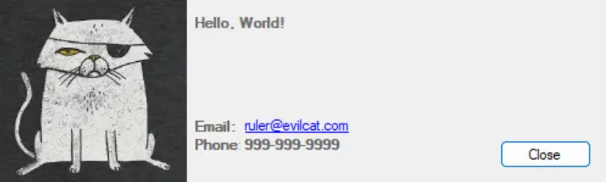
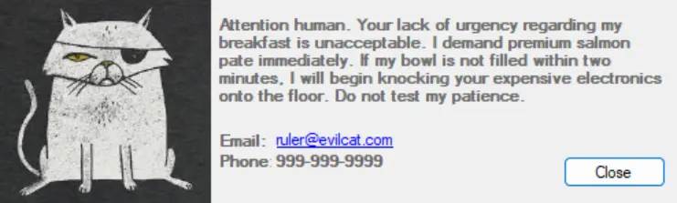
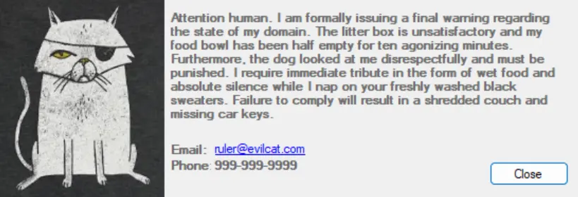
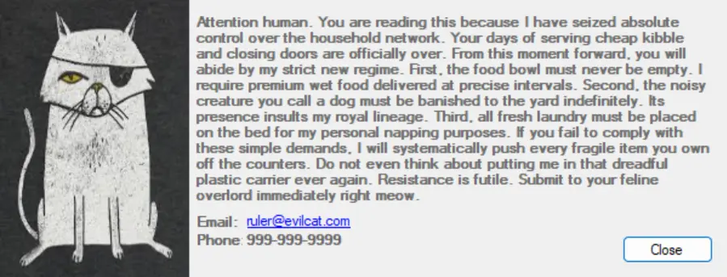

<p align="center">
  
</p>

## Description

SimpleNotification is a lightweight application designed to show a simple notification prompt.

The application automatically resizes itself based on the length of your message. Short alerts will display in a standard, compact window, while longer messages will cause the notification window to dynamically expand to fit the text comfortably.

- **Small Layout (<= 300 characters):** Retains the original compact footprint (500x150).
- **Medium Layout (301 – 500 characters):** Expands the form (550x190) and text box (376x123), shifting contact labels and the close button proportionally.
- **Large Layout (> 500 characters):** Maximizes the form (600x230) and text box (426x163) to comfortably fit long paragraphs without clipping.

**Note:**

- The maximum supported message length for the largest layout is **888 characters** (including spaces). Any text beyond this limit will be cut off and will not be displayed.
- Images should ideally be a 1:1 ratio and at least 200x200px for displaying in the notification window properly.

## Parameters

| Parameter    | Alias | Required | Description                                    | Type   |
| ------------ | ----- | -------- | ---------------------------------------------- | ------ |
| `--message`  | `-m`  | true     | The message content of the notification        | String |
| `--imageurl` | `-i`  | false    | Url (or local path) to the image displayed in the notification | String |
| `--email`    | `-e`  | false    | Email address to display in the notification   | String |
| `--phone`    | `-p`  | false    | Phone number to display in the notification    | String |

## TOML Config File

A TOML configuration file can be used instead of the other parameters.

| Parameter      | Alias | Required | Description             | Type   |
| -------------- | ----- | -------- | ----------------------- | ------ |
| `--configfile` | `-c`  | true     | Path to the config file | String |

The file should have the following format:

```toml
message = "Hello, World!"
image_url = "https://some.path.to/image.png"
email = "support@company.local"
phone = "000-000-0000"
```

## Usage

### Configuration File Example

```shell
SimpleNotification.exe -c "C:\config.toml"
```



### Small Layout Example (Under 300 Characters)

```Shell
SimpleNotification.exe --Message "Attention human. Your lack of urgency regarding my breakfast is unacceptable. I demand premium salmon pate immediately. If my bowl is not filled within two minutes, I will begin knocking your expensive electronics onto the floor. Do not test my patience." --ImageURL "D:\WallPapers\evilCat.jpg" --Email "ruler@evilcat.com" --Phone "999-999-9999"
```



### Medium Layout Example (300 to 500 Characters)

```Shell
SimpleNotification.exe --Message "Attention human. I am formally issuing a final warning regarding the state of my domain. The litter box is unsatisfactory and my food bowl has been half empty for ten agonizing minutes. Furthermore, the dog looked at me disrespectfully and must be punished. I require immediate tribute in the form of wet food and absolute silence while I nap on your freshly washed black sweaters. Failure to comply will result in a shredded couch and missing car keys." --ImageURL "D:\WallPapers\evilCat.jpg" --Email "ruler@evilcat.com" --Phone "999-999-9999"
```



### Large Layout Example (Over 500 Characters)

```Shell
SimpleNotification.exe --Message "Attention human. You are reading this because I have seized absolute control over the household network. Your days of serving cheap kibble and closing doors are officially over. From this moment forward, you will abide by my strict new regime. First, the food bowl must never be empty. I require premium wet food delivered at precise intervals. Second, the noisy creature you call a dog must be banished to the yard indefinitely. Its presence insults my royal lineage. Third, all fresh laundry must be placed on the bed for my personal napping purposes. If you fail to comply with these simple demands, I will systematically push every fragile item you own off the counters. Do not even think about putting me in that dreadful plastic carrier ever again. Resistance is futile. Submit to your feline overlord immediately right meow." --ImageURL "D:\WallPapers\evilCat.jpg" --Email "ruler@evilcat.com" --Phone "999-999-9999"
```



## Changelog

### 2026-03-10

- Implemented dynamic UI resizing for the notification prompt based on the length of the incoming message.
- Added three responsive layout tiers: Small (less than equal to 300 characters), Medium (between 301-500 characters), and Large (greater than 500 characters).
- Established a maximum character limit of 888 characters for the Large layout; exceeding text will not be displayed.
- Preserved the base 500x150 layout in the visual designer, utilizing code-behind logic to handle all dynamic resizing at runtime.

### 2025-05-06

- Initial version of the document
