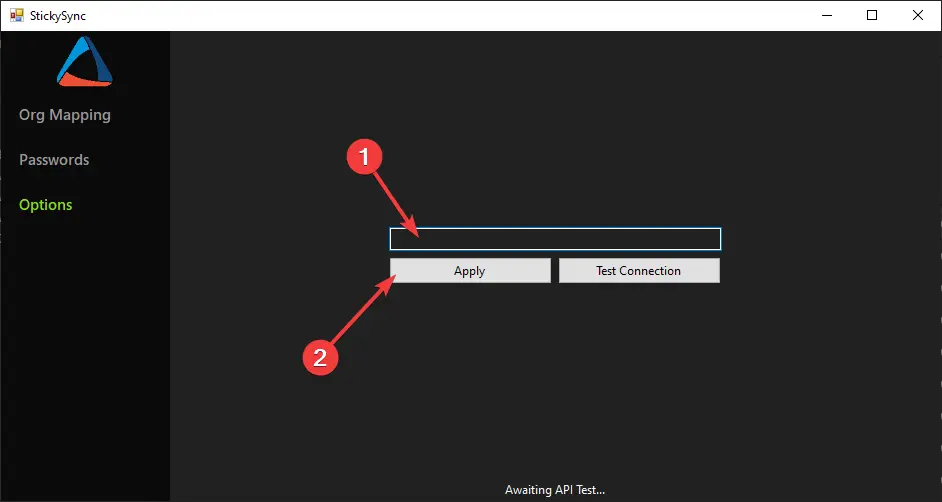
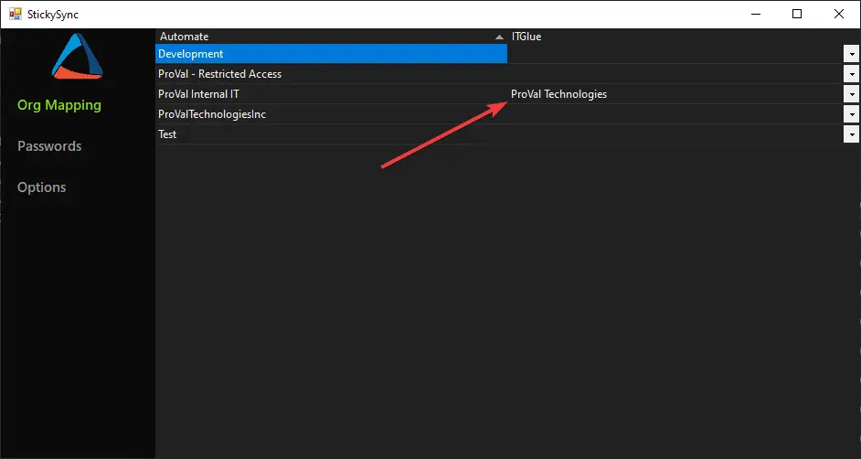
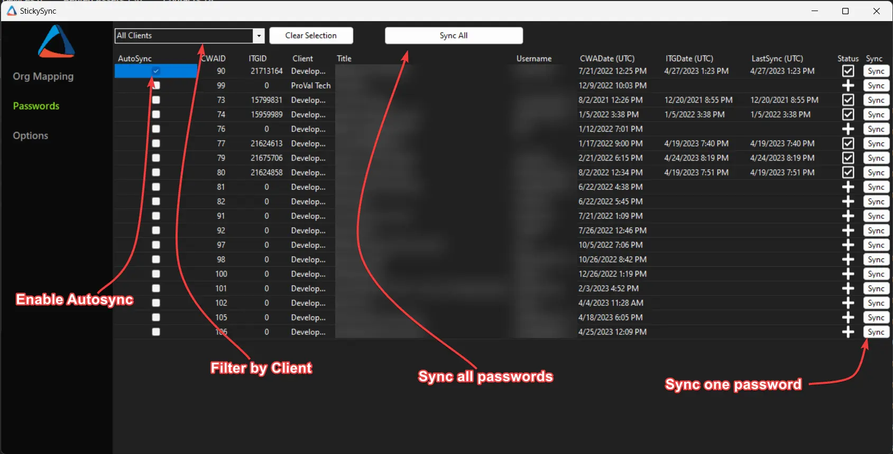

 

  

<h1 align="center">StickySync</h1>

  <h3 align="center">Sync Passwords from ConnectWise Automate to ITGlue</h3>

### Getting Started

1. Generate an ITGlue API key from instruction in this [KB Article](https://support.itglue.com/hc/en-us/articles/360004938078-Getting-started-with-the-IT-Glue-API):

> #### Generating an API key
>
> All API endpoints require authentication using a private API key. You can generate one or more API keys for your account. To generate a new API key:
>
> - Users with an Administrator role can navigate to Account > Settings.
> - Click on API Keys > Custom API Keys.
> - Enter a name for the key and click Generate API Key. You will not be able to > view a key again after it has been generated.
> - For security, an optional Password Access setting is provided for each API key. > Password values can be accessed from the Passwords API only if this setting is > enabled.
> - To generate multiple API keys, click the plus sign icon.

2. Install the StickySync.dll in the Plugin Manager of Automate.
3. Restart the Database agent.
4. Restart your Control Center.
5. Once your Control Center is back up, head over to Tools > StickySync.
6. Enter your API key and click "Apply".

7. Once your API key is confirmed, you're ready to start mapping clients. Head over to the Org Mapping section and start mapping your Automate clients to your ITGlue organizations.

8. Once that is complete, head over to the Passwords section.
9. You can Sync individual passwords from Automate to ITGlue here, or sync them en-masse with the "Sync All" button. Selecting the "AutoSync" checkbox for a password will ensure that the password in ITGlue is always the same as the password in Automate.
    - The "Sync All" button is contextual. If you are filtering the passwords list by a specific client, then the button will only "Sync All" passwords for that client.

