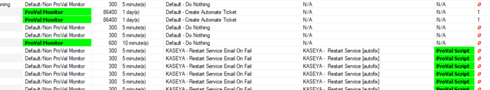

## Summary

This dataview shows all custom remote monitors with detailed implementation status information.

## Columns

| Column                     | Description                                                                                                                                                                                                                                        |
|---------------------------|----------------------------------------------------------------------------------------------------------------------------------------------------------------------------------------------------------------------------------------------------|
| Monitor                   | Remote monitor name                                                                                                                                                                                                                               |
| Monitor Nature            | This shows whether the remote monitor is a ProVal monitor or a DefaultNon ProVal monitor.                                                                                                                                                        |
| Interval                  | It shows the frequency of the monitor execution in the second format.                                                                                                                                                                            |
| Interval String           | It shows the frequency of the monitor execution in Days, Hours, and Minutes format.                                                                                                                                                               |
| AlertStyle                | This shows the monitor's alert style, which means the number of failures to trigger before alerting. 0 - Continuous -> It will trigger an autofix for each failure detected. 1 - Once -> It will trigger an alert for one failure and wait for the success to report to re-trigger the autofix again. 2 - Twice -> It will trigger an alert for two continuous failures and wait for the success to report to re-trigger the autofix again. 3 - Thrice -> It will trigger an alert for three continuous failures and wait for the success to report to re-trigger the autofix again. 4 - Fourth -> It will trigger an alert for the four continuous failures and wait for the success to report to re-trigger the autofix again. 5 - Fifth -> It will trigger an alert for five continuous failures and wait for the success to report to re-trigger the autofix again. 6 - Sixth -> It will trigger an alert for six continuous failures and wait for the success to report to re-trigger the autofix again. 7 - Seventh -> It will trigger an alert for seven continuous failures and wait for the success to report to re-trigger the autofix again. 8 - Eighth -> It will trigger an alert for eight continuous failures and wait for the success to report to re-trigger the autofix again. 9 - Ninth -> It will trigger an alert for nine continuous failures and wait for the success to report to re-trigger the autofix again. 10 - Tenth -> It will trigger an alert for ten continuous failures and wait for the success to report to re-trigger the autofix again. |
| Group                     | It shows the target group where the remote monitor is applied.                                                                                                                                                                                  |
| Alert Template            | It contains the alert template applied to the monitor.                                                                                                                                                                                          |
| Alert Template Description | It shows detailed information on the alert template if provided during the creation.                                                                                                                                                           |
| Script                    | It shows the script which is running as an autofix with the monitor via an alert template applied to it.                                                                                                                                       |
| Script Nature             | It shows whether the script used as an autofix is the ProVal script or a default script.                                                                                                                                                       |
| Ticket Category           | It shows the ticket category name to which the ticket will be generated via the autofix alert template.                                                                                                                                         |
| Affected Computers        | It shows the number of agents where the remote monitor is applied.                                                                                                                                                                              |

## Color Coding

Color coding was applied to the columns "Monitor Nature", "Affected Computers", and "Script Nature" as shown below:

Monitor Nature: The "ProVal Monitor" is highlighted in Green to catch the eye to show the ProVal remote monitors in the environment.  
Script Nature: Here, the "ProVal Script" is highlighted in Green to catch the eye of where the "ProVal" scripts are used as an autofix.  
Affected Computers: Here, the "0" is written in bold/Italic font using Red color to show the remote monitors that are not applied to any computers.

