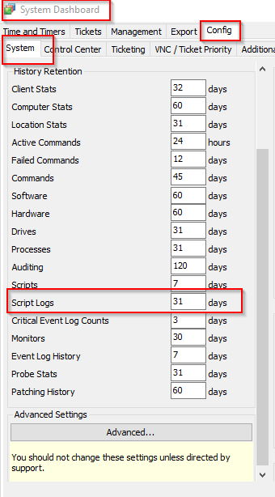
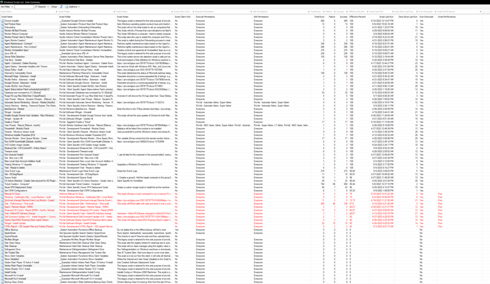

## Summary

This dataview lists all scripts in the environment with details about their script folders, the types of scripts, any notes included, and which user classes may run and/or edit the script. Additionally, it **displays a summary of all scripts run over the set script log retention days.**

The script log retention days can be seen at the Automate location below:

## Columns

| Column                     | Description                                                                                                       |
|---------------------------|-------------------------------------------------------------------------------------------------------------------|
| ScriptID                  | Script ID (Hidden)                                                                                                 |
| Script Name               | The name of the script                                                                                            |
| Script Parent Folder      | Parent folder of the script (Hidden)                                                                             |
| Script Folder             | The full path to the folder containing the script                                                                 |
| Script Version            | Version of the script (Hidden)                                                                                    |
| Script GUID               | GUID of the script (Hidden)                                                                                      |
| Script Notes              | Script notes                                                                                                     |
| Script Client Only        | Whether it's a Client or a Computer script                                                                        |
| Execute Permissions       | Comma-separated list of user classes that can execute the script; `EveryOne` stands for all users with basic permission for scripts. |
| Edit Permissions          | Comma-separated list of user classes that can edit the script; `EveryOne` stands for all users with basic permission for scripts. |
| Total Runs                | Number of times the script ran                                                                                   |
| Failure                   | Number of times the script failed                                                                                 |
| Success                   | Number of times the script succeeded                                                                              |
| Effective Percent         | Effective percentage of success                                                                                    |
| Script Last Run           | The last run of the script                                                                                        |
| Days Since Last Run       | Number of days since the script was last executed                                                                |
| Ever Executed             | Has the script ever been executed (Yes/No)                                                                       |
| Script Performance         | Displays 'Poor' if the script's effectiveness is lower than 80% and has been executed at least once. This column is primarily used for conditional formatting and needs to be displayed for the formatting to work. |

## Sample Screenshot

