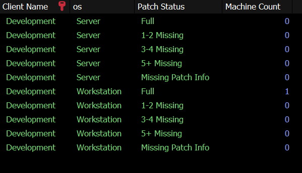

## Summary

This Dataview is the RMM-specific display of the client-level breakdown of machines missing a certain number of patches.

**Sample Screenshot:**  

## Dependencies

- [CWM - Automate - View - Plugin_ProVal_V_Patch_Count_Status](<../views/Plugin_ProVal_V_Patch_Count_Status.md>)  
- [CWM - Automate - Script - MySQL - View - Create - Plugin_ProVal_V_Patch_Count_Status](<../scripts/MySQL - View - Create - Plugin_ProVal_V_Patch_Count_Status.md>)  

## Columns

| Column        | Description                                                                                  |
|---------------|----------------------------------------------------------------------------------------------|
| Client ID     | Client ID                                                                                     |
| Client Name   | Client Name                                                                                  |
| OS            | Operating System (Server | Workstation)                                                     |
| Patch Status  | Category Name (Full | 1-2 Missing | 3-4 Missing | 5+ Missing | Missing Patch Info)         |
| Machine Count | Number of machines falling under the concerned category/patch status for the client.       |

