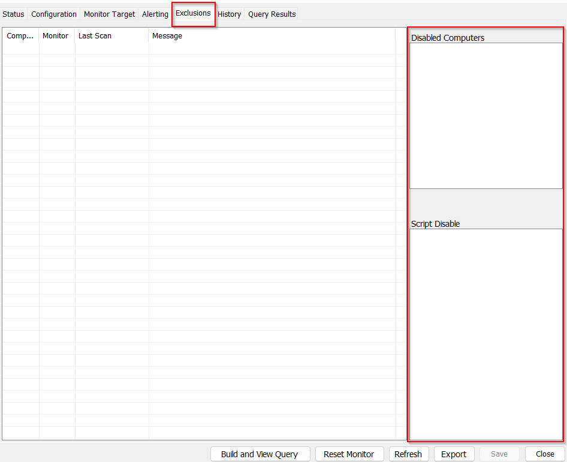

## Summary

This dataview displays the computers excluded from the internal monitors.  
You can find this information in Automate in the areas displayed below.

**Exclusion Actions:**
1. "Excluded From Detection" - indicates that the computer is added to the "Disabled Computers" section.
2. "Excluded From Autofix" - indicates the presence of the computer in the "Script Disable" section.

## Columns

| Column                | Description                                           |
|-----------------------|-------------------------------------------------------|
| Computer ID           | Computer ID                                          |
| Monitor Set           | Name of the Monitor Set                               |
| Client Name           | Client Name                                          |
| Location Name         | Location Name                                        |
| Excluded Computer      | Computer Name                                        |
| Exclusion Action      | "Excluded From Detection" or "Excluded From Autofix"|
| Operating System      | Operating System                                     |
| Last Contact          | Last Contact                                         |
| Days Since Last Contact| Days Since Last Contact                              |

