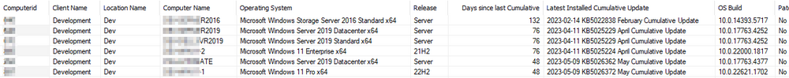

## Summary

Displays the data fetched by the [CWM - Automate - Script - Get Lastest Installed Cumulative Update](https://proval.itglue.com/DOC-5078775-12849478) script. The dataview is explicitly excluding the machines for which Microsoft does not release Cumulative Updates.

## Dependencies

- [CWM - Automate - Script - Get Lastest Installed Cumulative Update](https://proval.itglue.com/DOC-5078775-12849478)
- [CWM - Automate - Custom Table - pvl_win_latest_installed_cu](<../tables/pvl_win_latest_installed_cu.md>)

## Columns

| Column                              | Description                                         |
|-------------------------------------|-----------------------------------------------------|
| Clientid                            | Clientid (Hidden)                                   |
| Locationid                          | Locationid (Hidden)                                 |
| Computerid                          | Computerid                                         |
| Client Name                         | Client Name                                        |
| Location Name                       | Location Name                                      |
| Computer Name                       | Computer Name                                      |
| Operating System                    | Operating System                                    |
| Release                             | OS Release Number                                   |
| Latest Installed Cumulative Update   | Name of the Latest Installed Cumulative Update     |
| OS Build                            | Full Build Number of the Operating System           |
| Patch Managed                       | Is the computer patch Managed? (Yes/No)            |
| Is End of Life                      | Is the computer's Operating System End of Life? (Yes/No) |
| Last Logged In User                 | Last Logged In User                                 |
| Last Contact                        | Last Contact with RMM                              |
| Script Run Time                     | Last Run Time of the script                         |
| Patch Release Date                  | Date When the installed CU was released             |
| KBID                                | KBID of the CU                                     |
| Days Since Last Cumulative          | Age of the latest installed Cumulative Update in Days |

## Sample Screenshot

