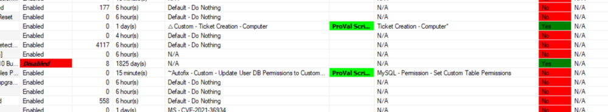

## Summary

This dataview shows all custom internal monitors built by ProVal with its detailed implementation status information.

## Columns

| Column                   | Description                                                                                                                             |
|-------------------------|-----------------------------------------------------------------------------------------------------------------------------------------|
| Monitor                 | Internal monitor name.                                                                                                                 |
| Monitor Status          | This shows whether the monitor is disabled or enabled.                                                                                  |
| Fail Count              | It shows the number of times the monitor failed.                                                                                        |
| Interval                | It shows the frequency of the monitor execution in the second format.                                                                   |
| Interval String         | It shows the frequency of the monitor execution in Days, Hours, and Minutes format.                                                    |
| AlertStyle              | This shows the monitor's alert style, which means the number of failures to trigger before alerting.                                    0 - Send Fail After Success -> It will trigger an alert for each failure and wait for the success to report to re-trigger the autofix again. 1 - Once Per Day -> It will trigger an alert for a failure once per day. 2 - Once Per 2 Days -> It will trigger an alert for a failure once in 2 days. 3 - Once Per 3 Days -> It will trigger an alert for a failure once in 3 days. 4 - Once Per 4 Days -> It will trigger an alert for a failure once in 4 days. 5 - Once Per 5 Days -> It will trigger an alert for a failure once in 5 days. 6 - Once Per 6 Days -> It will trigger an alert for a failure once in 6 days. 7 - Once Per 7 Days -> It will trigger an alert for a failure once in 7 days. 8 - Once Per 30 Days -> It will trigger an alert for a failure once in 30 days. 9 - Once Per 60 Days -> It will trigger an alert for a failure once in 60 days. 10 - Once Per 90 Days -> It will trigger an alert for a failure once in 90 days. 11 - Once Per Year -> It will trigger an alert for a failure once per year. 12 - Once Per 5 Years. -> It will trigger an alert for a failure once in 5 years. |
| Last Scan               | It stores the last scan date of the internal monitor.                                                                                  |
| Last Failure            | It shows the last failure detection date of the internal monitor.                                                                       |
| Next Scan               | It shows the next upcoming scan date of the internal monitor.                                                                          |
| Group                   | It shows the targeted group if the monitor is applied to a specific group.  Blank denotes the monitor applied globally to the environment. |
| Alert Template          | It contains the alert template applied with the monitor on the targeted group or globally.                                             |
| Alert Template Description | It shows detailed information on the alert template if provided during the creation.                                                  |
| Script                  | It shows the script which is running as an autofix with the monitor via an alert template applied to it.                               |
| Script Nature           | It shows whether the autofix script is a ProVal Script or a Default script.                                                            |
| Ticket Category         | It shows the ticket category name to which the ticket will be generated via the autofix alert template.                                |
| Monitor Synced/Updated  | This shows whether the internal monitor was synced from the ProSync plugin or not.                                                     |

## Color Coding

Color Coding is applied to the columns "Monitor Status", "Script Nature", and "Monitor Synced/Updated" as shown below:

**Monitor Status:** The "Disabled" font in bold/Italic is highlighted in Red to catch the eye to show the disabled monitor.

**Script Nature:** Here, the "ProVal Script" is highlighted in Green to catch the eye of where the "ProVal" scripts are used as an autofix.

**Monitor Synced/Updated:** It has "Yes" highlighted in Green, "No" highlighted in Red, and "N/A" highlighted in Grey to catch the eye easily and show whether the monitor is properly synced/updated from the ProVal plugin.

