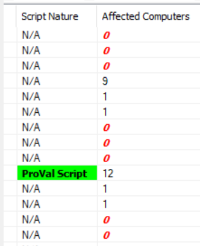

## Summary

This dataview shows all custom remote monitors built by ProVal with detailed implementation status information.

## Columns

| Column                | Description                                                                                                                      |
|----------------------|----------------------------------------------------------------------------------------------------------------------------------|
| Monitor              | Remote monitor name                                                                                                             |
| Interval             | Frequency of the monitor execution in seconds.                                                                                  |
| Interval String      | Frequency of the monitor execution in Days, Hours, and Minutes format.                                                          |
| Alert Style          | This shows the monitor's alert style, which indicates the number of failures required to trigger an alert:   0 - Continuous: It will trigger an autofix for each failure detected.   1 - Once: It will trigger an alert for one failure and wait for success to report to re-trigger the autofix.   2 - Twice: It will trigger an alert for two continuous failures and wait for success to report to re-trigger the autofix.   3 - Thrice: It will trigger an alert for three continuous failures and wait for success to report to re-trigger the autofix.   4 - Fourth: It will trigger an alert for four continuous failures and wait for success to report to re-trigger the autofix.   5 - Fifth: It will trigger an alert for five continuous failures and wait for success to report to re-trigger the autofix.   6 - Sixth: It will trigger an alert for six continuous failures and wait for success to report to re-trigger the autofix.   7 - Seventh: It will trigger an alert for seven continuous failures and wait for success to report to re-trigger the autofix.   8 - Eighth: It will trigger an alert for eight continuous failures and wait for success to report to re-trigger the autofix.   9 - Ninth: It will trigger an alert for nine continuous failures and wait for success to report to re-trigger the autofix.   10 - Tenth: It will trigger an alert for ten continuous failures and wait for success to report to re-trigger the autofix. |
| Group                | Target group where the remote monitor is applied.                                                                               |
| Alert Template       | Alert template applied to the monitor.                                                                                          |
| Alert Template Description | Detailed information on the alert template if provided during creation.                                                  |
| Script               | Script running as an autofix with the monitor via the alert template applied to it.                                             |
| Script Nature        | Indicates whether the script used as an autofix is the ProVal script or a default script.                                       |
| Ticket Category      | Ticket category name to which the ticket will be generated via the autofix alert template.                                     |
| Affected Computers   | Number of agents where the remote monitor is applied.                                                                          |

## Color Coding

Color coding has been applied to the columns "Affected Computers" and "Script Nature" as shown below:

**Script Nature**: Here, the "ProVal Script" is highlighted in green to draw attention to where the "ProVal" scripts are used as an autofix.  
**Affected Computers**: Here, the "0" is written in bold/italic font using red color to indicate remote monitors that are not applied to any computers.

