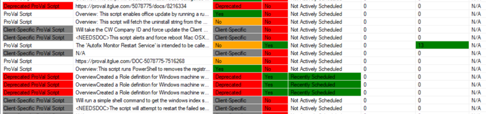

## Summary

This document provides a detailed overview of all custom scripts built by ProVal along with their implementation status information.

## Columns

| Column                    | Description                                                                                                                                                        |
|--------------------------|--------------------------------------------------------------------------------------------------------------------------------------------------------------------|
| Script Name               | Script name                                                                                                                                                       |
| Script Nature            | Indicates whether the script is "ProVal Client Specific," "ProVal Deprecated," or a ProVal non-stack script.                                                      |
| Script Type               | Indicates whether the script is a Computer or a Client script.                                                                                                |
| Script Notes             | Contains brief notes providing an overview of the script.                                                                                                     |
| Function Script           | Indicates whether the script is a function script that can only be called by automation or cannot be run manually. 0 - Not a function script; 1 - Function script. |
| Scheduled Script          | Indicates whether the script is scheduled or not. 1 - Scheduled; 0 - Not Scheduled.                                                                          |
| Scheduled By             | Shows the name of the Automate user who scheduled the script.                                                                                                  |
| Total Runs               | The total count of script runs overall, depending on the script retention set in the environment.                                                              |
| Run Last 30 Days         | Contains the script execution counts in the last 30 days overall.                                                                                             |
| First Run Date           | Contains information on the script's first run date.                                                                                                          |
| Last Run Date            | Contains details of when the script was last executed.                                                                                                         |
| Last Scheduled Run       | Contains information on the last scheduled run date of the script, either manually or via a group.                                                              |
| Next Scheduled Run       | Shows the next upcoming script execution date.                                                                                                                |
| Total Scheduled Run      | Shows the number of schedules set for the script in the environment.                                                                                           |
| Average Run Time         | Indicates the average run time of the script in seconds.                                                                                                       |
| Group Scheduled           | Denotes the name of the group where the script is scheduled.                                                                                                   |
| Group Path               | Shows the group's full path where the script is scheduled.                                                                                                     |
| Limit Search             | Indicates if the script is bound to a search or not. 1 - Limited to search; 2 - Applied to all members of the group.                                          |
| Search Name              | Shows the search name to which the script is limited.                                                                                                          |
| # Remote Monitor         | Displays the total number of remote monitors where the script is used as an autofix.                                                                           |
| # Internal Monitor       | Displays the total number of internal monitors where the script is used as an autofix.                                                                         |
| Applied to Alert Template  | Indicates whether the script is bound to an alert template or not. 1 - Yes; 0 - No.                                                                          |
| Alert Template           | Contains the alert template name to which the script is bound to run.                                                                                          |
| Machines Affected        | Shows the count of computers to which the script is scheduled.                                                                                                 |
| In Use                   | Indicates whether the script has been run within the past 6 months, is actively scheduled, or applied to any remote or internal monitors. Marks Yes or No if the above conditions are met. |
| Scheduled in Past 6 Months | Shows which script was either run by the group or manually in the past 6 months, or if the script was running as an autofix via monitors. If any condition is met, it is marked as "Recently Added." |

## Color Coding

Color coding is applied to the columns "# Internal Monitor," "# Remote Monitor," "Script Nature," "Group Scheduled," "Scheduled in Past 6 Months," and "Synced/Updated" as shown below:

- **# Internal Monitor:** Highlights counts greater than 0 to indicate how many internal monitors the script was applied to.
- **# Remote Monitor:** Highlights counts greater than 0 to indicate how many remote monitors the script was applied to.
- **Script Nature:** Highlights "Deprecated ProVal Script" in red and "Client-Specific ProVal Script" in red to draw attention to where the "ProVal" scripts are non-stack ProVal scripts.
- **Synced/Updated:** Highlights "Yes" in green, "No" in orange, "Client-Specific" in grey, and "Deprecated" in red to easily show whether the script is deprecated, client-specific, or if a non-stack script is properly synced/updated from the ProVal plugin.
- **Group Scheduled:** Highlights the group full name in green to indicate where the script is scheduled.
- **Scheduled in Past 6 Months:** Highlights "Recently Added" in green to show which script was either run by the group or manually in the past 6 months, or if the script was running as an autofix via monitors. If any condition is met, it is marked as "Recently Added."

