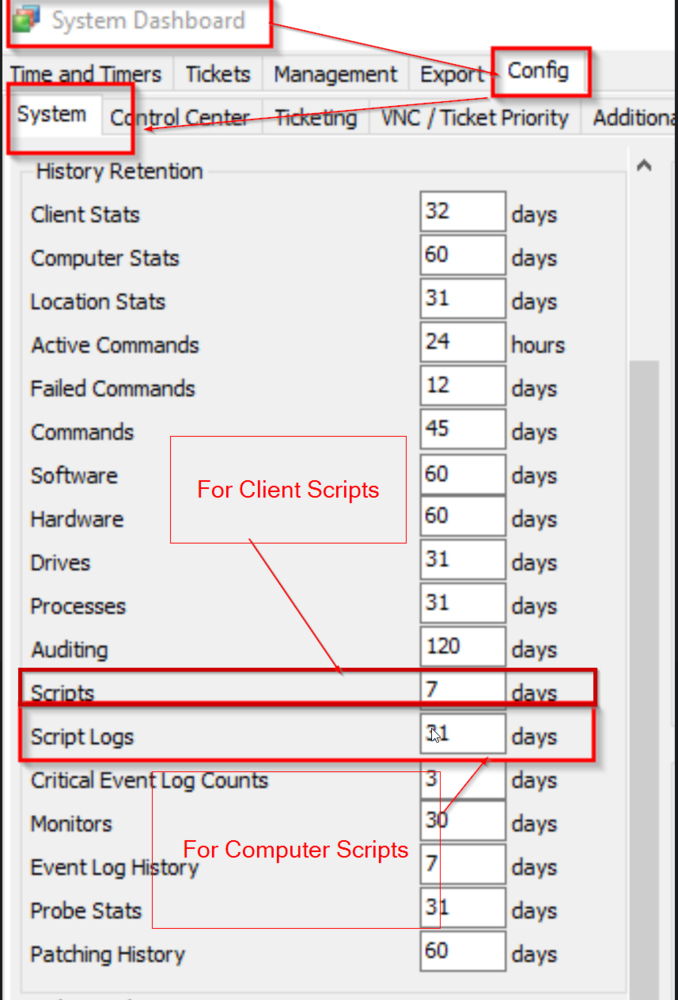
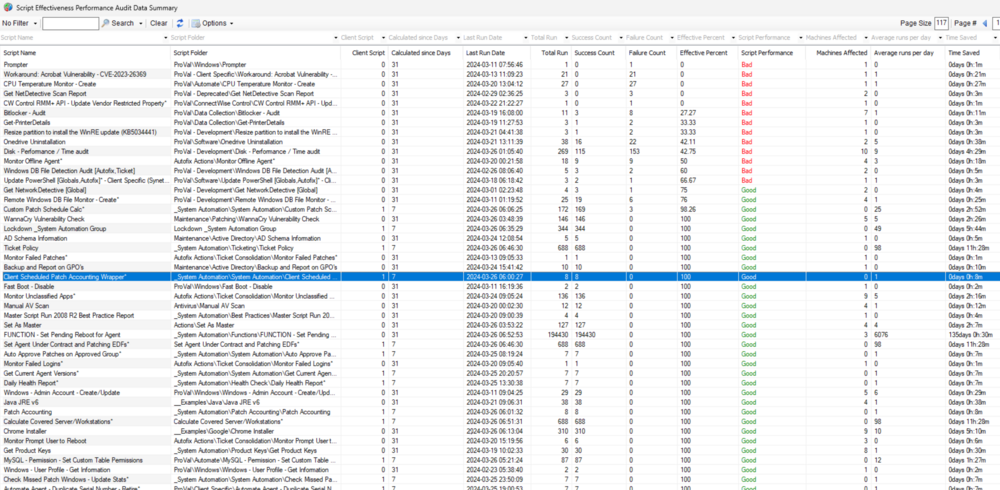

## Summary

This Dataview summarises all scripts run over the set script log retention days. It displays the total runs, failures, successes, and the script's effectiveness.

The Script log retention days can be seen at the automate location below:

## Columns

| Column                   | Description                                                                                                                                                                                                                                                                                                                                                                      |
|--------------------------|----------------------------------------------------------------------------------------------------------------------------------------------------------------------------------------------------------------------------------------------------------------------------------------------------------------------------------------------------------------------------------|
| Script Name              | Script Name                                                                                                                                                                                                                                                                                                                                                                      |
| Script Folder            | Path to the script                                                                                                                                                                                                                                                                                                                                                               |
| Client Script            | Is it a client script? (0 or 1)                                                                                                                                                                                                                                                                                                                                                  |
| Calculated since Days    | Retention Period. The retention period for the script may vary between client scripts and computer scripts, as illustrated in the screenshot provided in the 'Summary' section. For computer scripts, calculations are based on data from the 'h_Script' table. However, the 'h_Scripts' table is utilized for client scripts, as the 'h_Script' table does not contain the required historical data for client scripts. |
| Last Run Date            | The most recent execution date of the script.                                                                                                                                                                                                                                                                                                                                    |
| Total Run                | The total number of script executions within the number of days displayed in the `Calculated since Days` column.                                                                                                                                                                                                                                                             |
| Success Count            | Total number of times the script succeeded within the number of days displayed in the `Calculated since Days` column.                                                                                                                                                                                                                                                          |
| Failure Count            | Total number of times the script failed or killed within the number of days displayed in the `Calculated since Days` column. A script can be killed manually either by a user or Automate kills the script if a machine goes offline while running an Online Computer script.                                                                                                  |
| Effective Percent        | Effective Percent of Success of the script. Calculation: `(`Success Count` / `Total Runs`) * 100                                                                                                                                                                                                                                                                             |
| Script Performance        | Performance of the script over the retention period. Good: `Effective Percent` is greater than or equal to 75. Bad: `Effective Percent` is less than 75. Not Run Yet: Haven't executed even once within the number of days displayed in the `Calculated since Days` column.                                                                                                   |
| Machines Affected        | Number of individual machines it affected or ran against. This number will always be 0 for the client scripts.                                                                                                                                                                                                                                                                 |
| Avg. Runs - Day         | The average number of executions per day within the retention period. Calculation: `Total Run`/`Calculated since Days`                                                                                                                                                                                                                                                         |
| Time Saved               | Time Saved by the script during the retention period. Format: `days hours:minutes`                                                                                                                                                                                                                                                                                             |
| Time Saved - Minutes      | Time Saved by the script during the retention period in minutes. Calculation: `Total Run` * `Time Saved by Automation`. For scripts where the Time Saved by Automation is either not set or equal to 0: `Total Runs` * 1                                                                                                                                                     |
| Avg. Time Saved - Daily  | Average of time saved per day within the retention period. Format: `days hours:minutes`                                                                                                                                                                                                                                                                                         |
| Avg. Time Saved Daily - Minutes | Average of time saved per day within the retention period in minutes                                                                                                                                                                                                                                                                                                       |

## Format Control

| Column                   | Colour | Value |
|--------------------------|--------|-------|
| Script Performance        | Red    | Bad   |
| Script Performance        | Green  | Good  |

## Example Screenshot

