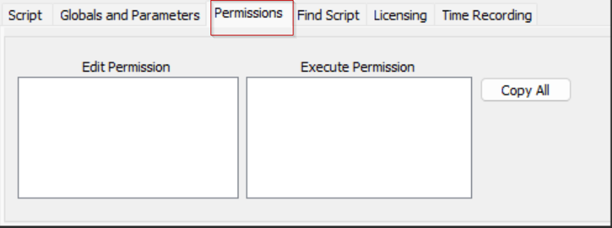
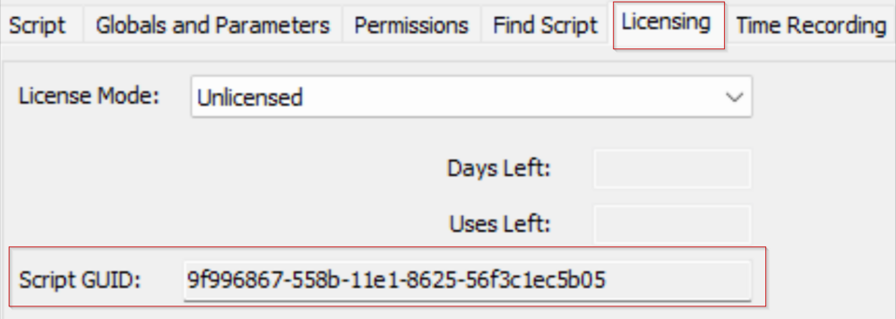
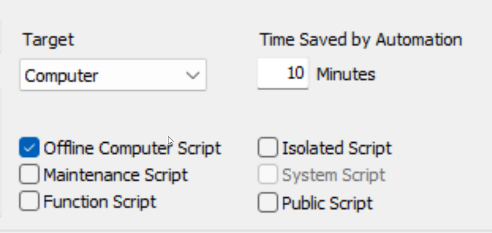
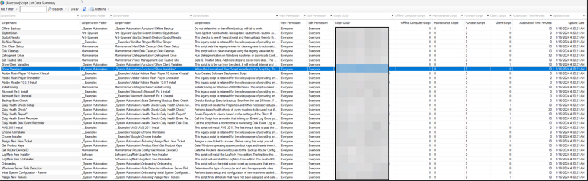

## Summary

This dataview will list all scripts in the environment with details about their script folders, the type of scripts, any notes included, and which user classes may run and/or edit the script.

## Columns

| Column                       | Description                                                                                                                                                                                                                  |
|------------------------------|------------------------------------------------------------------------------------------------------------------------------------------------------------------------------------------------------------------------------|
| Script Name                  | The name of the script.                                                                                                                                                                                                    |
| Script Parent Folder         | Name of the parent folder of the script.                                                                                                                                                                                  |
| Script Folder                | The full path to the script.                                                                                                                                                                                               |
| View Permission               | Comma Separated List of User Classes that can execute or view the script, `EveryOne` stands for all users with the basic permission of scripts.                  |
| Edit Permission               | Comma Separated List of User Classes that can edit the script, `EveryOne` stands for all users with the basic permission of scripts.                                                                                      |
| Script GUID                  | GUID of the script.                                                                                                                                                 |
| Offline Computer Script      | Can this script be executed against offline machines as well? (0/1)                                                                                   |
| Maintenance Script           | Can this script be executed against the computers in the maintenance mode as well? (0/1)                                                                                                                                 |
| Function Script              | Is this a function script? (0/1) (Function scripts can be called from an alert template or another script but cannot be executed directly against a computer/client)                                                       |
| Client Script                | Is this a client script? (0/1)                                                                                                                                                                                             |
| Automation Time Minutes      | Time Saved by Automation.                                                                                                                                                                                                   |
| Update Date                  | The most recent update date of the script.                                                                                                                                                                                 |
| Updated By                   | The name of the user who last updated the script.                                                                                                                                                                         |

## Example Screenshot

