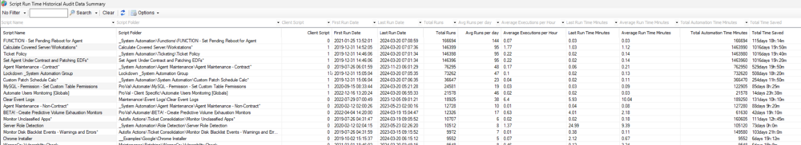

## Summary

This dataview displays historical runtime data for scripts in Automate since their creation. Please note that creating performance metrics based on this data is not feasible because Automate does not store the overall number of failures and successes.

## Columns

| Column                        | Description                                                                                                       |
|-------------------------------|-------------------------------------------------------------------------------------------------------------------|
| Script Name                   | Name of the script                                                                                               |
| Script Folder                 | The full path to the script                                                                                      |
| Client Script                 | Is this a Client Script? (0/1)                                                                                  |
| First Run Date                | First execution date of the script                                                                                |
| Last Run Date                 | The most recent execution date of the script.                                                                    |
| Avg. Runs - Hour              | The average number of executions per hour for the script between its `First Run Date` and `Last Run Date`.      |
| Last Run - Minute             | Execution time of the script in minutes for its most recent execution.                                          |
| Avg. Run - Minute             | The average duration, in minutes, for each run between the script's 'First Run Date' and 'Last Run Date'. This column aids in identifying scripts that are taking unusually long to complete. |
| Total Runs                    | Total number of executions between the script's 'First Run Date' and 'Last Run Date'.                          |
| Avg. Runs - Day               | The average number of executions per day for the script between its `First Run Date` and `Last Run Date`.       |
| Total Time Saved - Minutes     | The total time saved by the script in minutes through automation between its 'First Run Date' and 'Last Run Date'. |
| Total Time Saved              | The total time saved by the script through automation between its 'First Run Date' and 'Last Run Date'. Format: `days hour:minutes` |
| Total Run Time - Minutes      | Total duration, in minutes, that the script executed between its 'First Run Date' and 'Last Run Date'.          |
| Total Run Time                | Total duration that the script executed between its 'First Run Date' and 'Last Run Date'. Format: `days hour:minutes` |

## Example Screenshot

