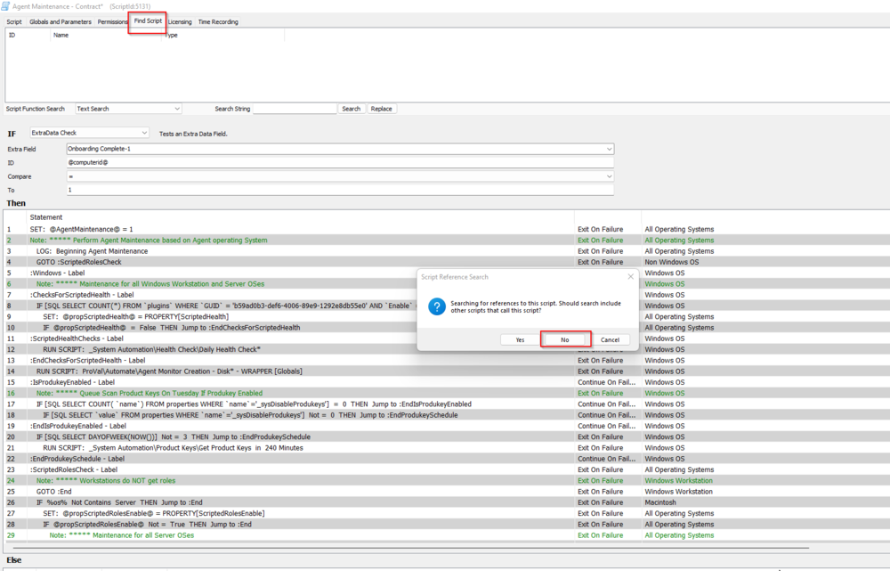
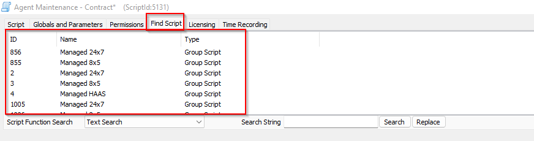

## Summary

This script displays the results of selecting 'Find Script', except displays it for all scripts

## Dependencies

- [CWM - Automate - Custom View - pvl_scripts_memberof](https://proval.itglue.com/DOC-5078775-13700065) 
- [CWM - Automate - Script - MySQL - View - Create (pvl_scripts_memberof)*](https://proval.itglue.com/DOC-5078775-13700067) 

## Implementation

- Import the [CWM - Automate - Script - MySQL - View - Create (pvl_scripts_memberof)*](https://proval.itglue.com/DOC-5078775-13700067) script.
- Import the dataview.
- Execute/Debug the script against any computer and ensure the presence of data in the dataview.
- Remove the script.

## Columns

| Column             | Description                                                                                             |
|--------------------|---------------------------------------------------------------------------------------------------------|
| Scriptid           | Id of the script.                                                                                       |
| Script Name        | Name of the Script.                                                                                     |
| Object Name        | Name of the Object.                                                                                     |
| Object Type        | Type of the Object (group/Monitor/Alert Template/Individual Computer/Maintenance).                     |
| Object description  | Full Path of the Group/Whether the alert template is applied on a computer-level remote monitor group remote monitor or an internal monitor. |
| Limited to         | Whether the scheduled group script/remote monitor is limited to a search/internal monitor is limited to any group. |
| Affected Agents    | Number of computers in the group/Number of agents detected in the search if limited to search.         |

