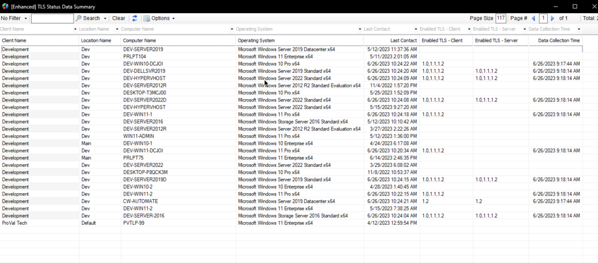

## Summary

This dataview is an easy way to audit which versions of TLS are enabled on the endpoint. This is native to the machine, not to Internet Explorer. An example of this would be the communication from the machine to a server, such as a File Server.

**Note:** Only if the Remote Monitor (from dependencies) has executed/run at least once on the machine will the enabled TLS version be shown in the dataview.

## Dependencies

- [EPM - Windows Configuration - Remote Monitor - TLS Version Check - Client](<../monitors/TLS Version Check - Client.md>)
- [EPM - Windows Configuration - Remote Monitor - TLS Version Check - Server](<../monitors/TLS Version Check - Server.md>)

## Columns

| Column                      | Description                                   |
|-----------------------------|-----------------------------------------------|
| Client ID                   | Client ID (Hidden)                           |
| Location ID                 | Location ID (Hidden)                         |
| Computer ID                 | Computer ID (Hidden)                         |
| Client Name                 | Client Name                                   |
| Location Name               | Location Name                                 |
| Computer Name               | Computer Name                                 |
| Operating System            | Operating System                              |
| Last Contact                | Last Contact with RMM                         |
| Last Logged In User         | Last Logged In User (Hidden)                 |
| Enabled TLS - Client        | Enabled TLS Client Version(s)                |
| Enabled TLS - Server        | Enabled TLS Server Version(s) (if applicable)|
| Data Collection Time        | Data Collection Time                          |

## Sample Screenshot

