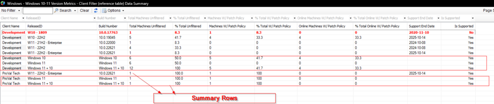

## Summary

This dataview will display the number of Windows 10 and Windows 11 Machines by the build number (ReleaseID) as well as a calculated percentage of machines on that version against the number of total Windows 10 and Windows 11 devices for each client. There are several filters available for this data.

Additional Summarized row per Windows version, eg - Windows 10, Windows 11, Windows 11+10. Please see below for reference:

There are three summarized rows in this dataview, one for all windows 10, one for all windows 11, and the final one for the combined number of windows 10 and windows 11 for the client. The red row represents that this ReleaseID is not supported by Microsoft anymore.

[SEC - Windows Patching - Custom Table - plugin_proval_windows_os_support](<../tables/plugin_proval_windows_os_support.md>)  
[SEC - Windows Patching - MySQL View - pvl_v_windows_version_metrics](<./SEC - Windows Patching - MySQL View - pvl_v_windows_version_metrics.md>)

## Columns

| Column                                  | Explanation                                                                                                                                                                                                                                                                                                                                                                                                                                                                                                                                                                                                                                                                                                                                                                                                                                                                                                                                                                                                                                                                                                                                                                                                                                                                                                                                                                                                                                                                                                                                                                                                                                                                                                                                                                                                                                                                                                                        |
| --------------------------------------- | ---------------------------------------------------------------------------------------------------------------------------------------------------------------------------------------------------------------------------------------------------------------------------------------------------------------------------------------------------------------------------------------------------------------------------------------------------------------------------------------------------------------------------------------------------------------------------------------------------------------------------------------------------------------------------------------------------------------------------------------------------------------------------------------------------------------------------------------------------------------------------------------------------------------------------------------------------------------------------------------------------------------------------------------------------------------------------------------------------------------------------------------------------------------------------------------------------------------------------------------------------------------------------------------------------------------------------------------------------------------------------------------------------------------------------------------------------------------------------------------------------------------------------------------------------------------------------------------------------------------------------------------------------------------------------------------------------------------------------------------------------------------------------------------------------------------------------------------------------------------------------------------------------------------------------------- |
| **ReleaseID**                           | The feature update version of Windows 10/11 for the client. Enterprise is a separate entry due to differing support dates. Examples: W10 - 1709 W10 - 21H1 W10 - 1803 - LTSC W10 - 1809 - Enterprise W11 - 22H1 W11 - 22H2 - Enterprise Summary Rows: The generalized OS version for the client (Windows 10, Windows 11, Windows 10 + 11)                                                                                                                                                                                                                                                                                                                                                                                                                                                                                                                                                                                                                                                                                                                                                                                                                                                                                                                                                                                                                                                                                                                                                                                                                                                                                                                                                                                                                                                                                                                                                                               |
| **Build**                               | The full build number of the ReleaseID. Summary Rows: The generalized OS version for the client (Windows 10, Windows 11, Windows 10 + 11).                                                                                                                                                                                                                                                                                                                                                                                                                                                                                                                                                                                                                                                                                                                                                                                                                                                                                                                                                                                                                                                                                                                                                                                                                                                                                                                                                                                                                                                                                                                                                                                                                                                                                                                                                                                         |
| **Total Machines Unfiltered**           | The count of machines on the ReleaseID for the client. Summary Rows: The number of machines reporting the generalized OS version for the client (Windows 10, Windows 11, Windows 10 + 11).                                                                                                                                                                                                                                                                                                                                                                                                                                                                                                                                                                                                                                                                                                                                                                                                                                                                                                                                                                                                                                                                                                                                                                                                                                                                                                                                                                                                                                                                                                                                                                                                                                                                                                                                         |
| **% Total Unfiltered**                  | The percentage of Windows 10+ machines that are on the ReleaseID for the client. Example: Windows 10/11 Total Machines: \\<strong>100\\</strong> W10 - 1709 Total Machines: 10 W11 - 22H2 Total Machines: 10 \\<strong>W10 - 1709 % Total Unfiltered: 10.0% W11 - 22H2 % Total Unfiltered: 10.0%\\</strong> Summary Rows: Windows 10 - The percentage of Windows 10+ machines that are on Windows 10 for the client. Windows 11 - The percentage of Windows 10+ machines that are on Windows 11 for the client. Windows 11 + 10 - Should always be 100. Example: Windows 10/11 Total Machines: \\<strong>100\\</strong> Windows 10 Total Machines: 80 Windows 11 Total Machines: 20 \\<strong>Windows 10 % Total Unfiltered: 80.0% Windows 11 % Total Unfiltered: 20.0%\\</strong> \\<strong>Windows 11 + 10 %Total Unfiltered: 100%\\</strong>                                                                                                                                                                                                                                                                                                                                                                                                                                                                                                                                                                                                                                                                                                                                                                                                                                                                                                                                                                                                                                               |
| **% Total Unfiltered - OS**             | The percentage of Windows 10+ machines out of the same base OS that are on the ReleaseID for the client. Example: Windows 10/11 Total Machines: \\<strong>100\\</strong> Windows 10 Total Machines: 40 Windows 11 Total Machines: 60 W10 - 1709 Total Machines: 10 W11 - 22H2 Total Machines: 10 \\<strong>W10 - 1709 % Total Unfiltered - OS: 25.0% W11 - 22H2 % Total Unfiltered - OS: 16.7%\\</strong> Summary Rows: Windows 10 - The percentage of Windows 10 machines that are on Windows 10 for the client. Should always be 100. Windows 11 - The percentage of Windows 11 machines that are on Windows 11 for the client. Should always be 100. Windows 11 + 10 - Should always be 100. Example: Windows 10/11 Total Machines: \\<strong>100\\</strong> Windows 10 Total Machines: 80 Windows 11 Total Machines: 20 \\<strong>Windows 10 % Total Unfiltered - OS: 100.0% Windows 11 % Total Unfiltered - OS: 100.0%\\</strong> \\<strong>Windows 11 + 10 %Total online - OS: 100%\\</strong>                                                                                                                                                                                                                                                                                                                                                                                                                                                                                                                                                                                                                                                                                                                                                                                                                                                                                          |
| **Count Machines Online**               | The count of machines on the ReleaseID for the client that have checked into CWA within 30 days. Summary Rows: The count of machines reporting the generalized OS version for the client (Windows 10, Windows 11, etc) that have checked into CWA within 30 days.                                                                                                                                                                                                                                                                                                                                                                                                                                                                                                                                                                                                                                                                                                                                                                                                                                                                                                                                                                                                                                                                                                                                                                                                                                                                                                                                                                                                                                                                                                                                                                                                                                                                  |
| **% Total Online**                      | The percentage of Windows 10+ machines that are on the ReleaseID for the client and have checked into Automate within 30 Days. Example: Windows 10/11 Total Machines: \\<strong>100\\</strong> W10 - 1709 Online Machines: 5\\<strong>\\</strong> W11 - 22H2 Online Machines: 7 \\<strong>W10 - 1709 % Total Online: 5.0% W11 - 22H2 % Total Online: 7.0%\\</strong> Summary Rows: Windows 10 - The percentage of Windows 10+ machines that are on Windows 10 for the client and have checked into Automate within 30 Days. Windows 11 - The percentage of Windows 10+ machines that are on Windows 11 for the client and have checked into Automate within 30 Days. Windows 11 + 10 - The percentage of Windows 10+ machines that have checked into Automate within 30 Days. Example: Windows 10/11 Total Machines: \\<strong>100\\</strong> Windows 10 online Machines: 66 Windows 11 online Machines: 12 Windows 10 + 11 online Machines: 78 \\<strong>Windows 10 % Total Online: 66.0% Windows 11 % Total Online: 12.0%\\</strong> \\<strong>Windows 11 + 10 % Total online: 78.0%\\</strong>                                                                                                                                                                                                                                                                                                                                                                                                                                                                                                                                                                                                                                                                                                                                                                                              |
| **% Total Online - OS**                 | The percentage of Windows 10+ machines out of the same base OS that are on the ReleaseID for the client and have checked into Automate within 30 Days. Example: Windows 10/11 Total Machines: \\<strong>100\\</strong> Windows 10 Total Machines: 40 Windows 11 Total Machines: 60 W10 - 1709 Online Machines: 35 W11 - 22H2 Online Machines: 55 \\<strong>W10 - 1709 % Total Online - OS: 87.5% W11 - 22H2 % Total Online - OS: 91.7%\\</strong> Summary Rows: Windows 10 - The percentage of Windows 10 machines that are on Windows 10 for the client and have checked into Automate within 30 Days. Windows 11 - The percentage of Windows 11 machines that are on Windows 11 for the client and have checked into Automate within 30 Days. Windows 11 + 10 - The percentage of Windows 10+ machines that have checked into Automate within 30 Days. Example: Windows 10/11 Total Machines: \\<strong>100\\</strong> Windows 10 Total Machines: 80 Windows 11 Total Machines: 20 Windows 10 online Machines: 66 Windows 11 online Machines: 12 Windows 10 + 11 online Machines: 78 \\<strong>Windows 10 % Total Online - OS: 82.5% Windows 11 % Total Online - OS: 60.0%\\</strong> \\<strong>Windows 11 + 10 %Total online - OS: 78.0%\\</strong>                                                                                                                                                                                                                                                                                                                                                                                                                                                                                                                                                                                                                                        |
| **Machines W/ Patch Policy**            | The count of machines on the ReleaseID for the client that have a patch policy with "Managed Mode" or "Managed Mode UI Disabled" as their patch install method. Summary Rows: The count of machines reporting the generalized OS version for the client (Windows 10, Windows 11, Windows 10 + 11) that have a patch policy with "Managed Mode" or "Managed Mode UI Disabled" as their patch install method.                                                                                                                                                                                                                                                                                                                                                                                                                                                                                                                                                                                                                                                                                                                                                                                                                                                                                                                                                                                                                                                                                                                                                                                                                                                                                                                                                                                                                                                                                                                        |
| **% Total W/ Patch Policy**             | The percentage of Windows 10+ machines that are on the ReleaseID for the client and have a patch policy with "Managed Mode" or "Managed Mode UI Disabled" as their patch install method. Example: Windows 10/11 Total Machines: \\<strong>100\\</strong> W10 - 22H1 With Managed Patch Policy: 23\\<strong>\\</strong> W11 - 22H2 With Managed Patch Policy: 27 \\<strong>W10 - 22H1 % Total W/ Patch Policy: 23.0% W11 - 22H2 % Total W/ Patch Policy: 27.0%\\</strong> Summary Rows: Windows 10 - The percentage of Windows 10+ machines that are on Windows 10 for the client and have a patch policy with "Managed Mode" or "Managed Mode UI Disabled" as their patch install method. Windows 11 - The percentage of Windows 10+ machines that are on Windows 11 for the client and have a patch policy with "Managed Mode" or "Managed Mode UI Disabled" as their patch install method. Windows 11 + 10 - The percentage of Windows 10+ machines for the client that have a patch policy with "Managed Mode" or "Managed Mode UI Disabled" as their patch install method. Example: Windows 10/11 Total Machines: \\<strong>100\\</strong> Windows 10 With Managed Patch Policy: 43 Windows 11 With Managed Patch Policy: 48 Windows 10 + 11 With Managed Patch Policy: 91 \\<strong>Windows 10 % Total W/ Patch Policy: 43.0% Windows 11 % Total W/ Patch Policy: 48.0%\\</strong> \\<strong>Windows 11 + 10 % Total W/ Patch Policy: 91.0%\\</strong>                                                                                                                                                                                                                                                                                                                                                                                                                                    |
| **%Total W/ Patch Policy - OS**         | The percentage of Windows 10+ machines out of the same base OS that are on the ReleaseID for the client and have a patch policy with "Managed Mode" or "Managed Mode UI Disabled" as their patch install method. Example: Windows 10/11 Total Machines: \\<strong>100\\</strong> Windows 10 Total Machines: 40 Windows 11 Total Machine: 60 W10 - 1709 With Managed Patch Policy: 35 W11 - 22H2 With Managed Patch Policy: 55 \\<strong>W10 - 1709 % Total W/ Patch Policy - OS: 87.5% W11 - 22H2 % Total W/ Patch Policy - OS: 91.7%\\</strong> Summary Rows: Windows 10 - The percentage of Windows 10 machines that are on Windows 10 for the client and have a patch policy with "Managed Mode" or "Managed Mode UI Disabled" as their patch install method. Windows 11 - The percentage of Windows 11 machines that are on Windows 11 for the client and have a patch policy with "Managed Mode" or "Managed Mode UI Disabled" as their patch install method. Windows 11 + 10 - The percentage of Windows 10+ machines for the client that have a patch policy with "Managed Mode" or "Managed Mode UI Disabled" as their patch install method. Example: Windows 10/11 Total Machines: \\<strong>100\\</strong> Windows 10 Total Machines: 80 Windows 11 Total Machines: 20 Windows 10 With Managed Patch Policy: 66 Windows 11 With Managed Patch Policy: 12 Windows 10 + 11 With Managed Patch Policy: 78 \\<strong>Windows 10 % Total W/ Patch Policy - OS: 82.5% Windows 11 % Total W/ Patch Policy - OS: 60.0%\\</strong> \\<strong>Windows 11 + 10 % Total W/ Patch Policy - OS: 78.0%\\</strong>                                                                                                                                                                                                                                                                                  |
| **Online Machines W/ Patch Policy**     | The count of machines on the ReleaseID for the client that have checked into CWA within 30 days and have a patch policy with "Managed Mode" or "Managed Mode UI Disabled" as their patch install method. Summary Rows: The count of machines reporting the generalized OS version for the client (Windows 10, Windows 11, Windows 10 + 11) that have checked into CWA within 30 days and have a patch policy with "Managed Mode" or "Managed Mode UI Disabled" as their patch install method.                                                                                                                                                                                                                                                                                                                                                                                                                                                                                                                                                                                                                                                                                                                                                                                                                                                                                                                                                                                                                                                                                                                                                                                                                                                                                                                                                                                                                                      |
| **% Total Online W/ Patch Policy**      | The percentage of Windows 10+ machines that are on the ReleaseID for the client that have checked into CWA within 30 days and have a patch policy with "Managed Mode" or "Managed Mode UI Disabled" as their patch install method. Example: Windows 10/11 Total Machines: \\<strong>100\\</strong> W10 - 22H1 Online Machines With Managed Patch Policy: 20\\<strong>\\</strong> W11 - 22H2 Online Machines With Managed Patch Policy: 24 \\<strong>W10 - 22H1 % Total Online W/ Patch Policy: 20.0% W11 - 22H2 % Total Online W/ Patch Policy: 24.0%\\</strong> Summary Rows: Windows 10 - The percentage of Windows 10+ machines that are on Windows 10 for the client that have checked into CWA within 30 days and have a patch policy with "Managed Mode" or "Managed Mode UI Disabled" as their patch install method. Windows 11 - The percentage of Windows 10+ machines that are on Windows 11 for the client that have checked into CWA within 30 days and have a patch policy with "Managed Mode" or "Managed Mode UI Disabled" as their patch install method. Windows 11 + 10 - The percentage of Windows 10+ machines for the client that have checked into CWA within 30 days and have a patch policy with "Managed Mode" or "Managed Mode UI Disabled" as their patch install method. Example: Windows 10/11 Total Machines: \\<strong>100\\</strong> Windows 10 Online Machines With Managed Patch Policy: 40 Windows 11 Online Machines With Managed Patch Policy: 45 Windows 10 + 11 With Managed Patch Policy: 85 \\<strong>Windows 10 % Total Online W/ Patch Policy: 40.0% Windows 11 % Total Online W/ Patch Policy: 45.0%\\</strong> \\<strong>Windows 11 + 10 % Total Online W/ Patch Policy: 85.0%\\</strong>                                                                                                                                                          |
| **% Total Online W/ Patch Policy - OS** | The percentage of Windows 10+ machines out of the same base OS that are on the ReleaseID for the client that have checked into CWA within 30 days and have a patch policy with "Managed Mode" or "Managed Mode UI Disabled" as their patch install method. Example: Windows 10/11 Total Machines: \\<strong>100\\</strong> Windows 10 Total Machines: 40 Windows 11 Total Machine: 60 W10 - 22H1 Online Machines With Managed Patch Policy: 30 W11 - 22H2 Online Machines With Managed Patch Policy: 50 \\<strong>W10 - 22H1 % Total Online W/ Patch Policy - OS: 75.0% W11 - 22H2 % Total Online W/ Patch Policy - OS: 83.3%\\</strong> Summary Rows: Windows 10 - The percentage of Windows 10 machines that are on Windows 10 for the client that have checked into CWA within 30 days and have a patch policy with "Managed Mode" or "Managed Mode UI Disabled" as their patch install method. Windows 11 - The percentage of Windows 11 machines that are on Windows 11 for the client that have checked into CWA within 30 days and have a patch policy with "Managed Mode" or "Managed Mode UI Disabled" as their patch install method. Windows 11 + 10 - The percentage of Windows 10+ machines for the client that have checked into CWA within 30 days and have a patch policy with "Managed Mode" or "Managed Mode UI Disabled" as their patch install method. Example: Windows 10/11 Total Machines: \\<strong>100\\</strong> Windows 10 Total Machines: 80 Windows 11 Total Machines: 20 Windows 10 Online Machines With Managed Patch Policy: 60 Windows 11 Online Machines With Managed Patch Policy: 10 Windows 10 + 11 Online With Managed Patch Policy: 78 \\<strong>Windows 10 % Total Online W/ Patch Policy - OS: 75.0% Windows 11 % Total Online W/ Patch Policy - OS: 50.0%\\</strong> \\<strong>Windows 11 + 10 % Total Online W/ Patch Policy - OS: 70.0%\\</strong> |
| **Support End Date**                    | The Microsoft support end date for the ReleaseID. Summary Rows: N/A                                                                                                                                                                                                                                                                                                                                                                                                                                                                                                                                                                                                                                                                                                                                                                                                                                                                                                                                                                                                                                                                                                                                                                                                                                                                                                                                                                                                                                                                                                                                                                                                                                                                                                                                                                                                                                                                |
| **Count Supported Machines**            | The count of machines on the ReleaseID for the client that are within their Microsoft support window. Summary Rows: The count of machines reporting the generalized OS version for the client (Windows 10, Windows 11, Windows 10 + 11) that are within their Microsoft support window.                                                                                                                                                                                                                                                                                                                                                                                                                                                                                                                                                                                                                                                                                                                                                                                                                                                                                                                                                                                                                                                                                                                                                                                                                                                                                                                                                                                                                                                                                                                                                                                                                                            |
| **Count Unsupported Machines**          | The count of machines on the ReleaseID for the client that are outside their Microsoft support window. Summary Rows: The count of machines reporting the generalized OS version for the client (Windows 10, Windows 11, Windows 10 + 11) that are outside their Microsoft support window.                                                                                                                                                                                                                                                                                                                                                                                                                                                                                                                                                                                                                                                                                                                                                                                                                                                                                                                                                                                                                                                                                                                                                                                                                                                                                                                                                                                                                                                                                                                                                                                                                                          |
| **% Supported Machines**                | The percentage of Windows 10+ machines that are on the ReleaseID for the client and are within their Microsoft support window. Example: Windows 10/11 Total Machines: \\<strong>100\\</strong> W10 - 22H1 Supported Machines: 20\\<strong>\\</strong> W11 - 22H2 Supported Machines: 24 \\<strong>W10 - 22H1 % Total Online W/ Patch Policy: 20.0% W11 - 22H2 % Total Online W/ Patch Policy: 24.0%\\</strong> Summary Rows: Windows 10 - The percentage of Windows 10+ machines for the client that are on Windows 10 and are within their Microsoft support window. Windows 11 - The percentage of Windows 10+ machines for the client that are on Windows 11 and are within their Microsoft support window. Windows 11 + 10 - The percentage of Windows 10+ machines for the client that are within their Microsoft support window. Example: Windows 10/11 Total Machines: \\<strong>100\\</strong> Windows 10 Supported Machines: 40 Windows 11 Supported Machines: 45 Windows 10 + 11 Supported Machines: 85 \\<strong>Windows 10 % Supported Machines: 40.0% Windows 11 % Supported Machines: 45.0%\\</strong> \\<strong>Windows 11 + 10 % Supported Machines: 85.0%\\</strong>                                                                                                                                                                                                                                                                                                                                                                                                                                                                                                                                                                                                                                                                                                          |
| **% Supported Machines - OS**           | The percentage of Windows 10+ machines for the client out of the same base OS that are on the ReleaseID and are within their Microsoft support window. Example: Windows 10/11 Total Machines: \\<strong>100\\</strong> Windows 10 Total Machines: 40 Windows 11 Total Machine: 60 W10 - 22H1 Supported Machines: 30 W11 - 22H2 Supported Machines: 50 \\<strong>W10 - 22H1 % Supported Machines - OS: 75.0% W11 - 22H2 % Supported Machines - OS: 83.3%\\</strong> Summary Rows: Windows 10 - The percentage of Windows 10 machines for the client that are on Windows 10 and are within their Microsoft support window. Windows 11 - The percentage of Windows 11 machines for the client that are on Windows 11 and are within their Microsoft support window. Windows 11 + 10 - The percentage of Windows 10+ machines for the client that are within their Microsoft support window. Example: Windows 10/11 Total Machines: \\<strong>100\\</strong> Windows 10 Total Machines: 80 Windows 11 Total Machines: 20 Windows 10 Supported Machines: 60 Windows 11 Supported Machines: 10 Windows 10 + 11 Supported Machines: 78 \\<strong>Windows 10 % Supported Machines - OS: 75.0% Windows 11 % Supported Machines - OS: 50.0%\\</strong> \\<strong>Windows 11 + 10 % Supported Machines - OS: 70.0%\\</strong>                                                                                                                                                                                                                                                                                                                                                                                                                                                                                                                                                                            |
| **% Unsupported Machines**              | The percentage of Windows 10+ machines that are on the ReleaseID for the client and are outside their Microsoft support window. Example: Windows 10/11 Total Machines: \\<strong>100\\</strong> W10 - 1809 Unsupported Machines: 7\\<strong>\\</strong> W11 - 22H2 Unsupported Machines: 0 \\<strong>W10 - 22H1 % Total Online W/ Patch Policy: 7.0% W11 - 22H2 % Total Online W/ Patch Policy: 0%\\</strong> Summary Rows: Windows 10 - The percentage of Windows 10+ machines for the client that are on Windows 10 and are outside their Microsoft support window. Windows 11 - The percentage of Windows 10+ machines for the client that are on Windows 11 and are outside their Microsoft support window. Windows 11 + 10 - The percentage of Windows 10+ machines for the client that are outside their Microsoft support window. Example: Windows 10/11 Total Machines: \\<strong>100\\</strong> Windows 10 Unsupported Machines: 14 Windows 11 Unsupported Machines: 0 Windows 10 + 11 Unsupported Machines: 14 \\<strong>Windows 10 % Unsupported Machines: 14.0% Windows 11 % Unsupported Machines: 0%\\</strong> \\<strong>Windows 11 + 10 % Unsupported Machines: 14.0%\\</strong>                                                                                                                                                                                                                                                                                                                                                                                                                                                                                                                                                                                                                                                                                                |
| **% Unsupported Machines - OS**         | The percentage of Windows 10+ machines for the client out of the same base OS that are on the ReleaseID and are outside their Microsoft support window. Example: Windows 10/11 Total Machines: \\<strong>100\\</strong> Windows 10 Total Machines: 40 Windows 11 Total Machine: 60 W10 - 1803 Unsupported Machines: 5 W11 - 22H2 Unsupported Machines: 0 \\<strong>W10 - 22H1 % Unsupported Machines - OS: 12.5% W11 - 22H2 % Unsupported Machines - OS: 0%\\</strong> Summary Rows: Windows 10 - The percentage of Windows 10 machines for the client that are on Windows 10 and are outside their Microsoft support window. Windows 11 - The percentage of Windows 11 machines for the client that are on Windows 11 and are outside their Microsoft support window. Windows 11 + 10 - The percentage of Windows 10+ machines for the client that are outside their Microsoft support window. Example: Windows 10/11 Total Machines: \\<strong>100\\</strong> Windows 10 Total Machines: 80 Windows 11 Total Machines: 20 Windows 10 Unsupported Machines: 8 Windows 11 Unsupported Machines: 0 Windows 10 + 11 Unsupported Machines: 8 \\<strong>Windows 10 % Unsupported Machines - OS: 10.0% Windows 11 % Unsupported Machines - OS: 0%\\</strong> \\<strong>Windows 11 + 10 % Unsupported Machines - OS: 8.0%\\</strong>                                                                                                                                                                                                                                                                                                                                                                                                                                                                                                                                                                |
| **Client Name**                         | Client Name                                                                                                                                                                                                                                                                                                                                                                                                                                                                                                                                                                                                                                                                                                                                                                                                                                                                                                                                                                                                                                                                                                                                                                                                                                                                                                                                                                                                                                                                                                                                                                                                                                                                                                                                                                                                                                                                                                                        |
| **Clientid**                            | Clientid                                                                                                                                                                                                                                                                                                                                                                                                                                                                                                                                                                                                                                                                                                                                                                                                                                                                                                                                                                                                                                                                                                                                                                                                                                                                                                                                                                                                                                                                                                                                                                                                                                                                                                                                                                                                                                                                                                                           |
| **Is Supported**                        | Yes/No (Used for Conditional Formatting)                                                                                                                                                                                                                                                                                                                                                                                                                                                                                                                                                                                                                                                                                                                                                                                                                                                                                                                                                                                                                                                                                                                                                                                                                                                                                                                                                                                                                                                                                                                                                                                                                                                                                                                                                                                                                                                                                           |

