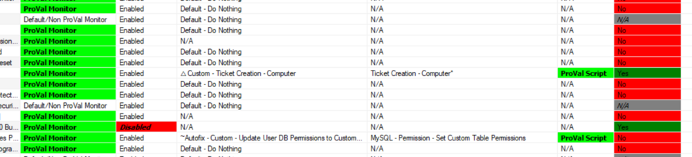

## Summary

This dataview shows all custom internal monitors with detailed implementation status information.

## Columns

| Column                    | Description                                                                                                                                                                                                                                                                                                                                                                                                                                                                                                                                                                                                                       |
|---------------------------|-----------------------------------------------------------------------------------------------------------------------------------------------------------------------------------------------------------------------------------------------------------------------------------------------------------------------------------------------------------------------------------------------------------------------------------------------------------------------------------------------------------------------------------------------------------------------------------------------------------------------------------|
| Monitor                   | Internal monitor name.                                                                                                                                                                                                                                                                                                                                                                                                                                                                                                                                                                                                             |
| Monitor Nature            | This indicates whether the internal monitor is a ProVal monitor or a Default Non-ProVal monitor.                                                                                                                                                                                                                                                                                                                                                                                                                                                                                                                                          |
| Monitor Status            | This indicates whether the monitor is disabled or enabled.                                                                                                                                                                                                                                                                                                                                                                                                                                                                                                                                                                              |
| Interval                  | This shows the frequency of the monitor execution in seconds.                                                                                                                                                                                                                                                                                                                                                                                                                                                                                                                                                                 |
| Interval String           | This shows the frequency of the monitor execution in Days, Hours, and Minutes format.                                                                                                                                                                                                                                                                                                                                                                                                                                                                                                                                                   |
| Alert Style               | This indicates the monitor's alert style, which specifies the number of failures required to trigger an alert.   0 - Send Fail After Success: Triggers an alert for each failure and waits for success to report to re-trigger the autofix.   1 - Once Per Day: Triggers an alert for a failure once per day.   2 - Once Per 2 Days: Triggers an alert for a failure once every 2 days.   3 - Once Per 3 Days: Triggers an alert for a failure once every 3 days.   4 - Once Per 4 Days: Triggers an alert for a failure once every 4 days.   5 - Once Per 5 Days: Triggers an alert for a failure once every 5 days.   6 - Once Per 6 Days: Triggers an alert for a failure once every 6 days.   7 - Once Per 7 Days: Triggers an alert for a failure once every 7 days.   8 - Once Per 30 Days: Triggers an alert for a failure once every 30 days.   9 - Once Per 60 Days: Triggers an alert for a failure once every 60 days.   10 - Once Per 90 Days: Triggers an alert for a failure once every 90 days.   11 - Once Per Year: Triggers an alert for a failure once per year.   12 - Once Per 5 Years: Triggers an alert for a failure once every 5 years. |
| Last Scan                 | This stores the last scan date of the internal monitor.                                                                                                                                                                                                                                                                                                                                                                                                                                                                                                                                                                                |
| Last Failure              | This shows the last failure detection date of the internal monitor.                                                                                                                                                                                                                                                                                                                                                                                                                                                                                                                                                                      |
| Next Scan                 | This shows the next upcoming scan date of the internal monitor.                                                                                                                                                                                                                                                                                                                                                                                                                                                                                                                                                                          |
| Group                     | This indicates the targeted group if the monitor is applied to a specific group. A blank entry denotes that the monitor is applied globally to the environment.                                                                                                                                                                                                                                                                                                                                                                                                                                                                                       |
| Alert Template            | This contains the alert template applied with the monitor on the targeted group or globally.                                                                                                                                                                                                                                                                                                                                                                                                                                                                                                                                             |
| Alert Template Description | This shows detailed information on the alert template if provided during creation.                                                                                                                                                                                                                                                                                                                                                                                                                                                                                                                                             |
| Script                    | This shows the script that is running as an autofix with the monitor via the applied alert template.                                                                                                                                                                                                                                                                                                                                                                                                                                                                                                                            |
| Script Nature             | This indicates whether the autofix script is a ProVal Script or a Default script.                                                                                                                                                                                                                                                                                                                                                                                                                                                                                                                                                           |
| Ticket Category           | This shows the ticket category name to which the ticket will be generated via the autofix alert template.                                                                                                                                                                                                                                                                                                                                                                                                                                                                                                                              |
| Synced/Updated            | This indicates whether the internal monitor was synced from the ProSync plugin or not.                                                                                                                                                                                                                                                                                                                                                                                                                                                                                                                                                     |

## Color Coding

Color coding is applied to the columns "Monitor Nature," "Monitor Status," "Script Nature," and "Synced/Updated" as shown below:

- **Monitor Nature**: The "ProVal Monitor" is highlighted in green to distinguish ProVal internal monitors from others.
- **Monitor Status**: The "Disabled" font is bold/italic and highlighted in red to draw attention to disabled monitors.
- **Script Nature**: The "ProVal Script" is highlighted in green to indicate where "ProVal" scripts are used as autofixes.
- **Synced/Updated**: "Yes" is highlighted in green, "No" in red, and "N/A" in grey to easily indicate whether the monitor is properly synced/updated from the ProVal plugin.

