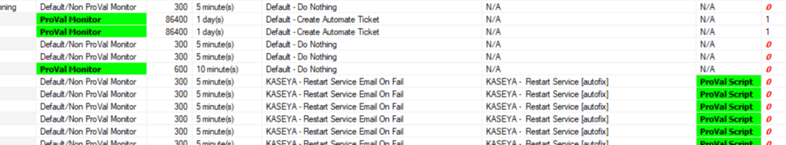

## Summary

This dataview shows all custom remote monitors with detailed implementation status information.

## Columns

| Column                     | Description                                                                                                                                                                                                                                        |
|---------------------------|----------------------------------------------------------------------------------------------------------------------------------------------------------------------------------------------------------------------------------------------------|
| Monitor                   | Remote monitor name                                                                                                                                                                                                                               |
| Monitor Nature            | Indicates whether the remote monitor is a ProVal monitor or a Default Non-ProVal monitor.                                                                                                                                                        |
| Interval                  | The frequency of the monitor execution in seconds.                                                                                                                                                                                               |
| Interval String           | The frequency of the monitor execution in Days, Hours, and Minutes format.                                                                                                                                                                       |
| Alert Style               | This shows the monitor's alert style, which indicates the number of failures required to trigger an alert.   0 - Continuous: Triggers an autofix for each failure detected.   1 - Once: Triggers an alert for one failure and waits for success to re-trigger the autofix.   2 - Twice: Triggers an alert for two continuous failures and waits for success to re-trigger the autofix.   3 - Thrice: Triggers an alert for three continuous failures and waits for success to re-trigger the autofix.   4 - Fourth: Triggers an alert for four continuous failures and waits for success to re-trigger the autofix.   5 - Fifth: Triggers an alert for five continuous failures and waits for success to re-trigger the autofix.   6 - Sixth: Triggers an alert for six continuous failures and waits for success to re-trigger the autofix.   7 - Seventh: Triggers an alert for seven continuous failures and waits for success to re-trigger the autofix.   8 - Eighth: Triggers an alert for eight continuous failures and waits for success to re-trigger the autofix.   9 - Ninth: Triggers an alert for nine continuous failures and waits for success to re-trigger the autofix.   10 - Tenth: Triggers an alert for ten continuous failures and waits for success to re-trigger the autofix. |
| Group                     | The target group where the remote monitor is applied.                                                                                                                                                                                          |
| Alert Template            | The alert template applied to the monitor.                                                                                                                                                                                                      |
| Alert Template Description | Detailed information on the alert template if provided during creation.                                                                                                                                                                        |
| Script                    | The script that runs as an autofix with the monitor via the applied alert template.                                                                                                                                                               |
| Script Nature             | Indicates whether the script used as an autofix is a ProVal script or a default script.                                                                                                                                                       |
| Ticket Category           | The ticket category name to which the ticket will be generated via the autofix alert template.                                                                                                                                                 |
| Affected Computers        | The number of agents where the remote monitor is applied.                                                                                                                                                                                      |

## Color Coding

Color coding was applied to the columns "Monitor Nature," "Affected Computers," and "Script Nature" as shown below:

- **Monitor Nature**: The "ProVal Monitor" is highlighted in green to draw attention to the ProVal remote monitors in the environment.
- **Script Nature**: The "ProVal Script" is highlighted in green to indicate where ProVal scripts are used as an autofix.
- **Affected Computers**: The "0" is displayed in bold/italic font using red color to indicate remote monitors that are not applied to any computers.

