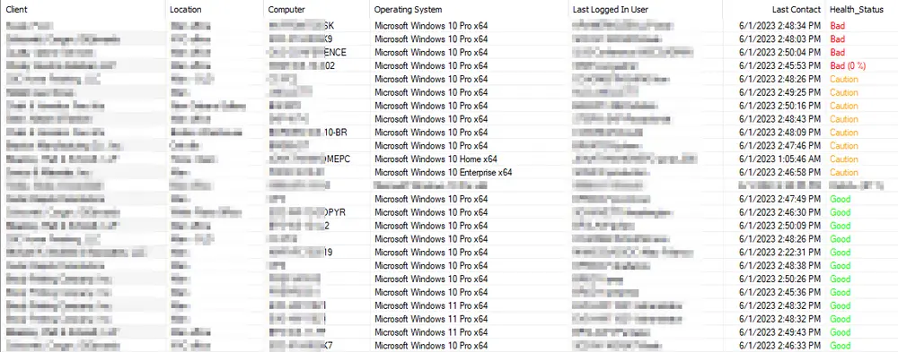

## Summary

Dataview displays the data retrieved by the [Script - Crystal Disk Info Report](/docs/651e701f-40d0-4657-817c-b81785d441ea) script. It is not necessary for all disks to show values for all columns/properties, as different drive models can return slightly different properties/results.

## Dependencies

- [Script - Crystal Disk Info Report](/docs/651e701f-40d0-4657-817c-b81785d441ea)  
- [Custom Table - pvl_crystal_disk_info](/docs/89182385-f98c-4e8b-ab62-1df0c73bbb1c)  
- [Solution - Crystal Disk Info](/docs/0df580b1-4b36-4988-b192-574a001a7323)

## Columns

| Column                   | Description                                                    |
|-------------------------|---------------------------------------------------------------|
| clientid                | Client ID (Hidden)                                           |
| locationid              | Location ID (Hidden)                                        |
| Computerid              | Computer ID                                                 |
| Client                  | Client Name                                                |
| Location                | Location Name                                              |
| Computer                | Computer Name                                              |
| Operating System        | Operating System                                           |
| Last Logged In User     | Last Logged In User                                        |
| Last Contact            | Last Contact with RMM                                      |
| Disk ID                 | Disk ID                                                   |
| Disk Model              | Disk Model                                                |
| Disk Serial Number      | Serial Number of the disk                                  |
| Firmware                | Firmware of the disk                                      |
| Disk Size               | Size of the Disk                                          |
| Buffer Size             | Buffer Size of the Disk returned by the Crystal Disk Info Tool |
| Queue Depth             | Queue Depth of the Disk returned by the Crystal Disk Info Tool |
| Number of Sectors       | Number of Sectors on the Disk returned by the Crystal Disk Info Tool |
| Rotation Rate           | Rotation Rate of the Disk returned by the Crystal Disk Info Tool |
| Interface               | Interface of the Disk                                      |
| Major Version           | Major Version of the Interface                              |
| Minor Version           | Minor Version of the Interface                              |
| Transfer Mode           | Transfer Mode(s) of the Disk returned by the Crystal Disk Info Tool |
| Power On Hours          | Power On Hours                                            |
| Power On Count          | Power On Count                                            |
| Host Reads              | Host Reads                                                |
| Host Writes             | Host Writes                                               |
| Wear Level Count        | Wear Level Count                                          |
| Temperature             | Disk Temperature                                          |
| Health_Status           | Health Status of the Disk                                  |
| Health Percentage       | Life left for the disk in percentage                       |
| Features                | Features of the Disk                                       |
| APM Level               | APM Level                                                 |
| AAM Level               | AAM Level                                                 |
| Drive Letter            | Drive(s) on the Disk                                      |
| Script Run Time         | Data Collection Time                                       |

## Sample Screenshot

