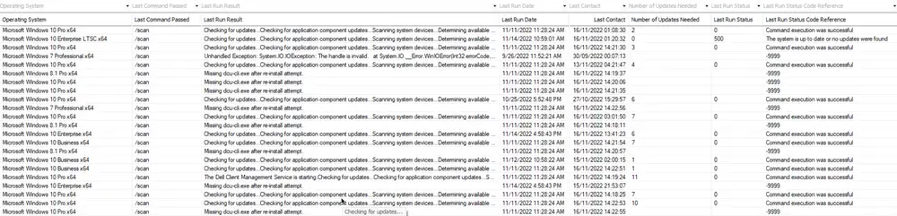

## Summary

The purpose of this dataview is to display the last execution result of [Script - Dell Command Update - Install/Upgrade + Command Handler script](/docs/91cc7f02-1c0d-4303-81f2-91fd0d275747/) for the Dell Workstations.

**Sample Screenshot:**

## Dependencies

[Script - Dell Command Update - Install/Upgrade + Command Handler script](/docs/91cc7f02-1c0d-4303-81f2-91fd0d275747/)

## Columns

| Column                       | Description                                                                 |
|------------------------------|-----------------------------------------------------------------------------|
| Client Name                  | The name of the client organization associated with the device              |
| Location Name                | The specific site or location where the device is situated                  |
| Computer Name                | The hostname or identifier of the computer being audited                    |
| Operating System             | The operating system installed on the device                                |
| Last Command Passed          | The most recent command that was successfully executed                      |
| Last Run Result              | The outcome or result of the last script execution                          |
| Last Run Date                | The date and time when the script was last executed                         |
| Last Contact                 | The most recent time the device communicated with the management system      |
| Number of Updates Needed     | The count of pending updates detected on the device                         |
| Last Run Status              | The current status of the last script run (e.g., 0, 1, 500)           |
| Last Run Status Code Reference | A reference code providing more detail about the last run status          |
