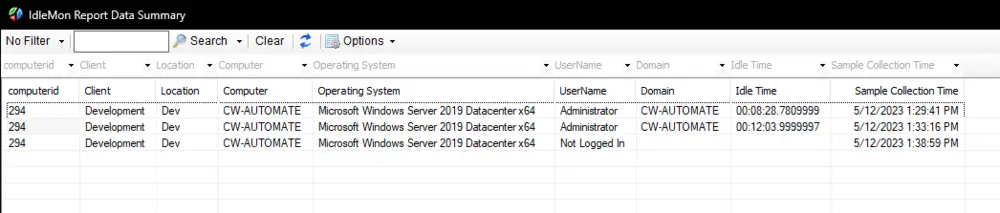

## Summary

The purpose of the dataview is to display the historical data of the user's idletime for a computer. The threshold of the data is defined in the global variable `ThresholdDays` of the [CWM - Automate - Script - IdleMon Report [Globals]](/docs/c6ea69e0-823f-4090-9894-2faf81ba8c46) script.

## Dependencies

- [CWM - Automate - Script - IdleMon Report [Globals]](/docs/c6ea69e0-823f-4090-9894-2faf81ba8c46)
- [CWM - Automate - Custom Table - pvl_report_idlemon](/docs/44909a53-c1ca-4d2d-994a-40fba5a139fa)

## Columns

| Column               | Description                                                                                                      |
|---------------------|------------------------------------------------------------------------------------------------------------------|
| clientid            | clientid (Hidden)                                                                                               |
| locationid          | locationid (Hidden)                                                                                             |
| computerid          | computerid                                                                                                      |
| Location            | Location Name                                                                                                   |
| Client              | Client Name                                                                                                     |
| Computer            | Computer Name                                                                                                   |
| Operating System     | Operating System                                                                                                |
| UserName            | Logged on User (Not Logged In if no one was logged on to the machine during script run)                       |
| Domain              | Domain of the user (Name of the computer for local users)                                                     |
| Idle Time           | Idle Time of the user (Hours:Minutes:Seconds.Milliseconds)                                                    |
| Is Admin            | Is Admin? (True/False) (Hidden)                                                                                |
| Is Domain Admin     | Is Domain Admin? (True/False) (Hidden)                                                                         |
| Is Enterprise Admin  | Is Enterprise Admin? (True/False) (Hidden)                                                                    |
| Sample Collection Time | Sample Collection Time                                                                                        |

## Sample Screenshot

