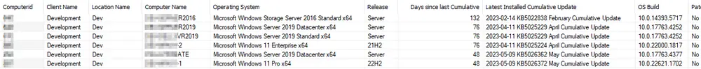

## Summary

This document displays the data fetched by the [CWM - Automate - Script - Get Latest Installed Cumulative Update](/docs/bd99d6b2-2d31-4611-9682-3c8518c53998) script. The data view explicitly excludes machines for which Microsoft does not release cumulative updates.

## Dependencies

- [CWM - Automate - Script - Get Latest Installed Cumulative Update](/docs/bd99d6b2-2d31-4611-9682-3c8518c53998)
- [CWM - Automate - Custom Table - pvl_win_latest_installed_cu](/docs/c03e4def-7efe-4a8b-99e9-d99ac2c65f5a)

## Columns

| Column                              | Description                                         |
|-------------------------------------|-----------------------------------------------------|
| Client ID                           | Client ID (Hidden)                                 |
| Location ID                         | Location ID (Hidden)                               |
| Computer ID                         | Computer ID                                       |
| Client Name                         | Client Name                                        |
| Location Name                       | Location Name                                      |
| Computer Name                       | Computer Name                                      |
| Operating System                    | Operating System                                    |
| Release                             | OS Release Number                                   |
| Latest Installed Cumulative Update   | Name of the Latest Installed Cumulative Update     |
| OS Build                            | Full Build Number of the Operating System           |
| Patch Managed                       | Is the computer patch managed? (Yes/No)            |
| Is End of Life                      | Is the computer's Operating System End of Life? (Yes/No) |
| Last Logged In User                 | Last Logged In User                                 |
| Last Contact                        | Last Contact with RMM                              |
| Script Run Time                     | Last Run Time of the script                         |
| Patch Release Date                  | Date when the installed CU was released             |
| KBID                                | KBID of the CU                                     |
| Days Since Last Cumulative          | Age of the latest installed cumulative update in days |
| Friendly Name                       | Friendly Name of the Machine                          |
| Days Since Last Script Run          | Days since script last ran on the machine                   |
| Days Since Last Contact             | Last Contact of the machine in days                   |

## Sample Screenshot

