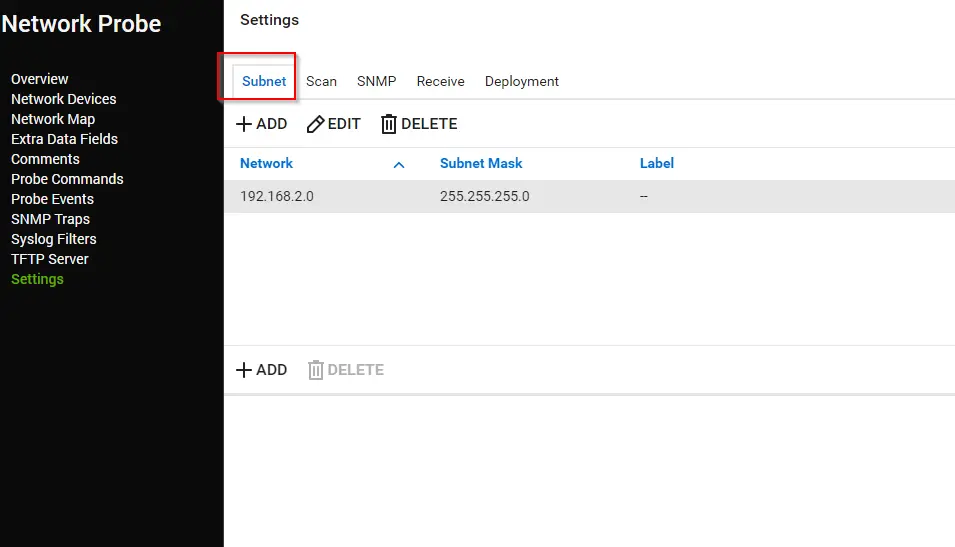
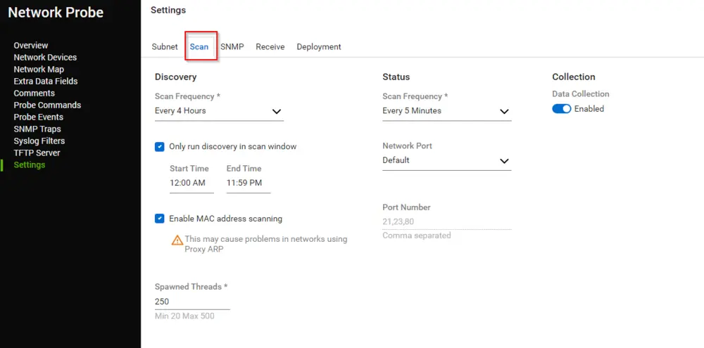
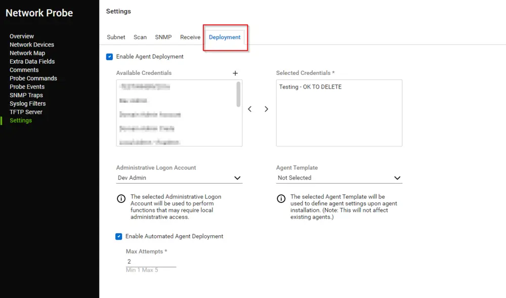

## Summary

This document presents information related to Network Probes (Gen1 and Gen2). It also suggests the best computer to use at a location if a network probe is not present.

Information from the following tabs of a Network Probe settings page is displayed in the Dataview:

### Subnet

### Scan

### Deployment

## Dependencies

- [CWM - Automate - Custom View - plugin_proval_probeconfig](/docs/bd07c1dc-34ff-4f87-aae9-b43dcd1b5057)
- [CWM - Automate - Script - Create View "plugin_proval_probeconfig"](/docs/5bee0fdf-d4c0-4158-8d69-ba49f43b66c5)

## Columns

| Column                          | Description                                                                                      |
|---------------------------------|--------------------------------------------------------------------------------------------------|
| Client                          | Client Name                                                                                     |
| Location                        | Location Name                                                                                   |
| Probe Status                    | Indicates if the probe is enabled or not; shows the name of the probe if enabled.              |
| Recommended Probe                | Name of the recommended computer if the probe is disabled; otherwise, it shows the probe name. |
| Probe Version                   | Version of the Probe, e.g., Generation 1 or Generation 2.                                     |
| IsMacAddressScanningEnabled      | Indicates if scanning for MAC addresses is enabled or disabled for the probe.                  |
| IsDataCollectionEnabled         | Indicates if data collection is enabled or disabled for the probe.                             |
| MaxDeploymentAttempts           | Number of attempts to deploy the agent.                                                         |
| AutomatedDeploymentEnabled       | Indicates if automated agent deployment is enabled or not.                                     |
| Network                         | Network(s) being scanned by the probe.                                                         |
| SubnetMask                      | Subnet Mask(s) of the Network(s) scanned by the probe.                                         |
| Credentials Title               | Title of the credentials being used for agent deployment.                                       |
| Credentials Username            | Usernames of the credentials being used for agent deployment.                                   |
| Discovery Scan Frequency         | Discovery scan frequency of the Network Probe.                                                 |
| Status Scan Frequency            | Status scan frequency of the Network Probe.                                                    |
| Scan Network Port               | Default | Custom | Disabled; Network Ports allowed to scan.                                        |
| Status Scan Port Number         | Network port numbers allocated for scanning.                                                    |
| Created By                      | Creator of the Network Probe.                                                                   |
| Updated By                      | Last user to make changes to the probe.                                                        |
| Creation Date                   | Date of creation.                                                                                |
| Last Update Date                | Last update date for the network probe.                                                         |