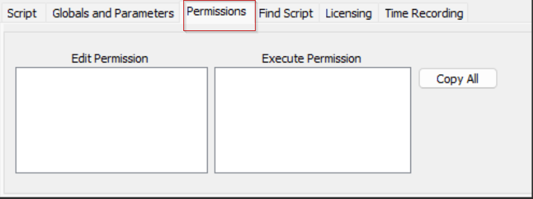
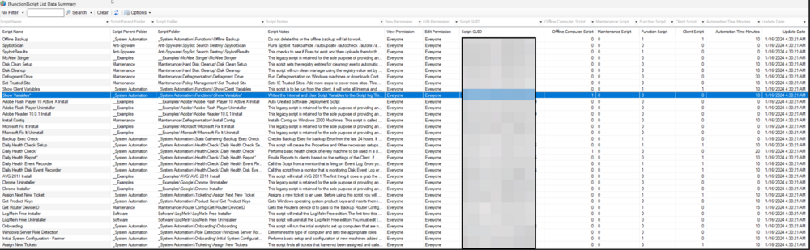

## Summary

This dataview lists all scripts in the environment with details about their script folders, the type of scripts, any notes included, and which user classes may run and/or edit the script.

## Columns

| Column                       | Description                                                                                                                                                                                                                  |
|------------------------------|------------------------------------------------------------------------------------------------------------------------------------------------------------------------------------------------------------------------------|
| Script Name                  | The name of the script.                                                                                                                                                                                                    |
| Script Parent Folder         | The name of the parent folder of the script.                                                                                                                                                                               |
| Script Folder                | The full path to the script.                                                                                                                                                                                               |
| View Permission              | A comma-separated list of user classes that can execute or view the script; `EveryOne` stands for all users with the basic permission for scripts.           |
| Edit Permission              | A comma-separated list of user classes that can edit the script; `EveryOne` stands for all users with the basic permission for scripts.                                                                                     |
| Script GUID                  | The GUID of the script.                                                                                                                                       |
| Offline Computer Script      | Can this script be executed against offline machines as well? (0/1)                                                                                |
| Maintenance Script           | Can this script be executed against computers in maintenance mode as well? (0/1)                                                                                                                                         |
| Function Script              | Is this a function script? (0/1) (Function scripts can be called from an alert template or another script but cannot be executed directly against a computer/client.)                                                       |
| Client Script                | Is this a client script? (0/1)                                                                                                                                                                                             |
| Automation Time Minutes      | Time saved by automation.                                                                                                                                                                                                   |
| Update Date                  | The most recent update date of the script.                                                                                                                                                                                 |
| Updated By                   | The name of the user who last updated the script.                                                                                                                                                                         |

## Example Screenshot

