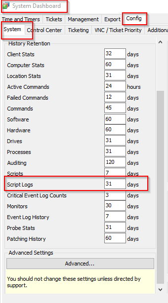
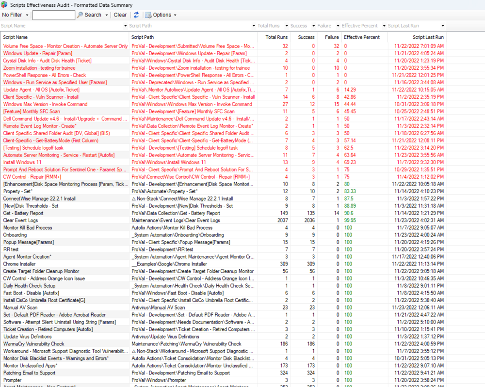

## Summary

This Dataview displays a summary of all scripts run over the set script log retention days. It includes the total runs, failures, successes, and the effectiveness of the scripts. The script log retention days can be seen at the automate location below:

## Columns

| Column              | Description                          |
|---------------------|--------------------------------------|
| Script Name         | Name of the script                   |
| Script Path         | Path to the script                   |
| Total Runs          | Number of times it ran               |
| Failure             | Number of times it failed            |
| Success             | Number of times it succeeded         |
| Effective Percent    | Effective percentage of success      |
| Script Last Run     | This shows the last run of the script|

## Example Screenshot

