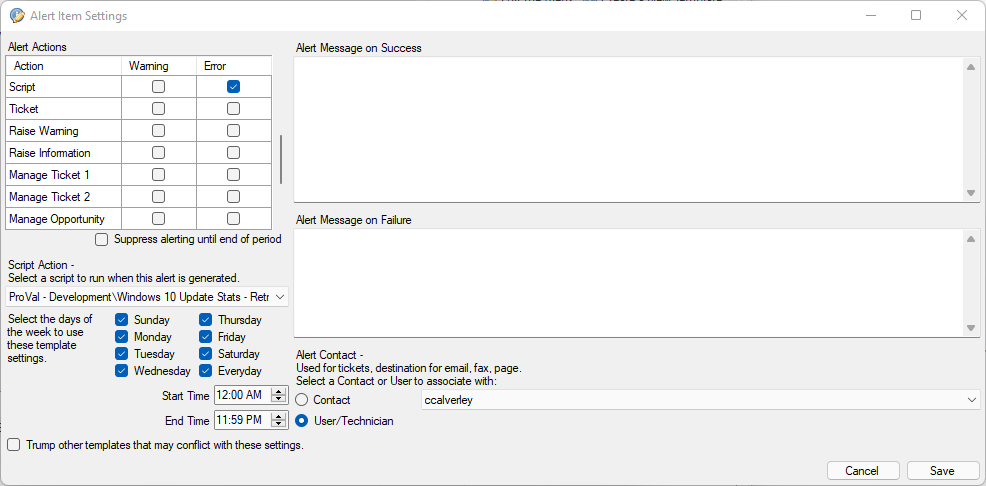

## Summary

This document provides statistics regarding the Windows 10 - Feature Update - Latest script. It includes information on the update installation date, the update state, success count of the script for each Windows version, failure count for each version, and the total attempts made.

## Requirements

1. The script **Windows 10 - Feature Update - Latest** must be used to push the most recent feature update.
2. The group **Windows 10 - Upgrade Pending Reports** must have the remote monitor (Application - Event 6501 - Provider Update-Windows10-PS) configured with an autofix action calling the script **Windows 10 Update Stats - Retrieve** on error every day, all day (see below). This should be configured within one hour of running the **Windows 10 - Feature Update - Latest** script for the first time.

## Dependencies

- [SEC - Windows Patching - Script - Windows 10 - Feature Update - Install Latest](/docs/5a4a9091-269e-4921-a7ba-bc87c209a43c)
- [EPM - Data Collection - Script - Windows 10 Update Stats - Retrieve](/docs/65815475-a61d-4f0d-b2ba-c7b8368285c9)

## Columns

| Column             | Description                                                                                              |
|--------------------|----------------------------------------------------------------------------------------------------------|
| ID                 | Displays the computer ID.                                                                                |
| Client Name        | Displays the client name for the device.                                                                |
| Computer Name      | Displays the name of the computer.                                                                       |
| Windows Version     | Displays the currently installed version of Windows on the computer.                                     |
| Installation Date   | Displays the date and time that the Windows 10 - Feature Update - Latest script was run on the computer.|
| Installation State  | Displays the state of the installation pushed. It will display one of the following: Not Attempted, Attempted, Failed, or Successful. |
| Success Count      | Displays the total number of times the Windows 10 Feature Update - Latest script was run and returned a successful result for this version. |
| Failure Count      | Displays the total number of times the Windows 10 Feature Update - Latest script was run and returned a failed result for this version. |
| Total Attempts      | Displays the total number of times the Windows 10 Feature Update attempted to push that Windows version on the specific computer. |

