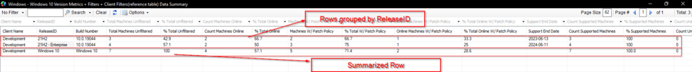

## Summary

This dataview displays the number of Windows 10 machines by the build number (ReleaseID) as well as a calculated percentage of machines on that version against the total number of Windows 10 devices for each client. There are several filters available for this data. See the columns listed below for filter details.

An additional summarized row per client is included in the dataview.

### Sample Screenshot:

- [SEC - Windows Patching - Custom Table - plugin_proval_windows_os_support](/docs/938cd822-f6a3-4ee3-add2-62b407e45622)
- [CWM - Automate - View - plugin_proval_v_windows_10_version_metrics](/docs/ea558c06-8fef-4c9f-87c7-42a3aa289dad)
- [Create View plugin_proval_v_windows_10_version_metrics](/docs/ac098d84-7d28-4b69-933f-74ab861d2b89)

## Columns

| Column                           | Type            | Explanation                                                                                                                                                                                                 |
|----------------------------------|-----------------|-------------------------------------------------------------------------------------------------------------------------------------------------------------------------------------------------------------|
| ReleaseID                        | mediumtext      | The Build Name/Number for Windows 10. Example: 1709, 21H1, 1803 - LTSC. It will show 'Windows 10' for the Summary Row.                                                                                   |
| Total Machines Unfiltered        | decimal(23,0)   | The number of Windows 10 machines for the client for the concerned ReleaseID. For the summary row, it's the total number of Windows 10 machines.                                                               |
| % Total Unfiltered               | varchar(27)     | The number of machines on that Windows 10 ReleaseID for the client divided by the total number of Windows 10 machines for the client. For the Summary row, it will be 100.                                          |
| Count Machines Online            | decimal(23,0)   | The number of machines on the respective Windows 10 ReleaseID for the client with the following filter: The machine must have checked into CW Automate in the last 15 minutes. For the Summary row, it's the number of online Windows 10 machines for the client. |
| % Total Online                   | decimal(28,1)   | The number of machines on the respective Windows 10 ReleaseID for the client with the above filter divided by the total number of Windows 10 machines for the client with the same ReleaseID. For the Summary row, it's the percentage of online Windows 10 machines out of the total Windows 10 machines for the client. |
| clientid                         | int(11)         | Client ID                                                                                                                                                                                                      |
| Machines W/ Patch Policy         | decimal(23,0)   | The number of machines on the respective Windows 10 ReleaseID for the client with the following filter: The machine must have a patch policy with "Managed Mode" or "Managed Mode UI Disabled" as its patch install method. For the Summary row, it's the total number of Windows 10 machines for the client with a "Managed Mode" or "Managed Mode UI Disabled" as its patch install method. |
| % Total W/ Patch Policy          | decimal(28,1)   | The number of machines on the respective Windows 10 ReleaseID for the client with the above filter divided by the total number of Windows 10 machines for the client with the same ReleaseID. For the Summary row, it's the percentage of Windows 10 machines for the client with a Managed Patch policy assigned out of the total Windows 10 machines for the client. |
| Online Machines W/ Patch Policy   | decimal(23,0)   | The number of machines on the respective Windows 10 ReleaseID for each client with the following filters: The machine must have a patch policy with "Managed Mode" or "Managed Mode UI Disabled" as its patch install method. The machine must have checked into CW Automate in the last 15 minutes. For the Summary row, it's the count of online Windows 10 machines for the client with a "Managed Mode" or "Managed Mode UI Disabled" as its patch install method. |
| % Total Online W/ Patch Policy   | decimal(28,1)   | The number of machines on the respective Windows 10 ReleaseID for each client with the above filters divided by the total number of Windows 10 machines for the client with the same ReleaseID. For the Summary row, it's the percentage of online Windows 10 machines for the client with a "Managed Mode" or "Managed Mode UI Disabled" as its patch install method out of the total number of Windows 10 machines for the client. |
| Client_Name                      | varchar(50)     | Name of the client                                                                                                                                                                                           |
| Support End Date                 | varchar(10)     | Official Support End Date for the ReleaseID, NULL/Blank for the Client Summary row.                                                                                                                      |
| Count Supported Machines          | varchar(21)     | Number of machines supported for the concerned Release ID, depending on the `Support End Date`. It's either the total number of machines for that ReleaseID or 0 for the ReleaseID rows. For the Summary row, it's the total count of all the supported Windows 10 machines for that client. |
| Count Unsupported Machines        | varchar(25)     | Number of unsupported machines for the concerned Release ID, depending on the `Support End Date`. It's either the total number of machines for that ReleaseID or 0 for the ReleaseID rows. For the Summary row, it's the total count of all the unsupported Windows 10 machines for that client. |
| % Supported Machines              | varchar(27)     | Either 100 or 0 for the ReleaseID row depending on whether the concerned ReleaseID is supported to date. For the Summary row, it's the percentage of the supported Windows 10 machines out of all the available Windows 10 machines. |
| % Unsupported Machines            | varchar(31)     | Either 0 or 100 for the ReleaseID row depending on whether the concerned ReleaseID is supported to date. For the Summary row, it's the percentage of the unsupported Windows 10 machines out of all the available Windows 10 machines. |
| Build                             | varchar(60)     | Build Number for the concerned ReleaseID. e.g., 10.0.19044, 10.0.19043. It will show 'Windows 10' for the Summary Row.                                                                                     |

