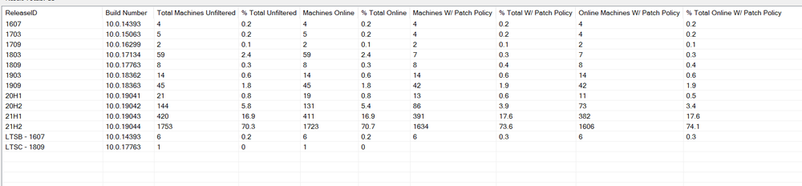
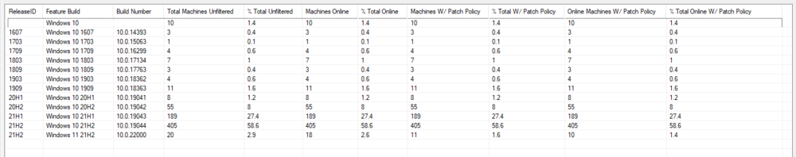

## Summary

This dataview displays the number of Windows 10 machines by build number (ReleaseID) as well as a calculated percentage of machines on that version against the total number of Windows 10 devices. Several filters are available for this data. See the columns listed below for filter details.

### Sample Screenshots:

  

## Dependencies

[SEC - Windows Patching - Custom Table - plugin_proval_windows_os_support](/docs/938cd822-f6a3-4ee3-add2-62b407e45622)

## Columns

| Column                          | Description                                                                                                                                                                                                                                        |
|---------------------------------|----------------------------------------------------------------------------------------------------------------------------------------------------------------------------------------------------------------------------------------------------|
| ReleaseID                       | The Build Name/Number for Windows 10. Example: 1709, 21H1                                                                                                                                                                                     |
| Total Machines Unfiltered       | The number of machines on each Windows 10 build with no filters applied.                                                                                                                                                                         |
| % Total Unfiltered              | The number of machines on each Windows 10 build divided by the total number of Windows 10 machines.                                                                                                                                                       |
| Online Machines W/ Patch Policy | The number of machines on each Windows 10 build with the following filters: The Windows 10 machine must have a patch policy with "Managed Mode" or "Managed Mode UI Disabled" as its patch install method. The Windows 10 machine must have checked into CW Automate in the last 30 days. |
| % Total Online W/ Patch Policy  | The number of machines on each Windows 10 build with the above filters divided by the total number of Windows 10 machines with the same filters applied.                                                                                                   |
| Machines Online                 | The number of machines on each Windows 10 build with the following filter: The Windows 10 machine must have checked into CW Automate in the last 30 days. (Available in column chooser)                                                        |
| % Total Online                  | The number of machines on each Windows 10 build with the above filter divided by the total number of Windows 10 machines with the same filter applied. (Available in column chooser)                                                                        |
| Machines W/ Patch Policy        | The number of machines on each Windows 10 build with the following filter: The Windows 10 machine must have a patch policy with "Managed Mode" or "Managed Mode UI Disabled" as its patch install method. (Available in column chooser)           |
| % Total W/ Patch Policy         | The number of machines on each Windows 10 build with the above filter divided by the total number of Windows 10 machines with the same filter applied. (Available in column chooser)                                                                        |

