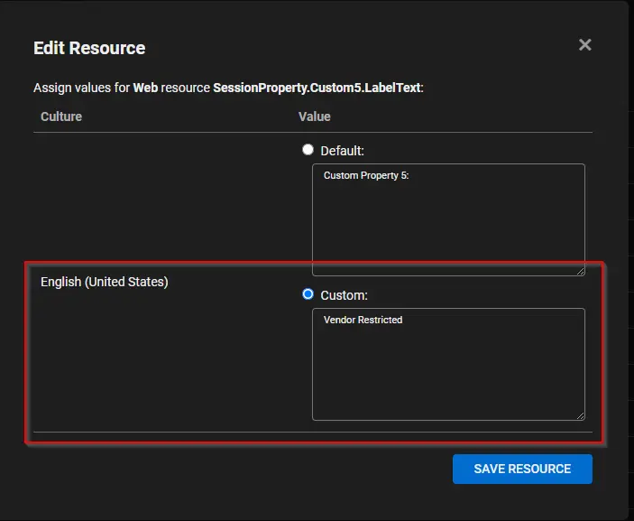
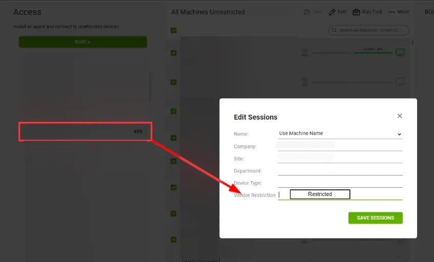
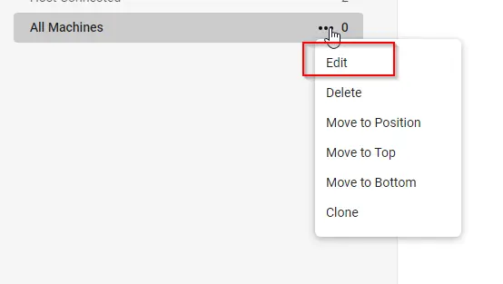

## Purpose

Due to compliance issues, some MSP partners need to restrict the ability for resources to see end-client machines in Automate. This solution will allow Automate admins to remove the ability to see specific clients in Automate.

**NOTE:** Any users with Super Admin will be able to remove the restricted access.

## Pre-requisites

- Create the below content in Automate using the script  before implementing the solution:

   1. Client/Location/Computer EDFs named "Restrict Vendor Access"  (This can be created using  [Script - ScreenConnect - Update Vendor Restricted Property* [RMM+]](/docs/1e1a92d4-008b-4b8e-af9d-3ff9579acb24) as mentioned in below process.)
   2. Create a search that filters the machines where the above EDFs are **NOT** marked.
   3. Create a group that is populated by the above search. This group is used to limit access to the vendor's Automate user account.

- Discuss with partner which all clients/Locations/Machines they would like to restrict.
- Verify if partner is already using the [Automate Database Maintenance - User Class Permission Sync](/docs/0b85cd78-2ed9-46b0-bf7a-6204226192bb) script in their environment. Note down the clientid used in the solution to copy the user class permissions. If not, discuss with partner if they would like to use any default client to copy the user class permissions. If not, Select any random user class. 

**Note : If PRONOC is responsible for making the Client Permission Changes and is intended to be a vendor-restricted user, ensure that the user class permission is updated as the final step.**

## Dependencies
- [Script - ScreenConnect - Update Vendor Restricted Property* [RMM+]](/docs/1e1a92d4-008b-4b8e-af9d-3ff9579acb24)
- [Automate Database Maintenance - User Class Permission Sync](/docs/0b85cd78-2ed9-46b0-bf7a-6204226192bb)
- [Internal Monitor - Automatically Restrict/Unrestrict Vendor Machines in SC](/docs/4a4b5a11-8087-4e0a-b2b1-629d07326dd2)

Please go through these solutions thoroughly before implementing the solutions. Import them, if they are already not imported in the Partners environment.

## Process

1. Import the [Script - ScreenConnect - Update Vendor Restricted Property* [RMM+]](/docs/1e1a92d4-008b-4b8e-af9d-3ff9579acb24) using the ProSync Plugin
   - It is a Duplicate of the [Script - ScreenConnect - Update Custom Property* [RMM+,Param]](/docs/b634da09-7507-466f-be5e-f7a8d62aacf7), just its user parameters are global parameters.

2. Reload the System Cache  
   

3. Run the script against any machine to create below:  

      | Item | Type | 
      |-----------------------------------|--------------------|
      |Restrict Vendor Access             | EDF                |
      |PropertyIndex                      | System Properties  |
      |Vendor Restricted - Super Admin    |User Class          |
      |Restricted vendor Access           |Search              |
      |Restrict Vendor Access             |Group               |

   - Navigate to `Automation` > `Scripts` within the CWA Control Center.
   - Open [ScreenConnect - Update Vendor Restricted Property* [RMM+]](/docs/1e1a92d4-008b-4b8e-af9d-3ff9579acb24) Script
   - Debug script on any machine with parameter `Set_Environment= 1`    
   

4. After performing the above step, reload the System Cache again otherwise group will cease to open with a permissions error   
   

5. With the pieces imported this is where a super admin user must take over.   

   - The admin must mark the Extra Data Fields (**Which are only editable if the user has the Super Admin userclass**) for the clients, locations or computers that must be hidden from the Vendor. 
   - Please open the target client, location or computer and navigate to the `Info` > `Default` tab.  (Discuss with partner which all clients/Locations/Machines they would like to restrict)

   

# CWA User Account

1. Create the user account that you would like to restrict. The typical setup for ProVal has been outlined below:
   - User Account - PRONOC -
     - Apply the Super Admin - Restrict Vendor Access permission to this account.
       - This is the account the team is trained to use.
   - User Account - PRONOCA - This is our standard US Only Super Admin account.  

   **Note:** This step will be performed by Account manager to store credentials in Bitwarden.

2. Assign the proper permissions to the accounts you just created
   - The Vendor Restricted user should have the newly created user class assigned to it   
     - Vendor Restricted - Super Admin  
     
   - The US account can have the full Super Admin rights

3. Assign the proper group membership from the Groups and Clients tab:
   - For the restricted user, the only group that should be in the 'Member of' side is 'All Agents.Restrict Vendor Access'.
     - This is the setting on the user account that hides the restricted clients from the login.  
     

4. To propagate EDF changes quicker to the restricted accounts, you can force sync the search like shown below:
   - Users with this configuration will perform similarly to the "All Agents" group in Automate, but thanks to the search included in the XML, excludes any clients where the EDF is marked. The 'All Agents.Restricted Vendor Access' group will not display these agents. This will effectively hide all machines at clients where the EDF is marked.
   - These changes can take up to 30 minutes to go into effect. If this needs to happen more quickly, please navigate to the 'All Agents.Restricted Vendor Access' group and force update agents in the group.   
   

**Note:** Follow the above steps for any other users that should have vendor restricted access. 

## Client Permissions

After following the above steps, we need to add client-level permissions for "Vendor Restricted - Super Admin" user class. First verify if partner is already using the [Automate Database Maintenance - User Class Permission Sync](/docs/0b85cd78-2ed9-46b0-bf7a-6204226192bb). If yes, verify the Client ID they are using to copy the permissions to other clients and perform the below steps on that client. If not, choose any client or confirm with the partner which client’s permissions should be copied. Follow the below steps to perform it.

1. Find the client you would like to deem the 'Default/Standard' configuration.

2. Make sure to ensure there are no exceptions to the default configuration that will need to get accounted for. Once you clear all of the permissions to begin copying the permissions, you can't view the old data.
   - It is recommended to open/export the '[User Class Permissions - Client](/docs/af60f4a6-c13c-4fc9-b488-263ce5c38485)' dataview to allow us to re-create the permissions if asked.

3. Navigate to Automation --> Scripts within the CWA Control Center.
   - Open [ScreenConnect - Update Vendor Restricted Property* [RMM+]](/docs/1e1a92d4-008b-4b8e-af9d-3ff9579acb24) Script
   - Debug script on any machine of the selected CLIENT (From step 1) with parameter `Set_Client_Permissions= 1`  
       
   This will add `Vendor Restricted - Super Admin` User Class with full permission to that client   
   

   **Note:** The above step is to set the permission for  `Vendor Restricted - Super Admins` User Class on that particular client and below steps is to copy that permissions to other clients in the partners environment.

4. If partner is not already using the [Automate Database Maintenance - User Class Permission Sync](/docs/0b85cd78-2ed9-46b0-bf7a-6204226192bb). Discuss with partner for any clients to exclude and accordingly set the system properties mentioned in this document in partners environment. (Please go through this solution thoroughly). If they are already using it. Just run this script against any client to copy the permissions to all the clients.

## ScreenConnect

1. Make sure you duplicate the 'All Machines' group and rename the original to 'All Machines (Unrestricted)'.  
   

- `All Machines (Unrestricted)` Group - This group will show all the machines regardless they are restricted or unrestricted.

- `All Machines` Group - This group will only show all the machines excluding the restricted one.

2. Create "Vendor Restricted" Custom Property:  
   (a). Open the Appearance page (`Admin` > `Appearance`) 

   (b). Type CTRL+F and look for custom property resource strings beginning with the key, `SessionProperty.Custom5.LabelText`.  
      - Custom Property slot 1-4 are used by the CWA / CWC plugin. Avoid using them.      
      - Try using the properties between 5-8 that are not already used.  

   (c). Edit `SessionProperty.Custom5.LabelText` (Note: This may vary according to the client.)  

   (d). Enter "Vendor Restricted" in the **Custom** text area. Click **Save Resource** to save  
        

   (e). Set the visibility of the "Vendor Restricted" Custom Property
      - Just Above `SessionProperty.Custom5.LabelText` you will find `SessionProperty.Custom5.AccessVisible`. Set this property to `True`.
      
   (f). The final setting should look like this:    
        
      The "Vendor Restricted" property will start displaying like shown below:
        

      _Note: The word "Restricted" will restrict any machine in Screenconnect and "Restriction OFF" will turn off the restriction. This will set by the script._

3. Now go to the copied Group 'All Machines'
   - Click on three dots on the right-hand side of the session group.
   - Click on Edit.  
   
   - This will open a dialog box,
     - Fill in the `Session Filter:` with `CustomProperty5 <> 'Restricted'`, so it will only show the machines that are not restricted 

       **NOTE:** The number after 'CustomProperty' needs to match the number   configured for the solution. 5 is the most common but can be changed.  
       

4. Work with the client to set this to 'Restricted' for all machines that need to be removed from vision for vendor  
   

5. Go to `Admin` > `Security` > `Roles`. Clone the Administrator role, rename to 'Administrator (Unrestricted)', and clone again to create a 'Administrator (Vendor Access)' or Administrator depending on the client's needs.
   This sets up admins or other tiered techs.  
   

6. Last step is to apply this role and permissions on the newly restricted group. 
   - Open the `Administrator (Vendor Access)` role. 
   - Deselect all the permissions from `All Sessions Group`.
   
   - Select the `All Machines` group (you just created for restriction) from the left side.
   - Assign the permissions  as shown in the below screenshot and save it:   
   

   **NOTE:** The `Administrator (Vendor Access)` role is limited to the Group `All Machines`. And the `Administrator (Unrestricted)` role is applied to all the groups to have full permission.

   - The restricted user will get below like page where the user can see only one group:

   

## SC Permissions

Below is the process that will ensure that when the EDFs "Restrict Vendor Access" are checked within automate, it automatically restricts the machines in SC.

1. Import the internal Monitor using ProSync Plugin
   - [Automatically Restrict/Unrestrict Vendor Machines in SC](/docs/4a4b5a11-8087-4e0a-b2b1-629d07326dd2)

2. Import the following Alert Template using the ProSync plugin:
   - `△ Custom - Execute Script - Update Vendor Restricted Property`

3. Reload the System Cache  
   

4. Configure the solution as follows:
   - Navigate to `System dashboard` > `Config` > `Configurations` > `System Properties` within the CWA Control Center.
     - Fetch "Vendor Restricted" property Index from Screenconnect Portal
     - In the above example we have used `SessionProperty.Custom5.LabelText` so its Property Index will be "5"
       - Set the Correct Value for the System property `PropertyIndex`
     - PropertyValue will automatically be fetched based on the EDF's value. If EDF's are selected and the machine is not restricted in Screenconnect it will automatically restrict it. Similarly, if any machine is accidentally set to restricted and EDF's are not selected at client or location level in CWA, it will automatically revert the changes for that machine.  
   - Navigate to `Automation` > `Monitors` within the CWA Control Center.
     - [ Automatically Restrict/Unrestrict Vendor Machines in SC](/docs/4a4b5a11-8087-4e0a-b2b1-629d07326dd2)
       - Configure with the alert template: `△ Custom - Execute Script - Update Vendor Restricted Property`
       - Right-click and Run Now to start the monitor.