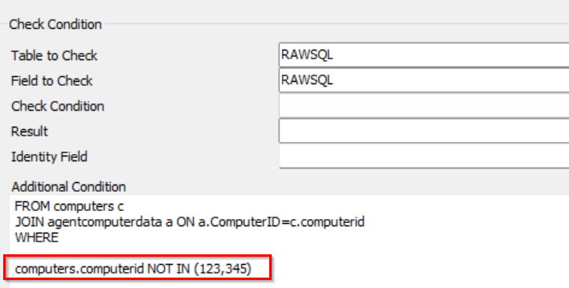
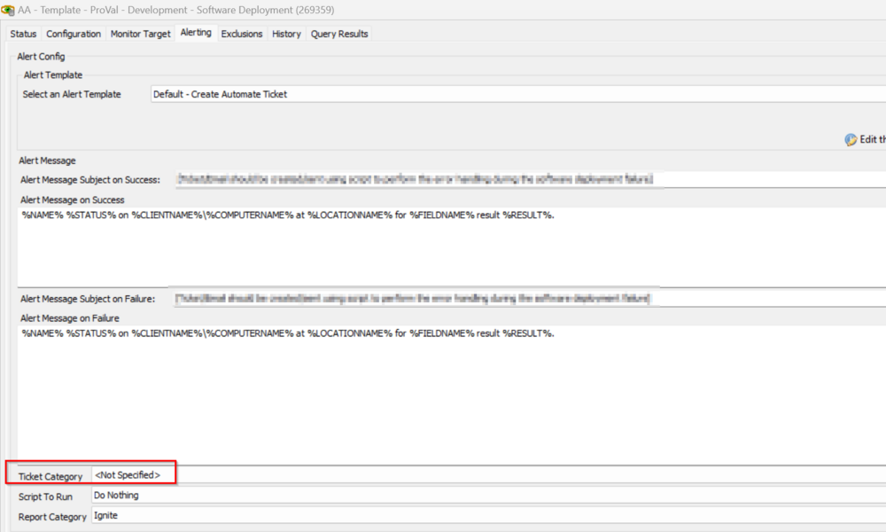
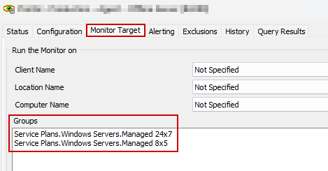
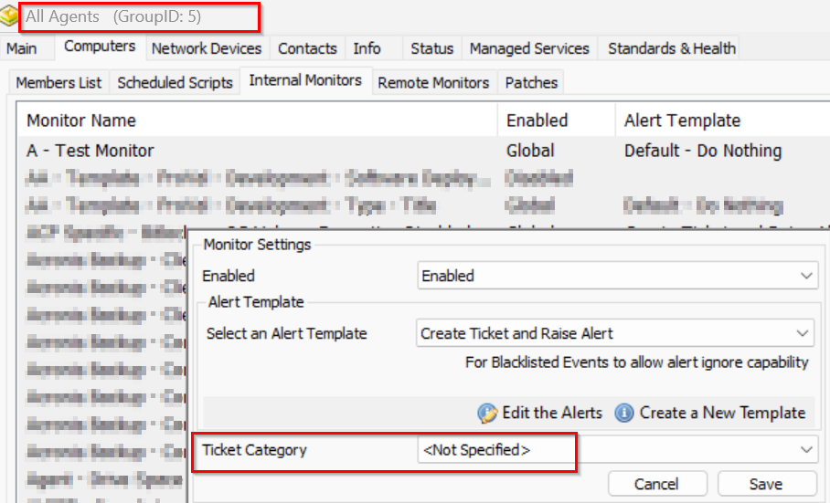
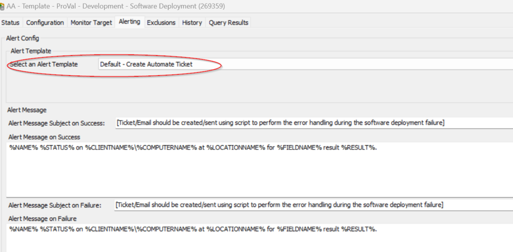
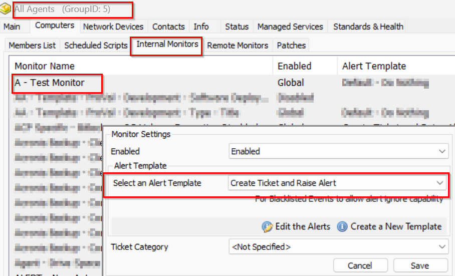
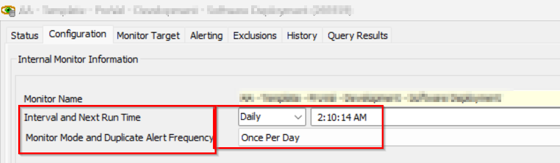
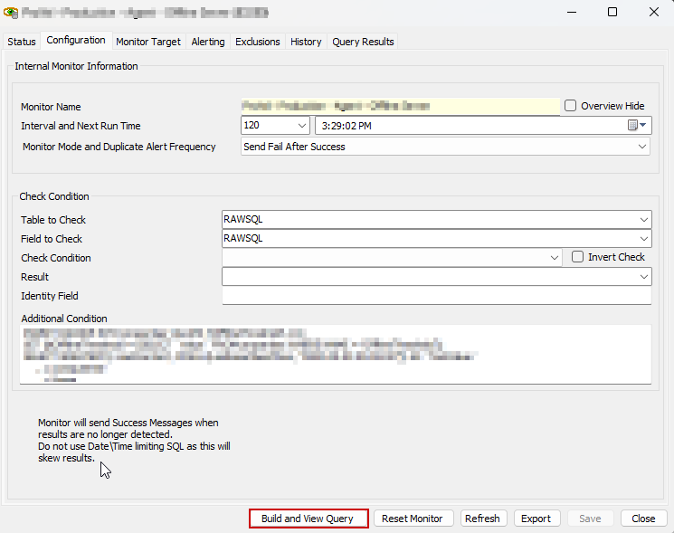

## Internal Monitor Update Process

#### SQL Level Exclusions

1. **Review SQL Level Exclusions**
    - Check any potential SQL-level exclusions in the old monitor before importing the  new modified monitor.
    - Example:
        ```sql
        computers.computerid NOT IN (123,456,.....)
        OR
        computers.clientid IN (1,2,......)
        OR
        tbl.computerid NOT IN (123,456,......)
        OR
        tbl.locationid NOT IN (3,4,......)
        ```
    - **Note** - the ..... represents the so on following with ',' (comma) separated.

   

   Note: IN and NOT IN contains the sets of the values. These should be the computerid, clientid, or locationids that are being excluded.
   Refer to the below link for more information on the logic:
   - [https://www.w3schools.com/sql/sql_in.asp](https://www.w3schools.com/sql/sql_in.asp)

   **Take Note of any SQL level exclusions showing in the old monitor.** This will need to be added to the newly updated/imported monitor.

#### Exclusion Tab

2. **Review Exclusion Tab**
   - Please review the exclusion tab for any exclusions on an old monitor before importing the modified monitor from the plugin.

   

   **Take note of anything found in this tab.** This will need to be moved over to the newly imported/updated monitor to ensure the same functionality after the update.

#### Ticket Category

3. **Review the Ticket Category Assigned**
   - Please check the assigned ticket category in the old monitor before syncing the new monitor from the plugin and set that category as same as before.

   

   - This is mandatory to capture the Ticket category before importing the new modified monitor.
   - Note: If the monitor has a target applied then please open that group and go to the Internal monitor, look for the monitor check the ticket category applied to it, and record that as well for the changes delivered.

   
   Then navigate to those groups and verify there is no custom ticket categories set at the group level.

   

   **Take note of the Ticket Category as suggested:** This will need to be moved over to the newly imported/updated monitor to ensure the same functionality after the update.

#### Alert Template

4. **Review the Alert Template**
   - Make sure to check the alert template before enabling the monitor after the update.

   

   - Note: If the monitor has a target applied, then please check the alert template at the target/group level because if the Alert Template is applied at the group level then it will override the one applied globally.

   

   **Take note of the alert template as suggested.** This will need to be moved over to the newly imported/updated monitor to ensure the same functionality after the update.

#### Alert Frequency

5. **Review Alert Frequency**
   - Make sure to set the alert frequency the same as it was set on the old monitor after the update.
   For example: Running daily at 2:00 AM.

   

   - Time is not a concern here, you just have to be smart enough to match the interval and the duplicate alert frequency.
   - Also, if any monitor is resulting in a reboot case, then please make sure to match the time of the scheduled after-hours window.

   **Take note of anything found in this tab.** This will need to be moved over to the newly imported/updated monitor to ensure the same functionality after the update.

#### Import Monitor

6. **Import the Updated Monitor**
   - Delete the old monitor
     - **Making sure to have taken note of ANY customizations on the old monitor (Steps above)**
   - Import the updated monitor using the ProSync Plugin.
     - The imported monitor will come into a disabled state.
   - **Before enabling the monitor**, please adjust the monitor to match the old monitor's settings and save the monitor afterwards. (Gathered in the above steps)
     - **NOTE**: Sometimes, hitting the save button does not actually save the configuration. Please verify all of the changes made have been saved properly.
   - Do Build and View Query of the new monitor after the modification.

   

   **IMPORTANT**: If it detects more than 10 results, and it is **targeting to create a ticket or send an email**, please connect with the account manager before enabling it.
