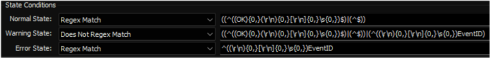

## Summary

The monitoring system is set up to gather data on event ID 4740 that occurred within the last 15 minutes and to generate an alert with the relevant information.

## Details

**Suggested "Limit to"**: Primary Domain Controllers of Each Domain `<Distinct Domain Controller Per Client>`

**Suggested Alert Style**: Continuous

**Suggested Alert Template**: △ Custom - Ticket Creation Computer - Failures Only

Insert the details of the monitor in the table below.

| Check Action | Server Address | Check Type | Execute Info | Comparator | Interval | Result            |
|--------------|----------------|------------|---------------|------------|----------|-------------------|
| System       | 127.0.0.1     | Run File   | **REDACTED**  | State Based | 900      | \<Screenshot Below> |



## Dependencies

[CWM - Automate - Script - Ticket Creation - Computer [Failures Only]](/docs/e14bf501-f10d-44d7-a19a-2284fd5c5cc9)

## Target

Domain Controllers  
  
The monitor set should be limited to the `<Server Role - AD - Infrastructure Master>` search.  


## Implementation

Please follow the instructions provided in the implementation article to implement the solution:  
[Implement - Remote Monitor - AD Account LockOut Detection](./Import%20-%20Remote%20Monitor%20-%20AD%20Account%20LockOut%20Detection.md)

## Ticketing

**Subject:** `<AD Account LockOut Detected on %COMPUTERNAME%>`

**Body:**  
Here are the details of the user(s) who were locked out:  
`%RESULT%.`

**Sample %RESULT%:**  
```
EventID    :    4740
EventDate   :   1/24/2024 7:34:50 AM
Username    :   TestUser1
Endpoint    :    DEV-Win11DomainJoined
Domain      :    provaltestdomain.local
DC          :    DEV-SERVER-2019$
```
