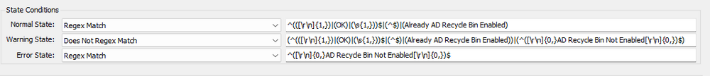

## Summary

This is a remote PowerShell monitor which detects whether the AD Recycle Bin is enabled or disabled on Windows DC servers.

## Details

**Suggested "Limit to"**: Windows Infrastructure masters  
**Suggested Alert Style**: Once  
**Suggested Alert Template**: △ Custom - Execute Script - AD - Enable AD Recycle Bin  

| Check Action | Server Address | Check Type | Comparator   | Interval | Result |
|--------------|----------------|-------------|--------------|----------|--------|
| System       | 127.0.0.1      | Run File    | state based   | 86400    |  |

## Dependencies

[AD - Enable AD Recycle Bin](<../scripts/AD - Enable AD Recycle Bin.md>)  
[RSM - Active Directory - Role - AD Domain Recycle Bin Feature](<../roles/AD Domain Recycle Bin Feature.md>)  

## Target

Domain Controllers only

## Implementation

[Import - Remote Monitor - AD Recycle Bin State Check](<./AD Recycle Bin State Check.md>)  

