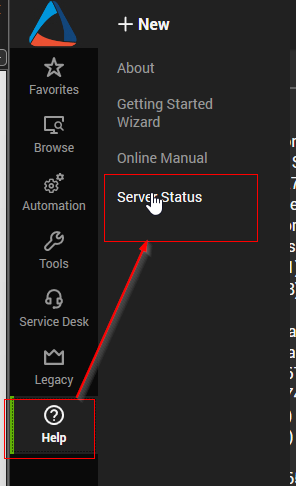
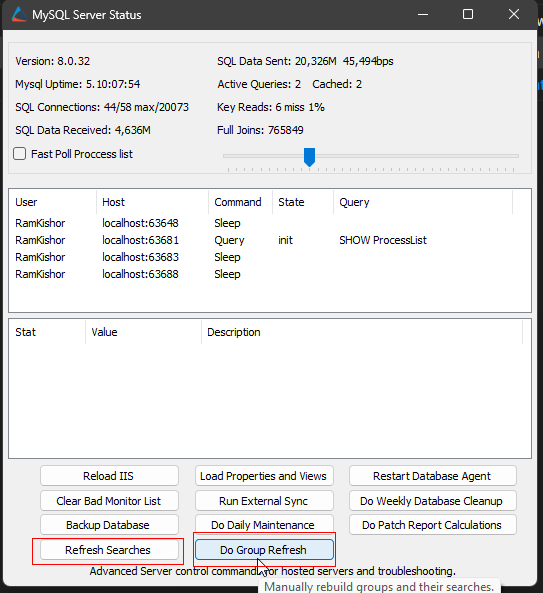
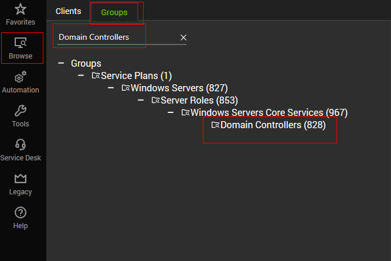
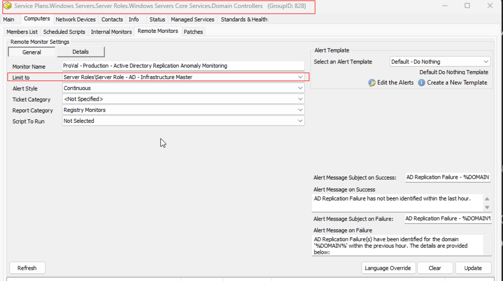

## Step 1
Run this SQL query from a RAWSQL monitor to import the required search.

```sql
INSERT INTO `sensorchecks` (`Name`, `SQL`, `QueryType`, `ListDATA`, `FolderID`, `GUID`, `SearchXML`) 
SELECT 'Server Role - AD - Infrastructure Master', 
'SELECT 
   computers.computerid as `Computer Id`,
   computers.name as `Computer Name`,
   clients.name as `Client Name`,
   computers.domain as `Computer Domain`,
   computers.username as `Computer User`,
   IFNULL(IFNULL(edfAssigned1.Value,edfDefault1.value),'0') as `Computer - Extra Data Field - Default - Under MSP Contract`,
   IFNULL(crd2.RoleDefinitionId,0) as `AD Infrastructure Master-2`,
   IFNULL(IFNULL(edfAssigned3.Value,edfDefault3.value),'0') as `Computer - Extra Data Field - Default - Exclude MSP Contract`,
   IF(INSTR(computers.os, 'server')>0, 1, 0) as `Computer.OS.IsServer`
FROM Computers 
LEFT JOIN inv_operatingsystem ON (Computers.ComputerId=inv_operatingsystem.ComputerId)
LEFT JOIN Clients ON (Computers.ClientId=Clients.ClientId)
LEFT JOIN Locations ON (Computers.LocationId=Locations.LocationID)
LEFT JOIN ExtraFieldData edfAssigned1 ON (edfAssigned1.id=Computers.ComputerId and edfAssigned1.ExtraFieldId =(Select ExtraField.id FROM ExtraField WHERE LTGuid='45c2da7e-3bf5-11e1-92fd-c1ee63289e9e'))
LEFT JOIN ExtraFieldData edfDefault1 ON (edfDefault1.id=0 and edfDefault1.ExtraFieldId =(Select ExtraField.id FROM ExtraField WHERE LTGuid='45c2da7e-3bf5-11e1-92fd-c1ee63289e9e'))
LEFT JOIN ComputerRoleDefinitions crd2 ON (crd2.ComputerId=Computers.ComputerId And crd2.RoleDefinitionId=(Select RoleDefinitionId From RoleDefinitions Where RoleDetectionGuid='e90000d4-2b70-11e3-9392-08002788414b') And (crd2.Type=1 OR (crd2.CurrentlyDetected=1 and crd2.Type<>2)))
LEFT JOIN ExtraFieldData edfAssigned3 ON (edfAssigned3.id=Computers.ComputerId and edfAssigned3.ExtraFieldId =(Select ExtraField.id FROM ExtraField WHERE LTGuid='a72e229b-3bf5-11e1-92fd-c1ee63289e9e'))
LEFT JOIN ExtraFieldData edfDefault3 ON (edfDefault3.id=0 and edfDefault3.ExtraFieldId =(Select ExtraField.id FROM ExtraField WHERE LTGuid='a72e229b-3bf5-11e1-92fd-c1ee63289e9e')) 
WHERE 
((((IFNULL(IFNULL(edfAssigned1.Value,edfDefault1.value),'0')<>0) AND (IFNULL(crd2.RoleDefinitionId,0) >0 ) AND (NOT ((IFNULL(IFNULL(edfAssigned3.Value,edfDefault3.value),'0')<>0))) AND (IF(INSTR(computers.os, 'server')>0, 1, 0)<>0))))
'4', 
'READONLY', 
'6', 
'430a4640-9c97-4344-bfe8-7a786b110729', 
'\\<LabTechAbstractSearch>\\<asn>\\<st>AndNode\\</st>\\<cn>\\<asn>\\<st>AndNode\\</st>\\<cn>\\<asn>\\<st>ComparisonNode\\</st>\\<lon>Computer.Extra Data Field.Default.Under MSP Contract\\</lon>\\<lok>Computer.Edf.45c2da7e-3bf5-11e1-92fd-c1ee63289e9e\\</lok>\\<lmo>IsTrue\\</lmo>\\<dv>NULL\\</dv>\\<dk>NULL\\</dk>\\</asn>\\<asn>\\<st>ComparisonNode\\</st>\\<lon>Computer.LabTech.Roles\\</lon>\\<lok>Computer.LabTech.Roles\\</lok>\\<lmo>HasRole\\</lmo>\\<dv>AD Infrastructure Master\\</dv>\\<dk>e90000d4-2b70-11e3-9392-08002788414b\\</dk>\\</asn>\\<asn>\\<st>NotNode\\</st>\\<cn>\\<asn>\\<st>ComparisonNode\\</st>\\<lon>Computer.Extra Data Field.Default.Exclude MSP Contract\\</lon>\\<lok>Computer.Edf.a72e229b-3bf5-11e1-92fd-c1ee63289e9e\\</lok>\\<lmo>IsTrue\\</lmo>\\<dv>NULL\\</dv>\\<dk>NULL\\</dk>\\</asn>\\</cn>\\</asn>\\<asn>\\<st>ComparisonNode\\</st>\\<lon>Computer.OS.IsServer\\</lon>\\<lok>Computer.OS.IsServer\\</lok>\\<lmo>IsTrue\\</lmo>\\<dv>NULL\\</dv>\\<dk>NULL\\</dk>\\</asn>\\</cn>\\</asn>\\</LabTechAbstractSearch>'
FROM (SELECT MIN(computerid) FROM computers) c 
WHERE (SELECT COUNT(*) FROM sensorchecks WHERE `GUID` = '430a4640-9c97-4344-bfe8-7a786b110729') = 0;
```

## Step 2
Run the provided SQL query to establish the `ProVal - Production - Active Directory Replication Anomaly Monitoring` remote monitor.

```sql
SET @SearchID = (SELECT MIN(sensid) FROM sensorchecks WHERE `GUID` = '430a4640-9c97-4344-bfe8-7a786b110729');
SET @Groupid = (SELECT MIN(groupid) FROM mastergroups WHERE `GUID` = '3ac455da-f1fb-11e1-b4ec-1231391d2d19');
INSERT INTO groupagents
    SELECT '' AS `AgentID`,
           `groupid` AS `GroupID`,
           @SearchID AS `SearchID`,
           'ProVal - Production - Active Directory Replication Anomaly Monitoring' AS `Name`,
           '6' AS `CheckAction`,
           '1' AS `AlertAction`,
           'AD Replication Failure - %DOMAIN%~~~AD Replication Failure has not been identified within the last hour.!!!AD Replication Failure - %DOMAIN%~~~AD Replication Failure(s) have been identified for the domain ''%DOMAIN%'' within the previous hour. The details are provided below:
%RESULT%
For a precise understanding of the error codes returned in the `LastError` property, please consult the following article: [Common Active Directory Replication Errors](https://learn.microsoft.com/en-us/troubleshoot/windows-server/identity/common-active-directory-replication-errors)' AS `AlertMessage`,
           '0' AS `ContactID`,
           '3600' AS `interval`,
           '127.0.0.1' AS `Where`,
           '7' AS `What`,
           'C://Windows//System32//WindowsPowerShell//v1.0//powershell.exe -ExecutionPolicy Bypass -Command \"$LRS=((Get-ADReplicationPartnerMetadata -Target $((Get-ADdomainController).Domain)) | Sort-Object -Property LastReplicationSuccess -Descending | Select-Object -First 1).LastReplicationSuccess;$LRA=((Get-ADReplicationPartnerMetadata -Target $((Get-ADdomainController).Domain)) | Sort-Object -Property LastReplicationAttempt -Descending | Select-Object -First 1).LastReplicationAttempt;if (($LRS -lt $LRA) -and ($LRA -ge $((Get-Date).AddHours(-1)))){(Get-ADReplicationFailure -Target $((Get-ADdomainController).Domain) -Scope Domain -Erroraction SilentlyContinue| Where-Object {$_.FirstFailureTime -ge $((Get-Date).AddHours(-1)) })}\"' AS `DataOut`,
           '16' AS `Comparor`,
           '10|((^((OK){0,}(//r//n){0,}[//r//n]{0,}//s{0,})$)%7C(^$))|11|((^((OK){0,}(//r//n){0,}[//r//n]{0,}//s{0,})$)%7C(^$))%7C(PartnerGuid)|10|PartnerGuid' AS `DataIn`,
           '' AS `IDField`,
           '0' AS `AlertStyle`,
           '0' AS `ScriptID`,
           '' AS `datacollector`,
           '21' AS `Category`,
           '0' AS `TicketCategory`,
           '1' AS `ScriptTarget`,
           CONCAT(
               SUBSTRING('abcdef0123456789', FLOOR(RAND()*16+1), 1),
               SUBSTRING('abcdef0123456789', FLOOR(RAND()*16+1), 1),
               SUBSTRING('abcdef0123456789', FLOOR(RAND()*16+1), 1),
               SUBSTRING('abcdef0123456789', FLOOR(RAND()*16+1), 1),
               SUBSTRING('abcdef0123456789', FLOOR(RAND()*16+1), 1),
               SUBSTRING('abcdef0123456789', FLOOR(RAND()*16+1), 1),
               SUBSTRING('abcdef0123456789', FLOOR(RAND()*16+1), 1),
               SUBSTRING('abcdef0123456789', FLOOR(RAND()*16+1), 1),
               '-',
               SUBSTRING('abcdef0123456789', FLOOR(RAND()*16+1), 1),
               SUBSTRING('abcdef0123456789', FLOOR(RAND()*16+1), 1),
               SUBSTRING('abcdef0123456789', FLOOR(RAND()*16+1), 1),
               SUBSTRING('abcdef0123456789', FLOOR(RAND()*16+1), 1),
               '-',
               SUBSTRING('abcdef0123456789', FLOOR(RAND()*16+1), 1),
               SUBSTRING('abcdef0123456789', FLOOR(RAND()*16+1), 1),
               SUBSTRING('abcdef0123456789', FLOOR(RAND()*16+1), 1),
               SUBSTRING('abcdef0123456789', FLOOR(RAND()*16+1), 1),
               '-',
               SUBSTRING('abcdef0123456789', FLOOR(RAND()*16+1), 1),
               SUBSTRING('abcdef0123456789', FLOOR(RAND()*16+1), 1),
               SUBSTRING('abcdef0123456789', FLOOR(RAND()*16+1), 1),
               SUBSTRING('abcdef0123456789', FLOOR(RAND()*16+1), 1),
               SUBSTRING('abcdef0123456789', FLOOR(RAND()*16+1), 1),
               SUBSTRING('abcdef0123456789', FLOOR(RAND()*16+1), 1),
               SUBSTRING('abcdef0123456789', FLOOR(RAND()*16+1), 1),
               SUBSTRING('abcdef0123456789', FLOOR(RAND()*16+1), 1)
           ) AS `GUID`,
           'root' AS `UpdatedBy`,
           NOW() AS `UpdateDate`
    FROM mastergroups m
    WHERE m.groupid = @Groupid
      AND m.groupid NOT IN (SELECT DISTINCT groupid FROM groupagents WHERE `Name` = 'ProVal - Production - Active Directory Replication Anomaly Monitoring');
```

## Step 3
Perform `Refresh Searches` and `Do Group Refresh` from the `MySQL Server Status` tool.

  


## Step 4
Validate the presence of the `ProVal - Production - Active Directory Replication Anomaly Monitoring` remote monitor in the group `Domain Controllers`. The remote monitor should be limited to the `Server Role - AD - Infrastructure Master` search.

**Group:**  


**Search:**  


**Remote Monitor:**  


## Step 5
Apply the relevant alert template and ticket category to the remote monitor. It is recommended to utilize the `△ Custom - Ticket Creation Computer - Failures Only` alert template.
