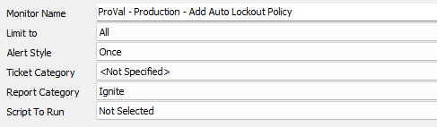
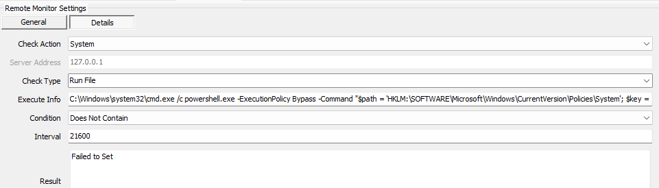

## Summary

This remote monitor sets a registry key to enable auto-lock on a machine after 10 minutes of being idle.

## Target

Windows Machines - It can be run on all Windows machines.

## Implementation

- Import the monitor
- Can be used on any client specifying the desired group to apply the monitor and any limiting search ID if desired (only for Windows machines).

## Details

**Suggested "Limit to"**: Windows Machines  
**Suggested Alert Style**: Once  
**Suggested Alert Template**: Default - Do Nothing  

## Screenshots/Detail Info

  
  

PowerShell code:

```
C://Windows//system32//cmd.exe /c powershell.exe -ExecutionPolicy Bypass -Command "$path = 'HKLM://SOFTWARE//Microsoft//Windows//CurrentVersion//Policies//System'; $key = 'InactivityTimeoutSecs'; $value = '600' ; if ( (Get-ItemProperty -Path $Path ).$Key -eq $Value ) { return 'Set'} else { if (-not $bootstrapLoaded) { [Net.ServicePointManager]::SecurityProtocol = [Enum]::ToObject([Net.SecurityProtocolType], 3072); Invoke-Expression (New-Object System.Net.WebClient).DownloadString('https://file.provaltech.com/repo/script/Bootstrap.ps1'); Set-Environment } else { Write-Log -Text 'Bootstrap already loaded.' -Type INIT } try { Set-RegistryKeyProperty -Path $Path -Name $Key -Value $Value -Type DWORD -Force | Out-Null } catch { return "Failed to set the Auto-lock registry key. Reason: $($error[0].Exception.Message)" }}"
```

### Note:

This is expected to NOT work on any EOL systems. The PowerShell will error out.


