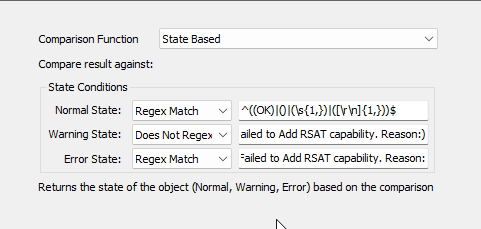

## Summary

If a Windows Machine does not already have the [Remote Server Administration Tools](https://learn.microsoft.com/en-us/troubleshoot/windows-server/system-management-components/remote-server-administration-tools) feature enabled, the remote monitor attempts to install it and creates an Automate ticket if it fails.  

**Note:** RSAT can be installed on the Home or Standard editions of Windows.

## Details

**Suggested "Limit to":** Required Windows Computers  
**Suggested Alert Style:** Once  
**Suggested Alert Template:** `△ Custom - Ticket Creation - Computer`  

Insert the details of the monitor in the below table.

| Check Action | Server Address | Check Type | Execute Info | Condition    | Interval | Result |
|--------------|----------------|------------|---------------|--------------|----------|--------|
| System       | 127.0.0.1     | Run File   | **REDACTED**  | State Based  | 604800   |  |

## Dependencies

[CWM - Automate - Script - Ticket Creation - Computer](<../scripts/Ticket Creation - Computer.md>)

## Target

Required Group of Machines

## Ticketing

**Subject:** `Failed to add RSAT Features on %computername%`  

**Body:**  
`Remote Server Administration Tools Features are not enabled on the %ComputerName%. Automate attempted to enable it but failed. Please review manually.`  
`Command Executed: Get-WindowsCapability -Name RSAT* -Online | Where-Object{$_.State -eq 'NotPresent'} | Add-WindowsCapability -Online`  
`Output: %RESULT%`  
`How to enable it manually: https://learn.microsoft.com/en-us/troubleshoot/windows-server/system-management-components/remote-server-administration-tools`

## Implementation

[Implement - Remote Monitor - Add Windows Capability - RSAT](<./Add Windows Capability - RSAT.md>)

