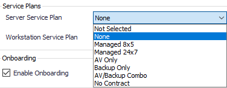

## Summary

This "monitor" is used to populate the location-level service plan dropdown list in CW Automate for MSPs using custom service plan names. (see screenshot)



The monitor achieves this by gathering all of the service plan names under the Service Plans.Windows Workstations or Service Plans.Windows Servers and then updating the extrafield table with the names of all available service plans.

## Dependencies

Ignite needs to be installed in CW Automate.

## Target

Global - Should be run without explicitly defined targets. It does not require an online agent as this is a database-only monitor.

## Translated SQL

Note: These are hardcoded GUIDs. If the MSP has adjusted these, it may cause this solution to break or update unintended fields in Automate.

```
UPDATE `extrafield`
SET fill=(SELECT 
CONCAT(GROUP_CONCAT(`name` ORDER BY NAME ASC SEPARATOR '~'),'|If this location is managed, select the appropriate plan. If the servers or workstations are not managed, please select None or No Contract if you plan on offering this location free basic monitoring|1')
FROM mastergroups 
WHERE parentid 
    IN(SELECT groupid FROM mastergroups WHERE fullname='Service Plans.Windows Workstations'))
WHERE LtGuid = '55346207-b7e1-11e0-aac1-9d777f14e852' AND ftype=2;

UPDATE `extrafield`
SET fill= (SELECT
CONCAT(GROUP_CONCAT(`name` ORDER BY NAME DESC SEPARATOR '~'),'|If this location is managed, select the appropriate plan. If the servers or workstations are not managed, please select None or No Contract if you plan on offering this location free basic monitoring|1')
FROM mastergroups 
WHERE parentid 
    IN(SELECT groupid FROM mastergroups WHERE fullname='Service Plans.Windows Servers') AND `Name` <> 'Server Roles')
WHERE LtGuid='5ca92306-2d93-11e1-ac0f-3d76979114ae' AND ftype=2;
```

