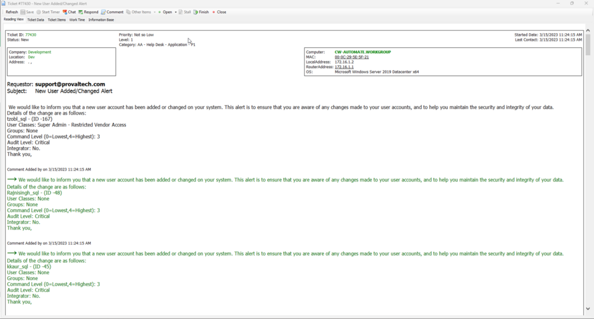

## Summary

To ensure the security and integrity of the system, it is important to monitor user activity and permissions within the application. To achieve this, a monitor has been developed that will alert whenever a new user is added or when a user's permissions are modified.

## Details

This is a RAWSQL monitor that alerts when a user's permissions are changed or when a user is added to the system.

## Recommended Alert Action

It is recommended to use an alert template that creates a ticket or sends an email.

## Ticketing

**Subject**  
**New User Added/Changed Alert**  

**Body**  

We would like to inform you that a new user account has been added or changed on your system. This alert is to ensure that you are aware of any changes made to your user accounts and to help you maintain the security and integrity of your data.  

Details of the change are as follows:  
%RESULT%.  

Thank you,  

