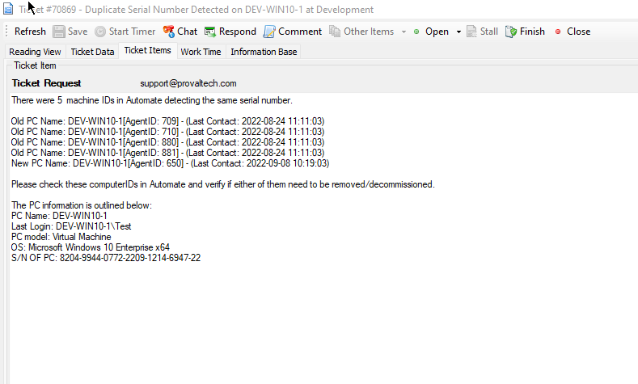

## Summary

This monitor looks for machines that have the same serial number listed in the database. Machines with duplicate serial numbers are likely duplicate agents.

It will list all the duplicate instances of the machines that are offline in Automate for more than one day, and the monitor set excludes virtual machines to avoid false positives.

**Alert Template:** Custom - Ticket Creation - Computer

**Sample Ticket:**  

## Dependencies

[CWM - Automate - Script - Ticket Creation - Computer](<../scripts/Ticket Creation - Computer.md>)

## Target

Global - Should be run without explicitly defined targets.

**Note:** Not all machines have proper serial numbers. The SQL below attempts to filter out as many bad results as possible. For example, some SuperMicro PCs all use the same serial number "1234567890." This can lead to false positives. Please review the data for each device before taking action.

