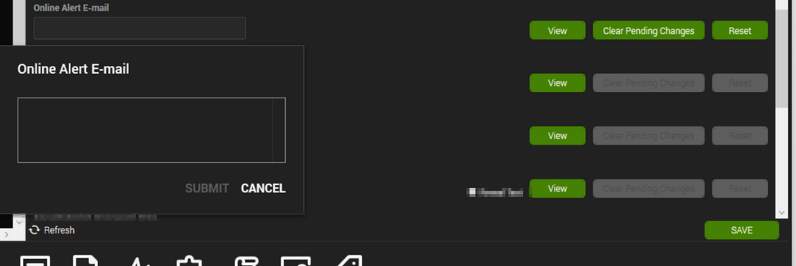

## Summary

This monitor will alert on any computer that has checked in in the last 5 minutes that also has the 'Online Alert E-mail' ConnectWise Automate computer level EDF filled out with a valid email address.

Alert Template: △ Custom - E-Mail - Machine Back Online

## Dependencies

[CWM - Automate - Script - Email - EDF - Machine Back Online [Autofix]*](https://proval.itglue.com/DOC-5078775-11753156)

## Target

Global

