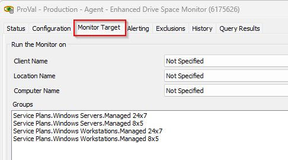
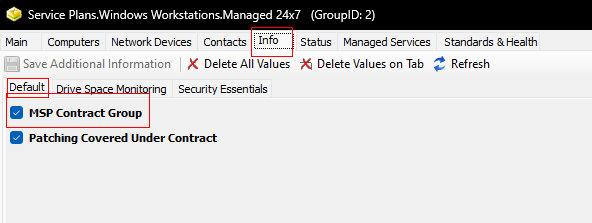
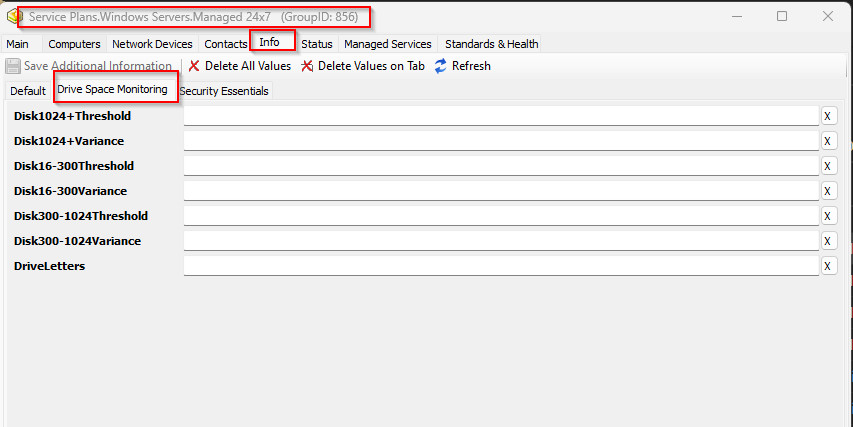
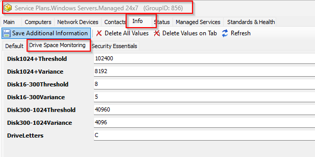
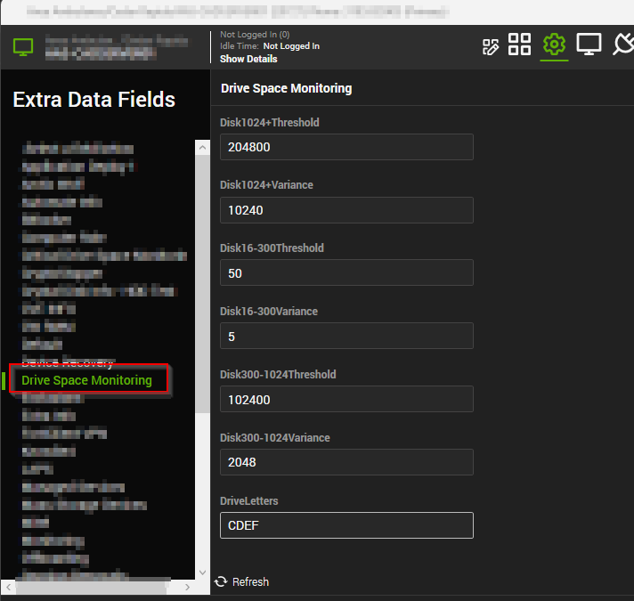
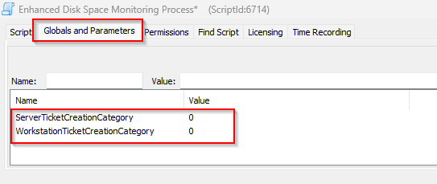
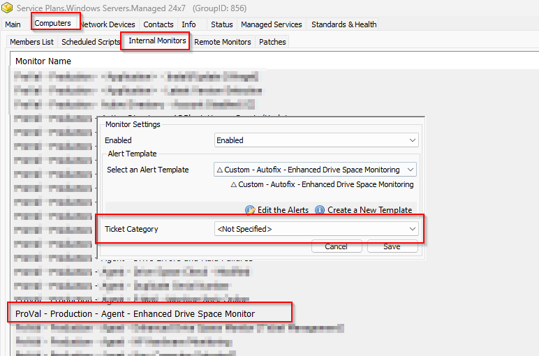
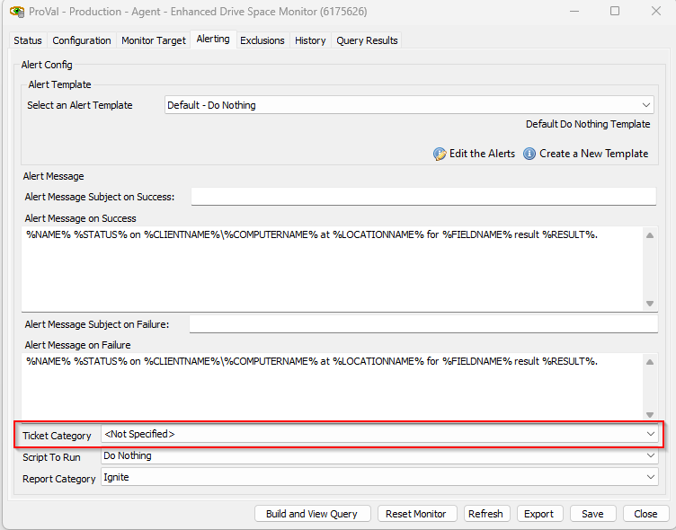
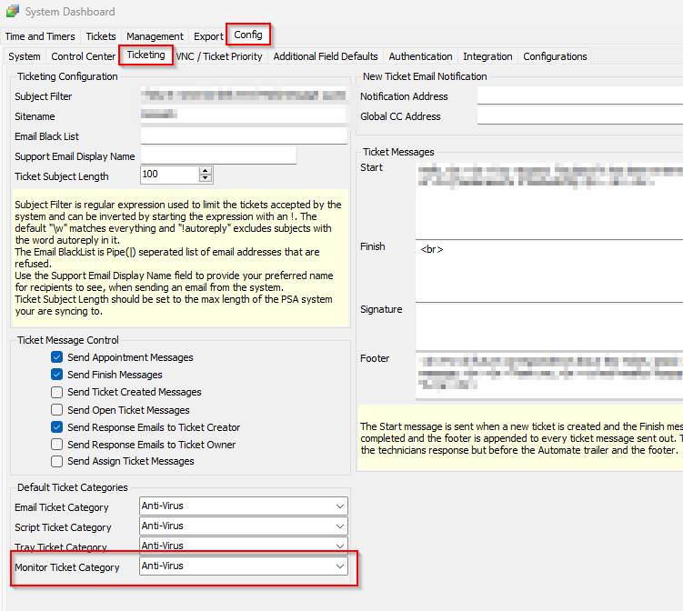

## Summary

This monitor set is designed to check the drive space of devices and generate alerts based on defined thresholds. Here's a breakdown of how the monitoring system works:

1. **Threshold Levels:**
   - **Global Threshold:** A default threshold value defined at the global level.
   - **Group-Level Threshold:** A threshold value defined at the group level, which takes precedence over the global threshold.
   - **Computer-Level Threshold:** A threshold value defined at the computer level, which takes precedence over the group-level threshold.

2. **Alert Generation:**
   - The monitor checks the drive space for each drive on the device.
   - If the drive's space falls below the defined threshold (global, group-level, or computer-level), an alert/ticket is generated, if Autofix fails to clear some space.

3. **Ticket Closure:**
   - Tickets generated by the solution for low drive space are automatically closed once the free drive space grows larger than the respective threshold by the relevant variance.
   - This feature prevents the system from continuously creating and closing tickets too frequently.

4. **Drive Letters to Monitor:**
   - Drive letters to monitor can be set at the group or computer level using EDFs (Extra Data Fields).
   - If specific drive letters are not set, the solution will monitor all available internal drives on the device.

5. **Limitation to Windows Computers:**
   - The monitoring system is limited to Windows computers only.

6. **Configuration via EDFs and System Properties:**
   - The monitor set can be operated and configured using various EDFs and system properties.
   - Further details about these configuration options are provided in this article.

Overall, the monitoring system is designed to track drive space and generate alerts based on defined thresholds at the global, group, or computer level. It offers flexibility through EDFs and system properties for customization and configuration.

**Note:** The monitor will not detect machines in maintenance mode.

## Dependencies

- [EPM - Disk - Script - Enhanced Disk Space Monitoring Process](https://proval.itglue.com/DOC-5078775-12033151)

## Target

Must be applied on the Managed Service Plan Groups  
  

The groups should have `MSP Contract Group` EDF Marked  

## System Properties

| Property                     | Default Value | Description                                                                                 |
|------------------------------|---------------|---------------------------------------------------------------------------------------------|
| Disk16-300Threshold          | 10            | Threshold in **percentage** to detect the drives between 16GB to 300GB.                  |
| Disk16-300Variance           | 2             | Variance in **percentage** to close the tickets generated after the free drive space grows larger than the respective threshold by the set percentage for the drives between 16GB to 300GB. |
| Disk300-1024Threshold        | 30720         | Threshold in **MB** to detect the drives between 300GB to 1024GB.                        |
| Disk300-1024Variance         | 4096          | Variance in **MB** to close the tickets generated after the free drive space grows larger than the respective threshold by the set **MBs** for the drives between 300GB to 1024GB. |
| Disk1024+Threshold           | 51200         | Threshold in **MB** to detect the drives larger than 1024GB.                             |
| Disk1024+Variance            | 6144          | Variance in **MB** to close the tickets generated after the free drive space grows larger than the respective threshold by the set **MBs** for the drives larger than 1024GB. |

According to the Default Global Property Settings:
- Drives with total size between 16GB to 300GB will generate a ticket when the free space goes below 10% of the total size. However, the ticket will only be closed after the free space grows 2% larger than the 10% of the total size.
- Drives with total size between 300GB to 1024GB will generate a ticket when the free space goes below 30720MBs (30GB). However, the ticket will only be closed after the free space grows 4096MBs larger than the 30720MBs, i.e., the ticket will close after free space reaches at least 34 GB.
- Drives with total size larger than 1024GB will generate a ticket when the free space goes below 51200MBs (50GB). However, the ticket will only be closed after the free space grows 6144MBs larger than the 51200MBs, i.e., the ticket will close after free space reaches at least 56 GB.

## Group Level EDFs

| Name                     | Example | Description                                                                                 |
|--------------------------|---------|---------------------------------------------------------------------------------------------|
| Disk16-300Threshold      | 8       | Threshold in **percentage** to detect the drives between 16GB to 300GB. To override the Global value stored in the system property Disk16-300Threshold for the machines in the group. |
| Disk16-300Variance       | 5       | Variance in **percentage** to close the tickets generated after the free drive space grows larger than the respective threshold by the set percentage for the drives between 16GB to 300GB. To override the Global value stored in the system property Disk16-300Variance for the machines in the group. |
| Disk300-1024Threshold    | 40960   | Threshold in **MB** to detect the drives between 300GB to 1024GB. To override the Global value stored in the system property Disk300-1024Threshold for the machines in the group. |
| Disk300-1024Variance     | 4096    | Variance in **MB** to close the tickets generated after the free drive space grows larger than the respective threshold by the set **MBs** for the drives between 300GB to 1024GB. To override the Global value stored in the system property Disk300-1024Variance for the machines in the group. |
| Disk1024+Threshold       | 102400  | Threshold in **MB** to detect the drives larger than 1024GB. To override the Global value stored in the system property Disk1024+Threshold for the machines in the group. |
| Disk1024+Variance        | 8192    | Variance in **MB** to close the tickets generated after the free drive space grows larger than the respective threshold by the set **MBs** for the drives larger than 1024GB. To override the Global value stored in the system property Disk1024+Variance for the machines in the group. |
| DriveLetters             | C       | To store the drive letter(s) to monitor for the machines in the group. If left blank, the monitor set will look for all drives. Multiple drives can be set by simply adding the drive letters. e.g., putting **CDE** in this EDF will enable the monitor set for C, D, and E drive letters for the machines in this group. |

Group Level EDFs should be set at the managed service plan groups only.  
  
Managed service plan group must have `MSP Contract Group` EDF Marked. **Do Not Mark this checkbox for regular or non-managed service plan groups.**  

**Example:**  
  

In the above example:
- Drives with total size between 16GB to 300GB will generate a ticket when the free space goes below 8% of the total size. However, the ticket will only be closed after the free space grows 5% larger than the 8% of the total size.
- Drives with total size between 300GB to 1024GB will generate a ticket when the free space goes below 40960MBs (40GB). However, the ticket will only be closed after the free space grows 4096MBs larger than the 40960MBs, i.e., the ticket will close after free space reaches at least 44 GB.
- Drives with total size larger than 1024GB will generate a ticket when the free space goes below 102400MBs (100GB). However, the ticket will only be closed after the free space grows 8192MBs larger than the 102400MBs, i.e., the ticket will close after free space reaches at least 108 GB.
- The monitor set will only monitor the **C** drive of the machines in this group.

**Note:** Above explained EDFs can be used to override the global thresholds defined by the system properties.

## Computer Level EDFs

| Name                     | Example | Description                                                                                 |
|--------------------------|---------|---------------------------------------------------------------------------------------------|
| Disk16-300Threshold      | 50      | Threshold in **percentage** to detect the drives between 16GB to 300GB. To override the Global value stored in the system property Disk16-300Threshold and group level EDF Disk16-300Threshold for the machine. |
| Disk16-300Variance       | 5       | Variance in **percentage** to close the tickets generated after the free drive space grows larger than the respective threshold by the set percentage for the drives between 16GB to 300GB. To override the Global value stored in the system property Disk16-300Variance and group level EDF Disk16-300Variance for the machine. |
| Disk300-1024Threshold    | 102400  | Threshold in **MB** to detect the drives between 300GB to 1024GB. To override the Global value stored in the system property Disk300-1024Threshold and group level EDF Disk300-1024Threshold for the machine. |
| Disk300-1024Variance     | 2048    | Variance in **MB** to close the tickets generated after the free drive space grows larger than the respective threshold by the set **MBs** for the drives between 300GB to 1024GB. To override the Global value stored in the system property Disk300-1024Variance and group level EDF Disk300-1024Variance for the machine. |
| Disk1024+Threshold       | 102400  | Threshold in **MB** to detect the drives larger than 1024GB. To override the Global value stored in the system property Disk1024+Threshold and group level EDF Disk1024+Threshold for the machine. |
| Disk1024+Variance        | 204800  | Variance in **MB** to close the tickets generated after the free drive space grows larger than the respective threshold by the set **MBs** for the drives larger than 1024GB. To override the Global value stored in the system property Disk1024+Variance and group level EDF Disk1024+Variance for the machine. |
| DriveLetters             | CDE     | To store the drive letter(s) to monitor for the machine. If left blank, the monitor set will look for Drive letters stored in the group level EDF DriveLetters and for all drives if both computer and group level EDFs are blank. Multiple drives can be set by simply adding the drive letters. e.g., putting **CDE** in this EDF will enable the monitor set for C, D, and E drive letters for the machines in this group. |

**Example:**  
  

In the above example:
- Drives with total size between 16GB to 300GB will generate a ticket when the free space goes below 50% of the total size. However, the ticket will only be closed after the free space grows 5% larger than the 50% of the total size.
- Drives with total size between 300GB to 1024GB will generate a ticket when the free space goes below 102400MBs (100GB). However, the ticket will only be closed after the free space grows 2048MBs larger than the 102400MBs, i.e., the ticket will close after free space reaches at least 102GB.
- Drives with total size larger than 1024GB will generate a ticket when the free space goes below 204800MBs (200GB). However, the ticket will only be closed after the free space grows 10240MBs larger than the 204800MBs, i.e., the ticket will close after free space reaches at least 210GB.
- The monitor set will only monitor the **C, D, E,** and **F** drives of this machine.

**Note:** Above explained EDFs can be used to override the global thresholds defined by the system properties and values stored in the group level EDFs.

## Ticket Category

- Connectwise Manage board, type, priority for the ticket can be set by setting the proper ticket category.
- The ticket will be created by the [EPM - Disk - Script - Enhanced Disk Space Monitoring Process](https://proval.itglue.com/DOC-5078775-12033151) script and ticket category can be set at the following levels:
  - In the script's global variables. Setting the relevant ticket category id in these global variables will allow the script to create tickets under those categories.  
    
  - At the group level. Ticket category can be set from the groups where the internal monitor is applied. This ticket category will only be picked if global variables are set to 0.  
    
  - On global monitor set. Ticket category can be selected at the monitor set itself. This ticket category will only be picked if the group level ticket category is not defined and global variables are set to 0.  
    
  - If ticket category is set from none of the above mentioned places, then the ticket will be generated under the default ticket category.  
    

## FAQs

**Q:** The monitor is throwing errors after the import?  
**A:** Run or debug the script against a random Windows computer. Set the user parameter `SetEnvironment` to 1 during execution. This step will create the associated EDFs and System Properties.

**Q:** How to limit the monitor set for the workstations to monitor the C: Drive only?  
**A:** Refer to the Group Level EDF section of the [Internal Monitor's](https://proval.itglue.com/DOC-5078775-12182106) document.

**Q:** How to change the threshold for a computer?  
**A:** Refer to the Computer Level EDF section of the [Internal Monitor's](https://proval.itglue.com/DOC-5078775-12182106) document.

**Q:** The custom threshold set at the group/computer level is not working?  
**A:** The EDF data might not have been synced to the `v_extradatacomputers` or `v_extradatagroups` tables. Automate runs this sync every 20-25 minutes. So, either you need to wait for 20-25 minutes or you can run the following SQL queries from a `RAWSQL` monitor set to force sync the data:
- `Call V_Extradata(7, 'Groups');`
- `Call V_Extradata(1, 'Computers');`
- `Call V_ExtradataRefresh(7, 'Groups');`
- `Call V_ExtradataRefresh(1, 'Computers');`

**Q:** Should we expect any possible problems or errors on systems running PowerShell versions earlier than 5.0?  
**A:** For systems with PowerShell versions older than 5.0, you may encounter PowerShell errors similar to the one in this screenshot for the Soji failure notes.  

