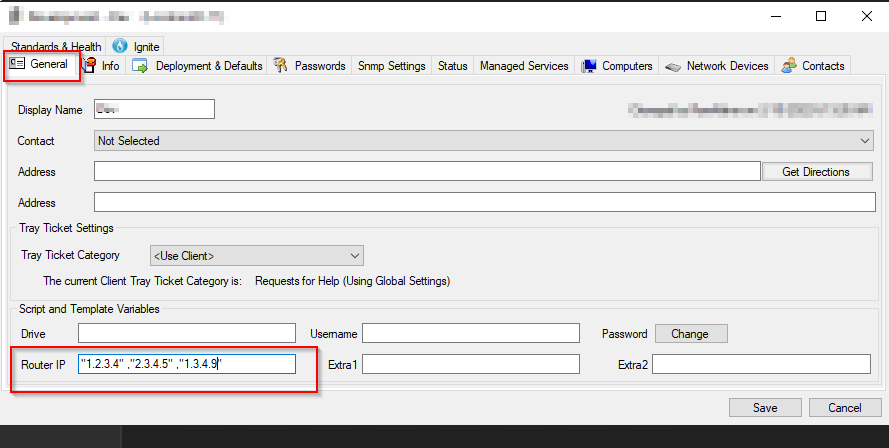
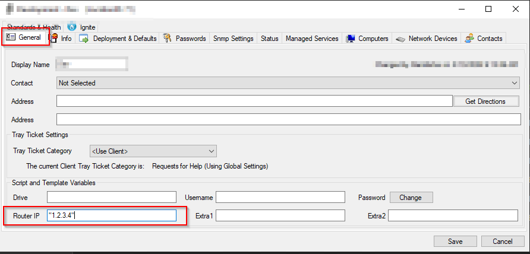
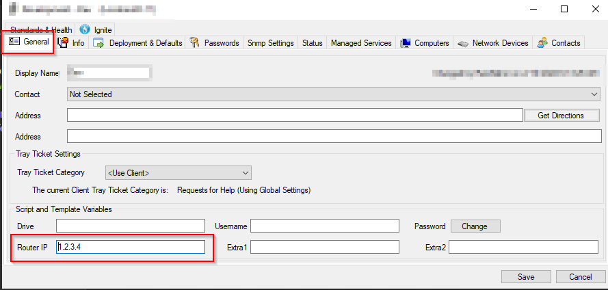

## Summary

The purpose of the monitor set is to detect the computers that are placed in the wrong location. Location is verified on the basis of the router address. Router IP for each location must be defined. Multiple router IPs can be defined as well. A router address must be written in double quotes ("Router Address"). For using multiple router addresses, each router address must be separated by a space and a comma ("Router Address 1", "Router Address 2", "Router Address n").

Sample screenshot for the multiple Router Addresses:

Sample screenshot for the single Router Address:

However, there's an option available in Monitor set to use router address without quotes, but in that case, you would not be able to use multiple router addresses for any of the locations. 

In order to use a single router address without quotes, you can un-comment "#ON FIND_IN_SET (a.routeraddress, b.scrouteraddress) <> 0" statement in the additional condition followed by commenting the very next line.

Sample Screenshot for single unquoted router address:

## Target

Global

