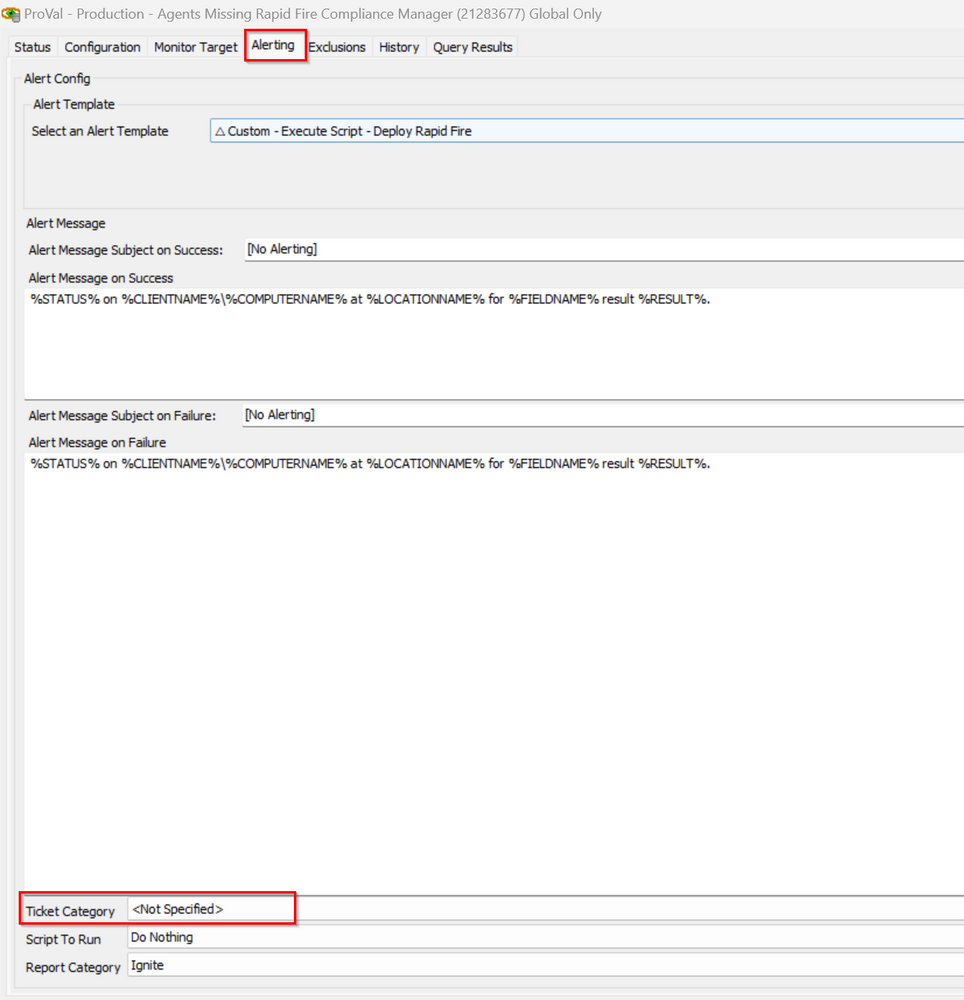

## Summary

This monitor detects the agent where the location of the agent contains the "Compliance Management Installer Key" and the deployment is enabled. The location or computers shouldn't be excluded.

## Dependencies

[CWA Script - Deploy Rapid Fire Compliance Management](https://proval.itglue.com/DOC-5078775-17700231)

## Target

Global

## Ticketing

*To create a ticket please set the ticket category in the alerting section of the monitor*

