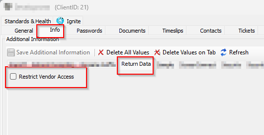
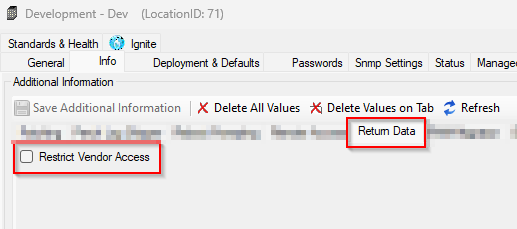
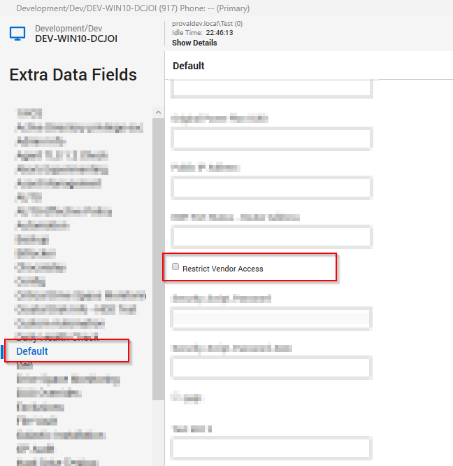

## Summary

The purpose of this monitor is to ensure that when the EDFs "Restrict Vendor Access" EDFs are checked within automate, it automatically restricts the machines in SC.

## Dependencies

Below EDFs must be created before importing the monitor:

- Select Client EDF "Restrict Vendor Access" to select Whole client for Vendor Restriction  
  

- Select Location EDF "Restrict Vendor Access" to select the Whole location for Vendor Restriction  
  

- Select Computer EDF "Restrict Vendor Access" to select a machine for Vendor Restriction  
  

## Target

All Operating Systems

## Alert Template

- `△ Custom - Execute Script - Update Vendor Restricted Property`

