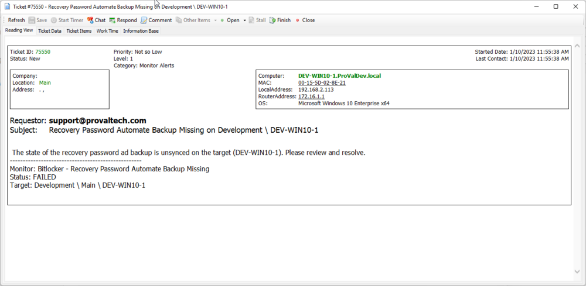

## Summary

This monitor will return any target machine whose client has the 'Bitlocker Monitoring' EDF checked, and the target's 'Bitlocker Monitoring Exclusion' is not checked, and its 'C' drive is listed as a mount point in 'plugin_proval_bitlocker_audit' and the RecoveryPassword in 'plugin_proval_bitlocker_audit' does not exist in the 'plugin_proval_ad_bitlocker_keyprotectors' table for that target.

## Dependencies

- [SEC - Encryption - Custom Table - plugin_proval_bitlocker_audit](https://proval.itglue.com/DOC-5078775-8943520)
- [SEC - Encryption - Solution - Bitlocker](https://proval.itglue.com/DOC-5078775-8953721)
- [SEC - Encryption - Custom Table - plugin_proval_ad_bitlocker_keyprotectors](https://proval.itglue.com/DOC-5078775-9045330)

## Target

Please follow the recommended target for the bitlocker solution.

## Translated SQL

```
SELECT computers.username AS TestValue
    ,computers.NAME AS IdentityField
    ,computers.computerid
    ,clients.NAME AS `Client Name`
    ,computers.domain AS `Computer Domain`
    ,IFNULL(IFNULL(edfAssigned1.Value, edfDefault1.value), '0') AS `Computer - Client - Extra Data Field - Security Compliance - Bitlocker Monitoring`
    ,IFNULL(IFNULL(edfAssigned2.Value, edfDefault2.value), '0') AS `Computer - Extra Data Field - Security Compliance - Bitlocker Monitoring Exclusion`
    ,a.noalerts
    ,a.uptimestart
    ,a.uptimeend
    ,computers.DateAdded
FROM Computers
LEFT JOIN inv_operatingsystem ON (Computers.ComputerId = inv_operatingsystem.ComputerId)
LEFT JOIN Clients ON (Computers.ClientId = Clients.ClientId)
LEFT JOIN Locations ON (Computers.LocationId = Locations.LocationID)
LEFT JOIN plugin_proval_bitlocker_audit ppba ON (computers.ComputerID = ppba.ComputerID)
LEFT JOIN agentcomputerdata a ON computers.computerid = a.computerid
LEFT JOIN ExtraFieldData edfAssigned1 ON (
        edfAssigned1.id = Clients.ClientId
        AND edfAssigned1.ExtraFieldId = (
            SELECT ExtraField.id
            FROM ExtraField
            WHERE LTGuid = '1e005883-98be-4325-b374-e0538a744efa'
            )
        )
LEFT JOIN ExtraFieldData edfDefault1 ON (
        edfDefault1.id = 0
        AND edfDefault1.ExtraFieldId = (
            SELECT ExtraField.id
            FROM ExtraField
            WHERE LTGuid = '1e005883-98be-4325-b374-e0538a744efa'
            )
        )
LEFT JOIN ExtraFieldData edfAssigned2 ON (
        edfAssigned2.id = Computers.ComputerId
        AND edfAssigned2.ExtraFieldId = (
            SELECT ExtraField.id
            FROM ExtraField
            WHERE LTGuid = '45a37cb2-d1d0-44eb-b359-22630a61a2c2'
            )
        )
LEFT JOIN ExtraFieldData edfDefault2 ON (
        edfDefault2.id = 0
        AND edfDefault2.ExtraFieldId = (
            SELECT ExtraField.id
            FROM ExtraField
            WHERE LTGuid = '45a37cb2-d1d0-44eb-b359-22630a61a2c2'
            )
        )
WHERE (
        (
            (
                (IFNULL(IFNULL(edfAssigned1.Value, edfDefault1.value), '0') \\<> 0)
                AND (IFNULL(IFNULL(edfAssigned2.Value, edfDefault2.value), '0') = 0)
                )
            )
        )
    AND (
        (ppba.MountPoint = 'C:')
        AND (ppba.`RecoveryPassword` != '')
        AND (
            ppba.RecoveryPassword NOT IN (
                SELECT RecoveryPassword
                FROM plugin_proval_ad_bitlocker_keyprotectors ppabk
                WHERE ppabk.ComputerID = ppba.ComputerID
                )
            )
        ) AND (
              computers.DateAdded \\< DATE_SUB(NOW(), INTERVAL 7 DAY )
              )
```

## Ticketing




