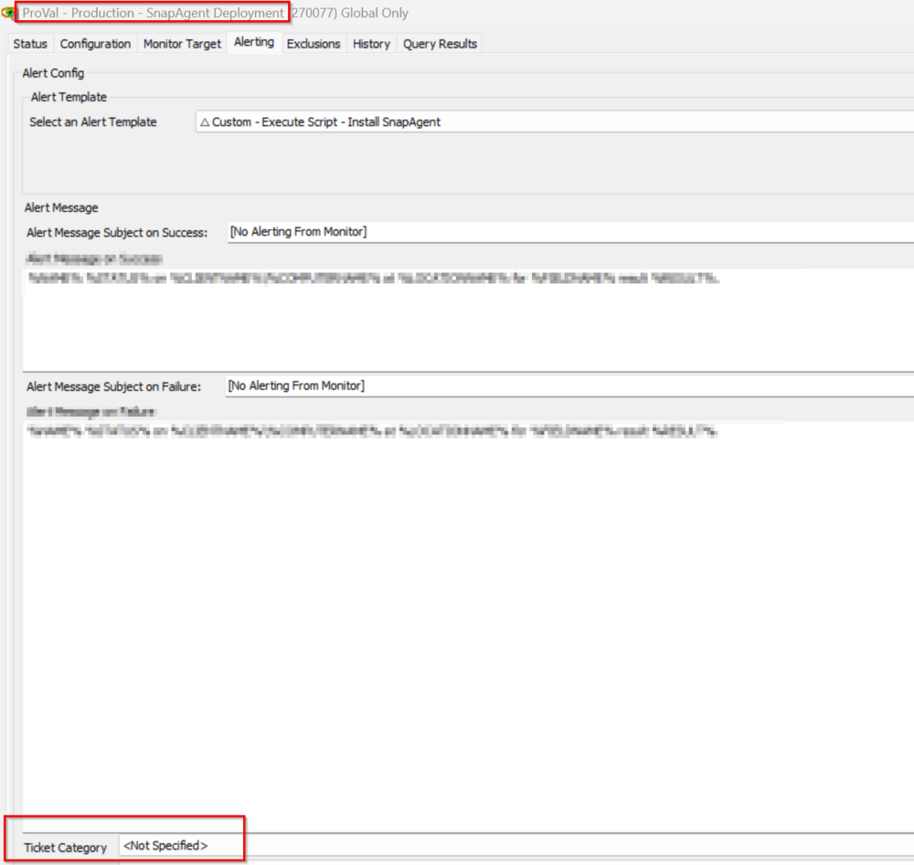

## Summary

This monitor detects the online Windows agent where the SnapAgent is not installed.

It also depends on the EDFs:
- BlackPoint SNAP URL -> Client EDF should contain the URL of the installer package downloader.
- BlackPoint SnapAgent Deploy -> Client EDF should be checked for the deployment confirmation.
- BlackPoint SnapAgent Deploy Exclude -> The location EDF shouldn't be checked for the deployment else the agents of the locations will be excluded.
- BlackPoint SnapAgent Exclude -> The computer EDF shouldn't be checked for the deployment else the agent will be excluded.

## Dependencies

[CWA - Script - SnapAgent Installer](https://proval.itglue.com/DOC-5078775-16179606)

## Target

Global

## Ticketing

- The ticket is controlled by the script "SnapAgent Installer".
- To enable the ticketing feature it is mandatory to set the ticket category at the monitor level as shown below:

